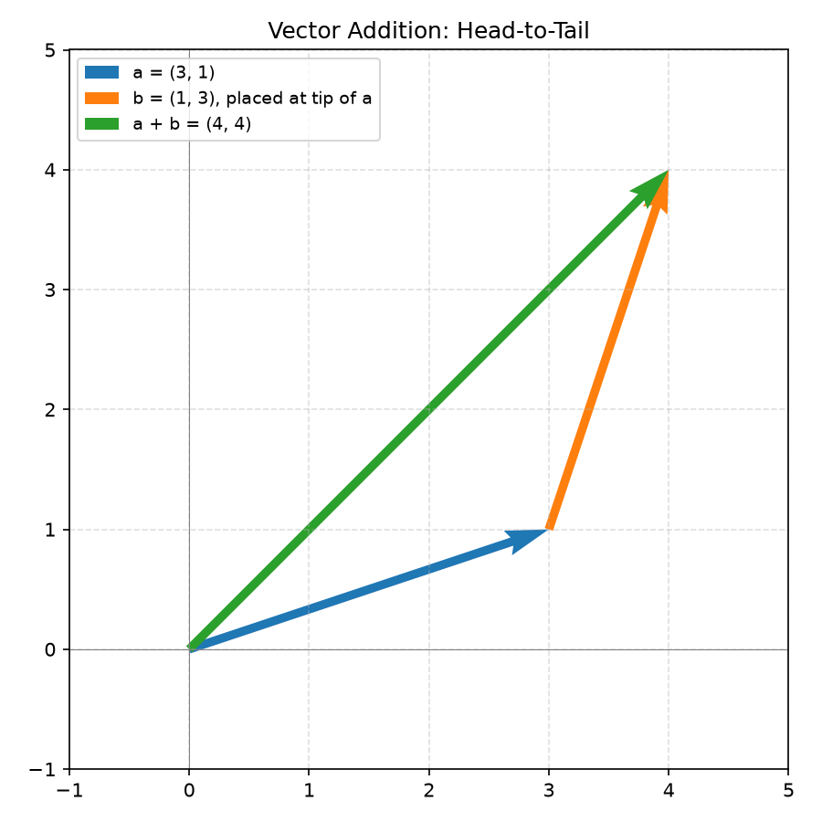
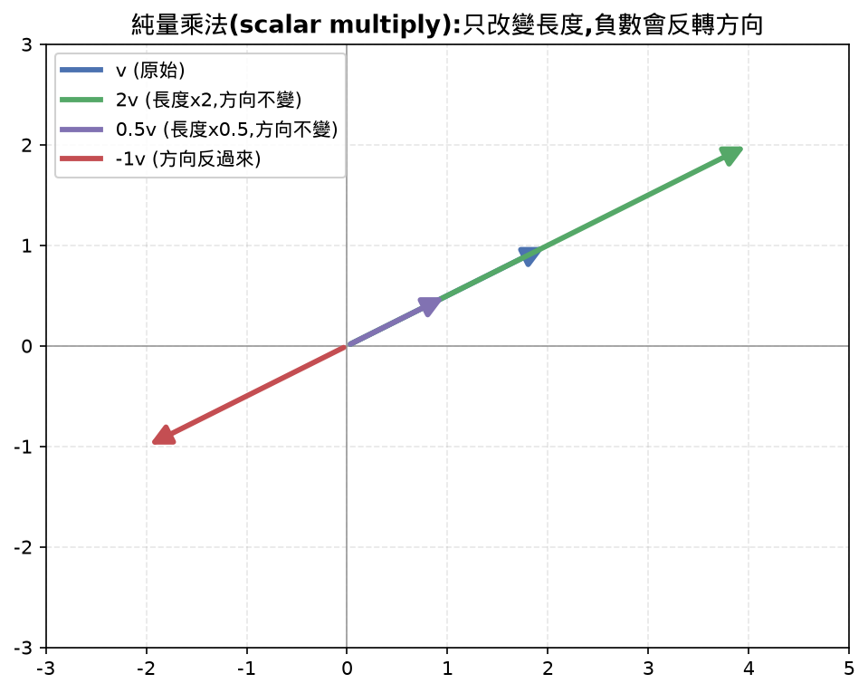
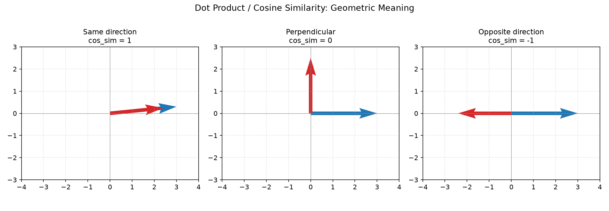
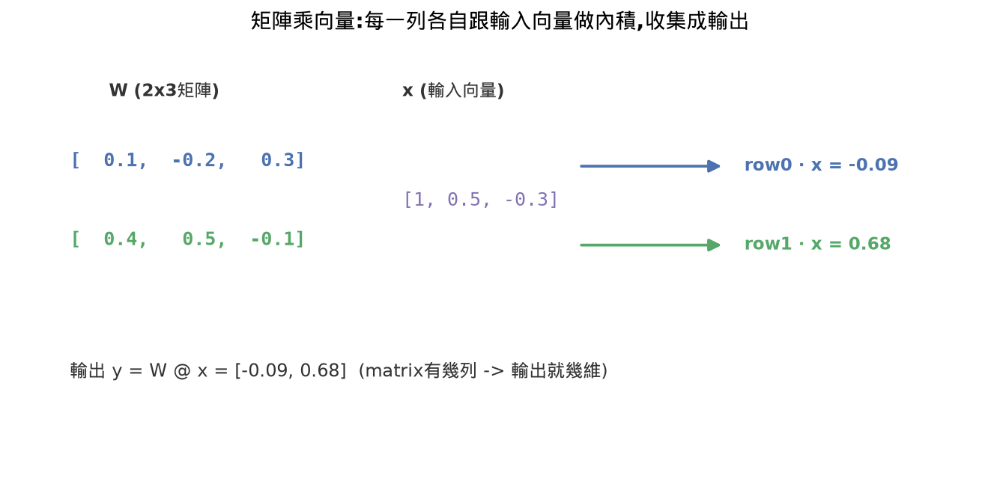
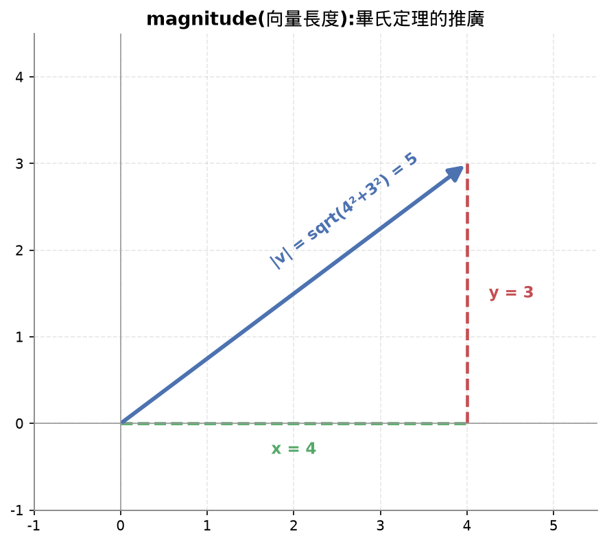
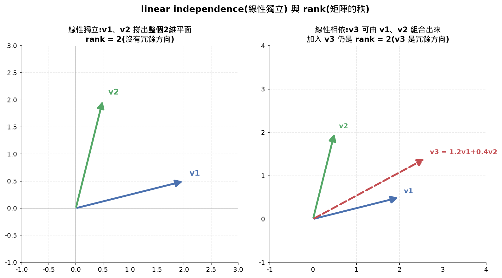
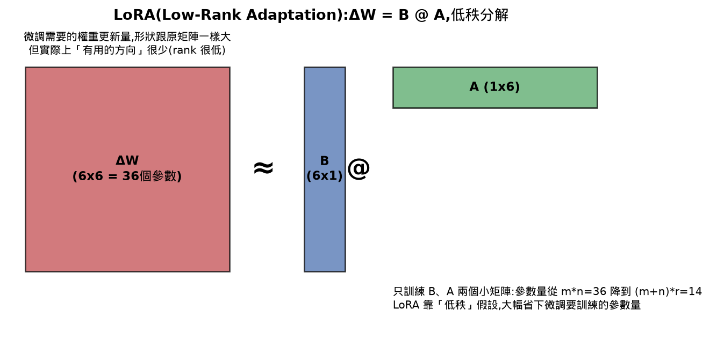

# Lesson 1 語法筆記：這一課學到的 Python 新東西

## Learning Objectives 打勾清單（回頭核對，2026-08-19補上）

- [x] Implement vector and matrix operations (addition, dot product, matrix multiply) from scratch in Python — Vector 的 add/sub/mul/dot 跟 Matrix 的矩陣乘向量都手打+驗證過，這項真的做到了
- [ ] Explain geometrically what the dot product, projection, and Gram-Schmidt process do — dot product 的幾何意義（同方向/垂直/反方向）有講清楚，但 projection（投影）跟 Gram-Schmidt 只有帶著跑過計算結果，沒有真的講到「幾何上在幹嘛」（投影是影子、Gram-Schmidt 是不斷扣掉重疊方向），這塊沒做到
- [ ] Determine linear independence, rank, and basis of a set of vectors using row reduction — linear independence 概念懂了（測驗第1題），但 rank 沒教好（測驗第2題答錯），basis 完全沒提過，row reduction（列運算/高斯消去法）只講過用途沒帶著手算
- [ ] Connect linear algebra concepts to their AI applications: embeddings, attention scores, and LoRA — embeddings 這塊講得最扎實（cosine similarity 貫穿整堂課），attention scores 只在最一開始的 Connections 表格提過名詞，沒解釋內積怎麼變成注意力分數；LoRA 是測驗答錯後才補講解釋，不是教學過程中主動教的

⚠️ 尚未完成：projection/Gram-Schmidt的幾何解釋、rank與basis與row reduction、attention scores的實際連結、LoRA主動教學（而非測驗事後補救）

## 30秒抓重點(複習只看這裡就能想起整堂課在幹嘛)

- vector就是一串數字,同時代表方向跟長度,加減法是箭頭頭尾相接,純量乘法只改變長度
- dot product量「兩個向量指向同一方向的程度」,同方向最大、垂直是0、反方向是負最大值
- cosine similarity = dot product除以兩個長度的乘積,拿掉長度干擾只留方向,是判斷embedding像不像的標準做法
- matrix乘vector的本質是「每一列分別跟輸入向量做內積」,收集起來變成輸出向量,是神經網路每一層的雛形
- rank(秩)是一組向量裡線性獨立的個數,代表矩陣實際撐起幾維空間;LoRA就是利用「權重更新量的rank通常很低」這個特性,把大矩陣拆成兩個小矩陣相乘來省參數
- 這堂課只做到核心40-45%,projection/Gram-Schmidt/basis/row reduction/attention scores跟內積的關係都還沒教

## 公式速查表

| 用途 | 公式 |
|---|---|
| 內積(dot product) | `a·b = a1*b1 + a2*b2 + ...`(對應位置相乘再全部加總) |
| 長度(magnitude) | `|a| = sqrt(a1² + a2² + ...)`(畢氏定理推廣) |
| 餘弦相似度(cosine similarity) | `cos_sim(a,b) = (a·b) / (|a| * |b|)`,範圍-1到1 |
| 矩陣乘向量 | 輸出第i個數字 = 矩陣第i列 · 輸入向量(逐列做內積) |
| LoRA低秩分解 | `ΔW = B @ A`,B是(m,r)、A是(r,n),r遠小於m和n |

## 核心重點整理(這堂課在教什麼)

| 概念 | 是什麼 | 關鍵規則 / 幾何意義 |
|---|---|---|
| vector(向量) | 一串數字,同時代表方向跟長度 | 可以想成空間裡一個從原點出發的箭頭 |
| 加法/減法 | 把第二個向量的箭頭接在第一個向量的尾端 | 頭尾相接法,終點就是相加後的向量;減法代表「從一個點走到另一個點」的方向跟距離 |
| 純量乘法(scalar multiply) | 向量乘上一個數字 | 只改變長度不改變方向;數字是負的話方向反過來 |
| dot product(內積) | 兩個向量對應位置的數字相乘再全部加總 | 幾何意義是兩個向量指向同一方向的程度:完全同方向最大、垂直是 0、完全反方向是負的最大值 |
| magnitude(長度) | 向量自己跟自己做內積再開根號 | 畢氏定理的推廣(各維度平方和開根號) |
| cosine similarity(餘弦相似度) | dot product 除以兩個向量長度的乘積 | 把長度的影響拿掉,只留方向像不像,範圍固定 -1 到 1(1=同方向、0=垂直無關、-1=完全反方向)。之後判斷文字/圖片像不像常常就是在算這個 |
| matrix(矩陣) | 很多個向量疊在一起,一列就是一個向量 | 矩陣乘向量 = 每一列分別跟輸入向量做一次內積,收集成新向量;輸出向量維度 = 矩陣有幾列 |
| embedding(嵌入) | 代表某樣東西(文字/圖片/使用者)意義的一個向量 | 本質上就是一般向量,差別在於經過學習後,意義相近的東西距離也會相近 |
| linear independence(線性獨立) | 一組向量裡,沒有任何一個能用其他向量的線性組合表示出來 | 代表每個向量都帶來「新的」方向資訊,彼此不重疊 |
| rank(秩) | 矩陣裡線性獨立的行(或列)的個數 | 代表這個矩陣實際能覆蓋到的維度數 |
| projection(投影) | 一個向量在另一個向量方向上的分量 | 可以想成物體照光後,在某個方向上的「影子」長度 |
| basis(基底) | 一組數量最少、彼此線性獨立、且能張成整個空間的向量 | 相當於這個空間的座標軸 |
| orthonormal(單位正交) | 彼此互相垂直、且長度都是1的一組向量 | 常見於旋轉矩陣跟QR分解裡 |











#### 常見地雷

> 容易誤會成:內積(dot product)本身數值越大,就代表兩個向量越像。
>
> 實際上:內積同時被「方向像不像」跟「向量各自的長度」影響,只要其中一個向量長度變大,內積就會跟著放大,即使方向完全沒有變得更像。真正只反映方向的是餘弦相似度(內積除以兩個長度的乘積),比較兩個embedding像不像,要看cosine similarity而不是原始內積。

這堂課刻意沒教到、留在 review queue 的:projection(投影)、Gram-Schmidt(正交化)、rank(矩陣的秩)、basis(基底)、row reduction(列運算/高斯消去法)、attention scores 跟內積的關係、LoRA。這些之後遇到再回頭補,不是這堂課的核心。

## 我自己手打的部分

這堂課用的是舊的手刻流程(還沒切換成 Top-Down),`practice.py` 整份都是自己手打並驗證過的:

```python
class Vector:
    def __init__(self, components):
        self.components = list(components)
        self.dim = len(components)

    def __add__(self, other):
        return Vector([a + b for a, b in zip(self.components, other.components)])

    def __sub__(self, other):
        return Vector([a - b for a, b in zip(self.components, other.components)])

    def __mul__(self, scalar):
        return Vector([x * scalar for x in self.components])

    def dot(self, other):
        return sum(a * b for a, b in zip(self.components, other.components))

    def magnitude(self):
        return sum(x**2 for x in self.components) ** 0.5

    def cosine_similarity(self, other):
        return self.dot(other) / (self.magnitude() * other.magnitude())

    def __repr__(self):
        return f"Vector({self.components})"


class Matrix:
    def __init__(self, rows):
        self.rows = [list(row) for row in rows]
        self.shape = (len(self.rows), len(rows[0]))

    def __matmul__(self, other):
        if isinstance(other, Vector):
            return Vector([sum(self.rows[i][j] * other.components[j] for j in range(self.shape[1])) for i in range(self.shape[0])])

    def __repr__(self):
        return f"Matrix({self.rows})"
```

加上主程式的驗證區塊(算 a+b、a-b、a*3、dot、magnitude、cosine_similarity、weights@input_vec 並印出結果)。`numpy_version.py` 也整份是自己打的,用 numpy 重做一次同樣的加法/內積/長度/cosine similarity,拿來對照手刻版本的結果是不是一致(兩邊都算出 0.9746,確認邏輯正確)。

## 今天花的時間

今天總共專注 6:35:45，其中最長一段連續 4:25:17。這是完全零基礎第一課，環境設定（VS Code、GitHub、Copilot）占掉不少時間，但那些是一次性成本，之後不用重來。(課程建議時間:約60分鐘，實際花費是建議時間的6倍以上，主因是第一課的環境設定屬於一次性成本，不是課程內容本身變重)

## 下次可以優化的地方

環境設定那段拖最久，主要是路徑格式（WSL 路徑轉 Windows 路徑沒處理好）跟視窗開太多次沒清乾淨，這些現在都抓到問題也修好了，理論上以後不會再卡在這裡。

中段花了不少時間在同一個概念反覆問、反覆解釋（尤其 Matrix 那段），後來切換成「簡短講、你不懂才深問」節奏之後明顯變快。下一課可以從一開始就用這個節奏，不用等卡住才切換。

範圍上也繞了幾圈（要不要簡化、要不要全教），後來定下來的標準是「跟目標相不相關」而不是「難不難」，這個標準之後直接套用，不用每課重新討論。

## 課程結尾理解確認題(先自己想過一遍,再點開看答案,這樣才是真的在複習)

<details>
<summary><b>Q1：兩個向量做內積(dot product)之後,結果是正數、0、負數,分別代表什麼幾何意義?餘弦相似度(cosine similarity)為什麼要拿內積再除以兩個向量的長度,不直接拿內積本身當作「像不像」的指標?</b></summary>

答案：內積量的是「兩個向量指向同一方向的程度」——完全同方向時內積最大、垂直時內積是0、完全反方向時內積是負的最大值。但內積的大小同時被兩件事影響：方向像不像,以及兩個向量各自的長度(magnitude)。舉例來說,兩個方向完全一樣的向量,如果其中一個長度是另一個的100倍,內積會被那個「長度」放大很多,這會讓人誤以為「內積很大=很像」,但其實只是其中一個向量比較長而已,方向像不像的訊號被長度污染了。餘弦相似度的做法是把內積除以兩個向量長度的乘積(`cos_sim(a,b) = (a·b) / (|a|*|b|)`),等於把長度的影響完全拿掉,只留下「方向像不像」這個乾淨的訊號,結果固定落在 -1 到 1 之間(1=同方向、0=垂直無關、-1=完全反方向)。這也是為什麼判斷兩段文字或兩張圖片的 embedding 像不像,幾乎都是算餘弦相似度而不是直接算內積。

</details>

<details>
<summary><b>Q2：矩陣乘向量的本質是什麼?一個 `(m, n)` 的矩陣乘上一個 n 維向量,為什麼輸出會是 m 維?</b></summary>

答案：矩陣可以想成很多個向量疊在一起,矩陣的「每一列」本身就是一個向量。矩陣乘向量的運算,本質上是「矩陣的每一列分別跟輸入向量做一次內積」,把這些內積的結果收集起來,就變成輸出向量。因為矩陣有 m 列,就會做 m 次內積,所以輸出向量自然是 m 維——輸出的維度數量,直接等於矩陣有幾列,跟輸入向量本身是幾維無關(輸入向量的維度必須跟矩陣的「行數」n 對上,這樣每一列才能跟輸入向量做內積)。這個機制正是神經網路裡每一層在做的事情的雛形：權重矩陣的每一列,決定了輸出的其中一個數字要怎麼由輸入的各個數字加權組合而成。

</details>

<details>
<summary><b>Q3：矩陣的 rank(秩)是什麼?這跟線性獨立(linear independence)有什麼關係?LoRA(Low-Rank Adaptation)為什麼可以靠「低秩」的概念,在微調大型模型時省下大量要訓練的參數?</b></summary>

答案：一組向量如果「線性獨立」,代表這組向量裡沒有任何一個可以用其他向量的線性組合(加權相加)湊出來——每個向量都真正帶來新的方向資訊,沒有人是多餘的。矩陣的 rank,就是這個矩陣的所有列(或行)向量裡,最多能找到幾個彼此線性獨立的向量,也就是這個矩陣「實際上」撐起了幾維的空間。

如果一個 m×n 的矩陣 rank 是 r 且 r 遠小於 m、n,代表這個矩陣雖然表面上很大,但它真正包含的獨立資訊量只有 r 維,其餘的列都可以由這 r 個方向組合出來,是「冗餘」的。LoRA 的核心觀察是：微調大型模型時,權重需要改變的量(更新矩陣 ΔW)雖然形狀跟原本的權重矩陣一樣大,但這個改變量本身的 rank 通常很低——也就是說，那麼大一個更新矩陣，實際上只需要很少的獨立方向就能表達。LoRA 因此不直接訓練一個跟原權重一樣大的 ΔW,而是把 ΔW 拆成兩個更小的矩陣相乘(`ΔW = B @ A`,B 是 (m, r)、A 是 (r, n),r 遠小於 m 和 n),只訓練 A、B 這兩個小很多的矩陣,參數量從 m×n 大幅降到 (m+n)×r,同時因為低秩結構已經足夠表達 ΔW 真正需要的資訊量,效果通常跟直接微調整個權重矩陣相差不大。



</details>

## 今天評分

| 項目 | 分數 | 說明 |
|---|---|---|
| 理解程度 | 8/10 | 核心的東西（Vector、Matrix乘向量、cosine similarity）是真的懂了不是背的 |
| 效率 | 5/10 | 環境設定加上重複解釋拖了不少時間，但問題都找到了 |
| 完成度 | 6/10 | 核心都做完，但完整版還有四成多沒碰 |

整體：今天算紮實但慢，下一課應該會快不少

## 今天完成度

- 核心概念 + Vector核心7方法 + Matrix矩陣乘向量 + NumPy基本版本：全部手打+驗證正確
- 官方完整課程內容（含 normalize/angle_between/project_onto、is_independent/gram_schmidt、Matrix完整版、Julia、PyTorch、QR分解、Ship It、Exercises）：約完成 40-45%，其餘排進 LEARNING.md 複習清單，不是遺失
- 測驗 1/3（post題），錯的是 rank、LoRA，這兩個今天沒深入教，不代表核心理解不足

## 這堂課的總結

這堂課在建立「向量(Vector)是什麼」這個最基本的直覺:一串數字,同時代表方向跟長度,可以想成空間裡一支箭頭。所有運算都是圍繞這個直覺展開的——加減法是箭頭頭尾相接、純量乘法只改變長度不改變方向、內積(dot product)是在量「兩個方向像不像」(同方向最大、垂直是0、反方向是負最大值)。

把內積除以兩個向量的長度,拿掉長度的干擾只留方向,就是餘弦相似度(cosine similarity)——這是整堂課最重要的落地應用,之後判斷兩段文字/兩張圖片像不像,底層算的幾乎都是這個。矩陣(matrix)則是把這套向量邏輯往上疊一層:一個矩陣乘上一個向量,本質上是「矩陣的每一列分別跟輸入向量做一次內積」,收集起來變成新向量——這就是神經網路裡每一層在做的事情的雛形。

**這堂課的關鍵公式,複習時直接看這幾條就夠:**

```
內積(dot product):      a·b = a1*b1 + a2*b2 + ... (對應位置相乘再全部加總)
長度(magnitude):        |a| = sqrt(a1² + a2² + ...) (畢氏定理推廣)
餘弦相似度:              cos_sim(a,b) = (a·b) / (|a| * |b|),範圍 -1 到 1
矩陣乘向量:              輸出的第i個數字 = 矩陣第i列 · 輸入向量(逐列做內積)
```

程式語法上,這堂課第一次接觸物件導向(class、self、運算子重載),對你來說是概念本身就陌生(不只是語法陌生),花比較多時間在這裡是正常的、值得的投資,之後每堂課都會用到 class。

## 面試向問題

- 如果發現兩個文件的embedding cosine similarity算出來很高,但業務方看內容覺得兩篇文章其實不太相關,你會怎麼往下排查?(對應「常見地雷」那段:內積大小不等於相似度)
- LoRA微調時,為什麼只用兩個小矩陣`B@A`相乘就能取代直接微調整個權重矩陣`ΔW`?這個做法什麼時候會失效?(對應「LoRA低秩分解」那段)
- 給你一個訓練好的權重矩陣,要怎麼用rank判斷這一層是不是存在參數冗餘、有壓縮空間?(對應「rank(秩)」那段)

---

（下面不重複講數學/AI概念，只整理「程式語法」本身，之後忘記可以回來查。盡量寫詳細一點，之後可以直接當參考書翻。）

## Class 是什麼、怎麼運作

Class 是一個「藍圖」，用來定義一種新的資料型態要有哪些資料、能做哪些操作。可以想成餅乾模具，同一個模具可以壓出很多片餅乾，每片餅乾就是用這個模具做出來的「物件」（object/instance），各自裝著不同的內容。

```python
class Vector:
    def __init__(self, components):
        self.components = components
```

| 語法 | 說明 |
|---|---|
| `class` | 宣告類別的固定關鍵字，接一個自己取的名字（習慣開頭大寫） |
| `__init__` | Python 固定名稱（前後各兩條底線），物件被建立的那一刻自動觸發一次，之後不會再跑 |
| `self` | 每個方法的第一個參數，代表「這個物件自己」，等同 C++ 的 `this`。技術上這名字可以換，但全世界都用 `self`，換了別人會看不懂，所以當成規定來記 |
| `self.xxx = xxx` | 把資料永久存到物件身上，之後可以用 `物件.xxx` 從外面拿到。不加 `self.` 的變數（例如單純的參數名）只是暫時的，方法執行完就消失，跟 `self.xxx` 是兩個不同的東西，只是常常取一樣的名字 |

呼叫方式：`a = Vector([1,2,3])`，這行本身就是在觸發 `__init__`，把 `[1,2,3]` 當成 `components` 傳進去，Python 不用你手動寫 `a.__init__(...)`，建立物件這個動作本身就會自動觸發它。

## 運算子重載：讓 +, -, *, @ 可以用在自己的物件上

```python
def __add__(self, other):
    return Vector([a+b for a,b in zip(self.components, other.components)])
```

Python 看到 `a + b`，會自動翻譯成 `a.__add__(b)` 去執行，`+` 左邊的東西自動變成 `self`，右邊變成 `other`（或你自己取的參數名）。這是「語法糖」，兩種寫法效果完全一樣，只是 `a+b` 比較好讀。

對應表：

| 運算子 | 對應的 dunder method | 說明 |
|---|---|---|
| `+` | `__add__` | 加法 |
| `-` | `__sub__` | 減法 |
| `*` | `__mul__` | 乘法(這堂課用來做純量乘法) |
| `@` | `__matmul__` | matrix multiply 縮寫，矩陣乘法專用符號 |

這些「前後兩條底線」的名字叫 dunder method（double underscore），是 Python 規定的固定名字，底線數量錯一個（例如打成 `__matmul`）Python 就完全不認得，那個符號用起來會直接報錯，不會有任何提示告訴你是底線數量的問題，只會說這個型態不支援這個運算。

如果沒寫對應的 dunder method，那個符號用在你的物件上，Python 會丟 `TypeError: unsupported operand type(s)`，因為 `Vector` 是你自創的型態，Python 完全不知道兩個 Vector 相加該怎麼算，除非你自己教它。

## List comprehension（列表推導式）

```python
[運算式 for 變數 in 可走訪的東西]
```

這是「一般 for 迴圈 + 建立新 list」的濃縮寫法。展開版本長這樣：

```python
result = []
for 變數 in 可走訪的東西:
    result.append(運算式)
```

例：`[x*2 for x in [1,2,3]]` → `[2,4,6]`。注意順序是反的：一般迴圈是先講 for 再講要做什麼，comprehension 是先講要算什麼、再講資料從哪來。

矩陣運算那段遇到過雙層的：

```python
[sum(self.rows[i][j]*other.components[j] for j in range(self.shape[1])) for i in range(self.shape[0])]
```

由內而外拆：`self.rows[i][j]*other.components[j]` 是矩陣某個位置乘向量對應位置；外面包 `sum(... for j in ...)` 是把「第i列」跟向量做內積；最外層 `for i in range(...)` 是對每一列重複做一次，收集成新 list。今天用真實數字（weights=[[0.1,-0.2,0.3],[0.4,0.5,-0.1]] 乘 input_vec=[1,0.5,-0.3]）親手追蹤過一次，算出 [-0.09, 0.68]，這個追蹤過程比死記語法有用很多，卡住可以自己重新代數字算一次。

## `zip()`

把兩個 list 同一位置的元素配成一對一對，像拉鍊咬合。`zip([1,2],[10,20])` 產生 `(1,10)`、`(2,20)`，常搭配 `for a, b in zip(...)` 使用，確保「對應位置」不會配錯，這是向量加減法能正確運作的關鍵，直接用 `+` 把兩個 list 接起來（像 `[1,2]+[3,4]`）只會變成 `[1,2,3,4]`，不是我們要的逐項相加。

## 內建函式清單（這課用到的）

| 函式 | 功能 |
|---|---|
| `list(x)` | 把 x 轉成 list 型態，常用來確保收到的東西一定是 list（防禦性寫法），不管外面傳 list 還是 tuple 進來 |
| `len(x)` | 算 x 裡有幾個元素 |
| `sum(...)` | 把一堆數字加總，裡面可以放 generator expression（沒中括號的 for），不用先建出完整 list 再加總，比較省 |
| `range(n)` | 產生 `0, 1, ..., n-1` 連續數字，注意不包含 n 本身，對應 C++ 的 `for(i=0;i<n;i++)` |
| `isinstance(x, 型態)` | 判斷 x 是不是某個型態，回傳 True/False，用在 `Matrix.__matmul__` 裡判斷對方傳進來的是向量還是矩陣 |

## f-string 字串格式化

```python
f"我叫{name}"          # {} 裡放變數/運算式，執行後換成實際值，不加 f 的話 {} 只是普通文字
f"{x:.4f}"              # :.4f = 顯示成浮點數，小數點後留4位，四捨五入
f"{x:10.4f}"            # 10 = 總寬度不夠補空白，4 = 小數位數，兩個可以一起用
```

`{}` 裡不是只能放單純變數名字，可以放任何算得出結果的運算式，像 `{a+b}`、`{a.dot(b)}` 都行，Python 會先執行這段運算式，再把結果轉成文字塞進字串。

格式化補充：只寫 `{x:10}` 不加 `f` 的話，數字太長不會被截斷，寬度是最小值不是上限，內容比10長就完整顯示，不會被砍掉。

## 索引 `[數字]`

`變數[數字]` 是取出 list 裡指定位置的元素（從 0 開始算），跟「建立新 list 用的中括號」`[1,2,3]` 是完全不同的用途，差別在於前面有沒有緊接著一個變數/值：緊接著就是索引，單獨出現就是建立新 list。矩陣是二維的，所以會看到兩層索引 `self.rows[i][j]`，先選第 i 列，再選這列裡第 j 個數字。

## `if` 條件判斷

```python
if 條件:
    只有條件是 True 才執行這裡
```

`isinstance(other, Vector)` 就是這種用法，用來判斷傳進來的到底是向量還是矩陣，決定要走哪一段邏輯。

## `return`

方法/函式執行到 `return X`，會立刻結束，把 `X` 交回給呼叫的地方，後面的程式碼不會再執行。沒有 `return`，函式執行完會回傳 `None`（空值）。可以想成工廠做完成品後「寄出去」，寄出去之後這次的工作就結束了。

## NumPy 語法

```python
import numpy as np                    # 載入 numpy 函式庫，as np 取簡稱，之後打 np. 就好
a = np.array([1,2,3], dtype=float)     # 把 list 轉成 numpy 的陣列型態，dtype=float 指定用小數存
np.dot(a, b)                           # 內積，等同自己寫的 dot
np.linalg.norm(a)                      # 算長度，等同自己寫的 magnitude
W @ x                                  # 矩陣乘向量，跟自己寫的 __matmul__ 是同一個 @ 符號
```

numpy 的陣列跟自己手刻的 Vector 做的是一樣的事，只是別人已經寫好、用 C 語言實作、速度快很多。今天手刻版本跟 NumPy 版本算 cosine_similarity 都得到 0.9746，證明兩邊邏輯一致。

## Python vs C++ 這課學到的差異

| 項目 | C++ | Python |
|---|---|---|
| 程式區塊 | 用大括號 `{}` | 用縮排（空格）決定誰屬於誰裡面，縮排錯了程式邏輯會跑掉 |
| 變數宣告 | 要先宣告型別（`int x = 5;`） | 不用，直接 `x = 5`，型別是執行到那行才動態判斷的，叫動態型別 |
| this 指標 | 自動存在不用寫 | 要自己明寫 `self`，而且規定是每個方法的第一個參數 |
| 建構子名稱 | 跟 class 同名 | 固定叫 `__init__`，不管 class 叫什麼名字都一樣 |

C++ 背景是演算法/競程，沒學過物件導向，所以 class、this、運算子重載這些概念本身（不只是語法）今天也是第一次接觸，不是只有 Python 語法陌生。
