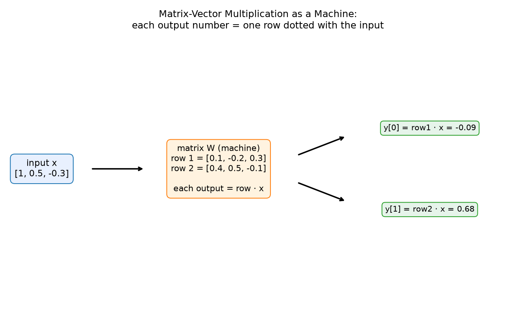
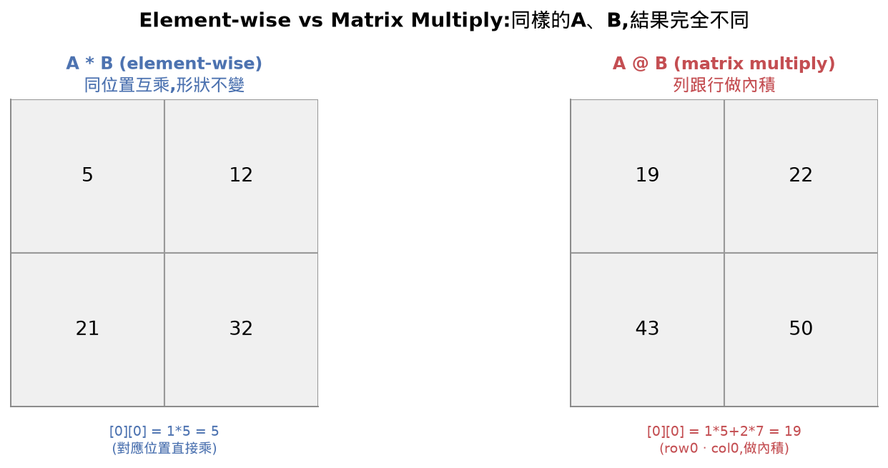
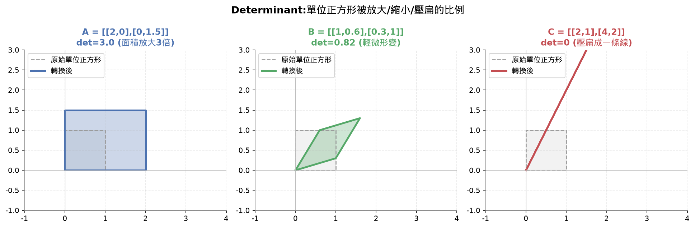
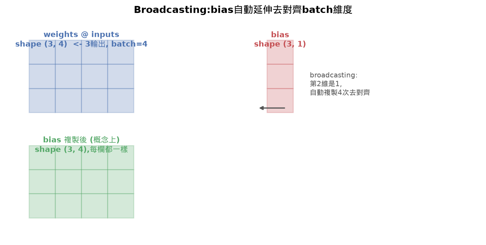
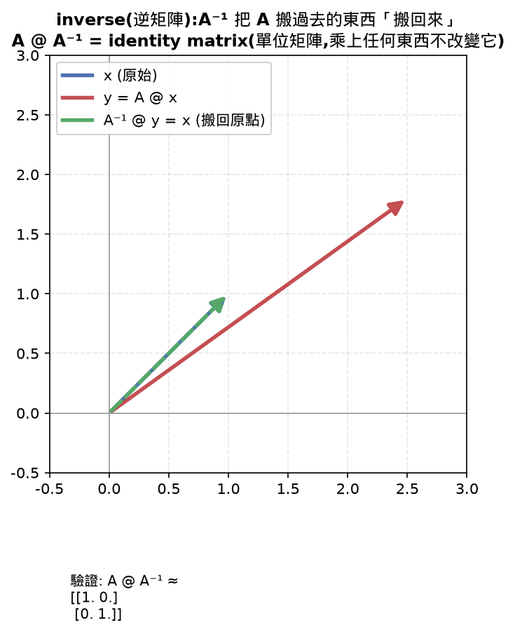
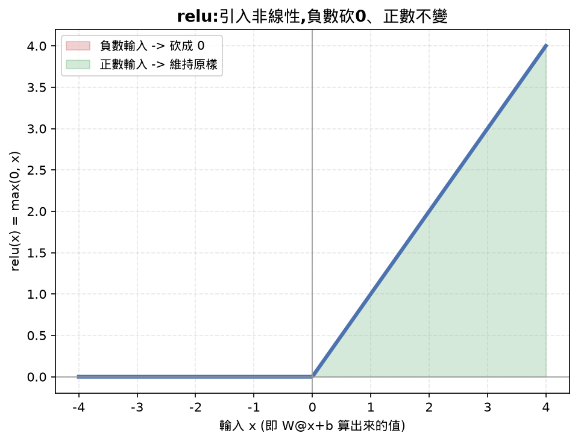

# Lesson 2 語法筆記:Vectors, Matrices & Operations

## 目錄

- [Learning Objectives 打勾清單](#learning-objectives-打勾清單)
- [30秒抓重點(複習只看這裡就能想起整堂課在幹嘛)](#30秒抓重點複習只看這裡就能想起整堂課在幹嘛)
- [公式速查表](#公式速查表)
- [這堂課的名詞總表](#這堂課的名詞總表)
  - [element-wise multiply vs matrix multiply 對照](#element-wise-multiply-vs-matrix-multiply-對照)
- [這堂課我卡住/搞混的地方(完整問答記錄,給複習用)](#這堂課我卡住搞混的地方完整問答記錄給複習用)
  - [Broadcasting 一開始不知道實際會用在哪裡](#broadcasting-一開始不知道實際會用在哪裡)
- [我自己手打的部分](#我自己手打的部分)
- [這堂課用的新教學策略](#這堂課用的新教學策略)
- [今天花的時間](#今天花的時間)
- [課程結尾理解確認題(先自己想過一遍,再點開看答案,這樣才是真的在複習)](#課程結尾理解確認題先自己想過一遍再點開看答案這樣才是真的在複習)
- [今天評分](#今天評分)
- [這堂課的總結](#這堂課的總結)
- [面試向問題](#面試向問題)
- [List comprehension 複習:matmul 那段對照 C++ 三層迴圈](#list-comprehension-複習matmul-那段對照-c-三層迴圈)
- [NumPy 是什麼、跟純 Python 的差別](#numpy-是什麼跟純-python-的差別)
- [Broadcasting 實際運作的時機](#broadcasting-實際運作的時機)
- [np.maximum(0, x)](#npmaximum0-x)
- [raise:主動丟出錯誤](#raise主動丟出錯誤)
- [Shape tuple (m, n) 的判讀方式複習](#shape-tuple-m-n-的判讀方式複習)
- [f-string 複習](#f-string-複習)
- [`@staticmethod` 跟 `@property`：兩種不需要「先有物件」或「不用加括號」的方法](#staticmethod-跟-property兩種不需要先有物件或不用加括號的方法)
- [三元運算式(ternary expression)：`X if 條件 else Y`](#三元運算式ternary-expressionx-if-條件-else-y)

## Learning Objectives 打勾清單

- [ ] Build a Matrix class with element-wise operations, matrix multiplication, transpose, determinant, and inverse — ⚠️ 沒有手刻。這是這堂課開始套用新的 Top-Down 流程後第一個刻意跳過手刻的項目,不是教學疏漏:matmul/transpose/determinant/inverse 全部程式碼都看過、逐段講解過邏輯(matmul 那段還用 C++ 三層迴圈對照過),口頭能解釋每個方法在幹嘛,但沒有自己手打進 practice.py。完整程式碼在 `reference.py`。
- [x] Distinguish element-wise multiplication from matrix multiplication and explain when each applies — 測驗第1題答對,形狀規則、內積 vs 對應相乘的差異都講清楚了
- [x] Implement a single dense neural network layer (`relu(W @ x + b)`) using only the from-scratch Matrix class — 做到了,但用的是 NumPy 版本(`weights @ inputs + bias` 再套 `np.maximum(0,...)`),不是原本要求的「只用手刻 Matrix class」。這是 Top-Down 新流程下刻意的調整:核心邏輯這行親手打、親自驗證過 shape 跟數值都對,但工具用 NumPy 不是從零刻的 Matrix class。
- [x] Explain broadcasting rules and how bias addition works in neural network frameworks — 一開始不確定 broadcasting 實際用在哪裡(選對答案但講不出應用場景),後來用「一次丟一整批資料進去,bias 要延伸套用到每一筆」的例子講清楚,也親手驗證過純 Python list 的 `+`(是串接)跟 numpy array 的 `+`(是逐項相加)完全是兩回事

⚠️ 尚未完成:Matrix class 完整手刻(matmul/transpose/determinant/inverse),依新的 Top-Down 策略是刻意不做,不是忘記教。

## 30秒抓重點(複習只看這裡就能想起整堂課在幹嘛)

- 矩陣可以想成一台機器:吃進n維向量,吐出m維向量,每個輸出數字是輸入向量跟矩陣某一列做內積
- element-wise multiply是「位置對位置」相乘,形狀不變;matrix multiply是「列對行做內積」,`(m,n)@(n,p)=(m,p)`
- determinant代表矩陣把空間放大/縮小幾倍,0就是空間被壓扁、資訊遺失;inverse只有det≠0才存在,因為壓扁後沒有回頭路
- `relu(W @ x + b)`是神經網路一層的樣子:W決定輸入怎麼組合、b是偏移量、relu把負數砍成0引入非線性
- broadcasting只在兩邊形狀不一樣但能延伸對齊時發生(某維度是1或不存在就複製延伸對齊),典型場景是batch資料加bias
- 這堂課開始改用Top-Down策略,大部分Matrix class程式碼是看懂邏輯過關,沒有全部手刻

## 公式速查表

| 用途 | 公式 |
|---|---|
| 矩陣乘法形狀規則 | `(m,n) @ (n,p) = (m,p)`,中間的n必須對上 |
| determinant與inverse | det=0代表空間壓扁資訊遺失;inverse存在條件是det≠0 |
| 神經網路一層 | `output = relu(W @ x + b)` |
| relu | `max(0, x)`,負數變0、正數不變 |
| broadcasting觸發 | 某個維度是1(或缺少)時,自動複製延伸去對齊另一邊 |

## 這堂課的名詞總表

| 英文 | 中文 | 一句話定義 |
|---|---|---|
| Vector | 向量 | 一串有順序的數字,在AI裡可以想成高維空間裡的一個點 |
| Matrix | 矩陣 (m×n) | 一台機器:吃n維向量,吐出m維向量,每一列對應輸出的其中一個數字,是「輸入向量」跟「這一列」做內積算出來的 |
| Element-wise Multiply | 逐項相乘 | 兩個形狀完全一樣的東西,同位置的數字互乘,numpy用`*`,結果形狀不變 |
| Matrix Multiply | 矩陣乘法 | 一列跟一行做內積,不是同位置相乘,numpy用`@`,形狀規則(m,n)@(n,p)=(m,p),中間的n要對上 |
| Transpose | 轉置 | 把矩陣的行跟列互換,(m,n)轉置後變成(n,m),原本[i][j]轉置後在[j][i] |
| Determinant | 行列式 | 只有正方形矩陣才有,代表這個矩陣把空間放大/縮小幾倍;是0代表空間被壓扁、資訊永久遺失、沒辦法逆推 |
| Inverse | 逆矩陣 | 「反著做」的矩陣,A把X搬到Y、A⁻¹把Y搬回X,只有determinant≠0才存在,因為壓扁遺失的資訊沒有回頭路 |
| Identity Matrix | 單位矩陣 | 對角線是1、其餘是0,乘上任何東西都不改變它,是矩陣世界的「1」,A乘上A⁻¹結果就是它 |
| ReLU Layer (`relu(W @ x + b)`) | 神經網路一層 | 深度學習裡最常重複的一行,W決定輸入怎麼組合、b是每個輸出的偏移量、relu把負數砍成0;輸出維度由W的形狀決定 |
| Broadcasting | 廣播 | 形狀不完全一樣的陣列做運算時,numpy自動把size是1的維度複製延伸去對齊另一邊,對不齊才報錯,常見於一次丟一整批(batch)資料時bias自動複製batch次 |









![transpose:行列互換,A[i][j]轉置後變成A.T[j][i]](images/transpose.png)





### element-wise multiply vs matrix multiply 對照

這兩個是這堂課最容易搞混的一對,名字都有「multiply」,numpy裡差一個符號,但邏輯完全不同,放在一起對照:

| | element-wise multiply | matrix multiply |
|---|---|---|
| 怎麼算 | 同位置的數字互相乘 | 一列跟一行做內積(對應位置相乘再加總) |
| numpy運算子 | `*` | `@` |
| 形狀要求 | 兩邊形狀要完全一樣(或能broadcast) | 左邊的行數要等於右邊的列數 |
| 結果形狀 | 跟原本一樣 | `(m,n) @ (n,p) = (m,p)` |
| 什麼時候用 | 兩個同形狀的東西要逐項對應處理,例如套用mask、element-wise的激活函數輸出 | 把資料從一個空間映射到另一個空間,例如`W @ x`算神經網路一層的輸出 |

#### 常見地雷

> 容易誤會成:兩個矩陣用`*`相乘,結果跟數學課本寫的「矩陣乘法」是同一件事。
>
> 實際上:numpy的`*`是element-wise multiply(逐項相乘,形狀不變),真正的矩陣乘法要用`@`,兩者形狀規則、算法完全不同,混用會讓程式碼「跑得動但答案錯」——如果剛好兩個矩陣形狀相同,`*`不會報錯,只是默默算出完全不對的數字。

## 這堂課我卡住/搞混的地方(完整問答記錄,給複習用)

### Broadcasting 一開始不知道實際會用在哪裡

Learning Objectives 打勾清單裡記錄的原話是:選擇題選對了(知道規則),但講不出「這個東西實際上用在什麼場景」——換句話說,規則背起來了,但沒有連到「為什麼要有這個功能存在」。

**先重新確認規則本身:** broadcasting 只有在兩個陣列形狀「不一樣、但可以延伸對齊」時才會發生。如果兩邊形狀本來就完全相同,就是直接逐項運算,沒有 broadcasting 這回事——這句話當時容易被跳過,但其實是判斷「這裡到底有沒有用到broadcasting」最關鍵的第一步:先看兩邊形狀是不是本來就一樣。

**判斷準則(逐維度比對):** 兩個陣列做運算時,從最後一個維度開始比對,如果某個維度其中一邊是 1(或那個維度根本不存在),numpy 就會把那個維度自動「複製延伸」去對齊另一邊;兩邊維度數字不相等又都不是1,就直接報錯,不會硬猜。

**具體場景是怎麼被想清楚的:** 一開始只知道「形狀不一樣、可以延伸對齊」這句抽象規則,套用不到實際案例上。後來換成「一次丟一整批(batch)資料進神經網路」這個具體情境才通:

假設這一層神經網路輸出2個數字(2個神經元),`bias` 天生就是幫「這2個輸出各自」固定加的偏移量,形狀是 `(2, 1)`,例如 `bias = [[0.1], [0.2]]`。

- **沒有觸發 broadcasting 的情況(一次只丟1筆資料):** `weights @ inputs` 算出來的結果形狀是 `(2, 1)`,跟 `bias` 的形狀 `(2, 1)` 完全一樣,直接逐項相加,沒有 broadcasting,`(2,1)+(2,1)=(2,1)`,每個位置各自加自己的偏移量。
- **觸發 broadcasting 的情況(一次丟5筆資料,batch=5):** `inputs` 這時候形狀是 `(3, 5)`(3個輸入特徵、橫著排5筆樣本),`weights @ inputs` 算出來的結果形狀變成 `(2, 5)`——但 `bias` 還是原來的 `(2, 1)`,形狀對不上。這時候 numpy 的規則生效:`bias` 的第二個維度是 1,跟另一邊的 5 對不齊但符合「其中一邊是1」的條件,所以 numpy 自動把 `bias` 那一欄複製 5 次,變成等效於 `[[0.1,0.1,0.1,0.1,0.1], [0.2,0.2,0.2,0.2,0.2]]` 再跟 `(2,5)` 逐項相加。結果就是:5筆資料裡,每一筆各自的第1個輸出都加上0.1、每一筆的第2個輸出都加上0.2——**bias不用手動幫每一筆資料各複製一份,broadcasting自動幫忙做掉這件事。**

**回頭確認「為什麼要有這個功能」:** 如果沒有 broadcasting,寫程式的人必須自己手動把 `bias` 複製成跟 batch 一樣寬的矩陣(`np.tile(bias, (1, 5))`)才能相加,batch大小換了就要重新複製一次,很麻煩也浪費記憶體(真的存出一份5倍大的重複資料)。Broadcasting 讓 numpy 在「邏輯上」把 bias 當成已經延伸過的樣子去計算,但不會真的在記憶體裡把資料複製出來,省下空間也省下手動維護的麻煩——這就是這個功能存在的實際理由,不是憑空的語法規則。

**額外驗證過的對照(純 Python list vs numpy array 的 `+` 完全是兩件事):**
```python
[1, 2] + [3, 4]                        # 純 Python list 的 +:串接 → [1, 2, 3, 4]
np.array([1, 2]) + np.array([3, 4])    # numpy array 的 +:逐項相加 → [4, 6]
```
這兩者用的是完全不同的 `+` 實作(list 的 `+` 是串接、numpy array 的 `+` 是數學上的逐項加法,broadcasting規則只套用在後者身上),親手驗證過兩邊行為確實不同,不是同一套運算子被兩種資料結構共用。

## 我自己手打的部分

這堂課依 Top-Down 策略,大部分程式碼是看過、逐段講解、口頭能解釋邏輯,不是手打驗證的。真正自己手打並驗證過的,只有 `numpy_version.py` 裡這一行核心邏輯:

```python
output = np.maximum(0, weights @ inputs + bias)
```

其餘的 import、inputs/weights/bias 的建立、print 陳述式,是先幫忙寫好的樣板碼。

**回頭補記(2026-09-07):** `matmul` 這個方法當時有真的逐行對照 C++ 三層迴圈拆解過(從最內層 `for k` 的內積累加,到中層 `for j`、外層 `for i`,順序完全對應),是真的看懂逐行邏輯,不只是「口頭能解釋」的層級,所以事後補進了 `practice.py`(連同讓它能跑的最小 `Matrix.__init__`)。`transpose`/`determinant`/`inverse` 這三個維持原判斷,只有整體邏輯講解過、沒有逐行拆解,所以不補,完整版留在 `reference.py`。

## 這堂課用的新教學策略

從這堂課開始,Phase 1(純數學章節)改成 **Top-Down 模式**:核心直覺、幾何意義、shape 規則要懂,但不用每個 method 都手刻;真正的模型架構本體章節(Autograd、Neural Network、Transformer、Attention)才會回到全部手刻。這堂課手打的只有一行核心邏輯(`output = np.maximum(0, weights @ inputs + bias)`),其他 Matrix class 的程式碼都是「看過、講過邏輯、能解釋」的方式教完。

## 今天花的時間

這堂課總共專注 2:16:30,其中 AI 相關部分就是這 2:16:30(整段都算)。比 Lesson 1 的 6:35:45 快非常多,主要是 Top-Down 策略省下大量手刻時間,加上環境設定的一次性成本這堂課不用再付。(課程建議時間:約60分鐘,實際花費是建議時間的兩倍多)

## 課程結尾理解確認題(先自己想過一遍,再點開看答案,這樣才是真的在複習)

<details>
<summary><b>Q1：element-wise multiplication(逐元素相乘)跟 matrix multiplication(矩陣乘法)差在哪裡?各自對形狀(shape)有什麼要求?</b></summary>

答案：element-wise multiplication 要求兩個陣列的形狀完全一樣,運算方式是「同一個位置的數字互相乘」,結果的形狀跟原本一模一樣,numpy 裡用 `*`。matrix multiplication 則完全是另一套邏輯：不是同位置相乘,而是「左邊矩陣的一列」跟「右邊矩陣的一行」做內積,numpy 裡用 `@`。形狀規則是 `(m,n) @ (n,p) = (m,p)`——左邊矩陣的「行數」必須跟右邊矩陣的「列數」對上(中間的 n 要相等),對不上就無法運算;結果的形狀是左邊的列數配右邊的行數。簡單說：element-wise 是「位置對位置」的運算,shape 不變;matrix multiply 是「列對行做內積」的運算,shape 通常會變。

</details>

<details>
<summary><b>Q2：`relu(W @ x + b)` 這一行代表神經網路的一層,W、b、relu 三個部分各自扮演什麼角色?</b></summary>

答案：`W`(權重矩陣)決定輸入的各個數字要怎麼被加權組合——W 的形狀是 `(輸出維度, 輸入維度)`,`W @ x` 這一步,本質上是矩陣的每一列分別跟輸入向量 x 做一次內積,決定每個輸出數字是「輸入的哪些數字用什麼比例混合而成」。`b`(偏差,bias)是每個輸出各自的固定偏移量,跟輸入無關,讓輸出可以整體往上或往下平移,不被硬性要求「輸入全部是0時輸出也一定是0」。`relu`(激活函數)則是把 `W@x+b` 算出來的結果,逐元素套用 `max(0, x)`——負數全部砍成0、正數維持原樣,作用是引入非線性,如果沒有這一步,不管疊多少層線性的 `W@x+b`,整體效果永遠等於一層線性運算,學不會複雜的規律。輸出向量的維度,由 W 的列數(第一個維度)決定。

</details>

<details>
<summary><b>Q3：broadcasting 最常在什麼情境下被觸發?判斷規則是什麼?</b></summary>

答案：broadcasting 只有在兩個陣列形狀「不一樣、但可以延伸對齊」時才會發生——如果兩邊形狀本來就完全相同,就是直接逐項運算,沒有 broadcasting 這回事。判斷準則是：兩個陣列做運算時,如果某個維度其中一邊是 1(或那個維度根本不存在),numpy 就會把那個維度自動「複製延伸」去對齊另一邊,對不齊(既不相等也不是1)才會直接報錯。實務上最常見的觸發情境是「一次丟一整批(batch)資料進神經網路」：假設 `weights @ inputs` 的結果形狀是 `(輸出維度, batch大小)`,但 `bias` 的形狀是 `(輸出維度, 1)`——這時候做 `weights@inputs + bias`,numpy 會自動把 bias 那一欄複製 batch 次,讓每一筆資料都加到同一組 bias,不需要自己手動把 bias 重複貼成跟 batch 一樣寬的矩陣。

</details>

## 今天評分

| 項目 | 說明 |
|---|---|
| 理解程度 | 8/10,矩陣乘法、shape 規則、element-wise vs matrix multiply、determinant/inverse 的直覺都是真的懂,不是背的 |
| 效率 | 明顯比 Lesson 1 快很多,Top-Down 流程省下大量手刻時間 |
| 完成度 | 核心 4 個 Learning Objectives 裡 3 個做到、1 個依新流程刻意跳過(非疏漏) |

## 這堂課的總結

這堂課把 Lesson 1 的矩陣乘向量,擴展成「矩陣乘矩陣」跟矩陣的其他基本操作。核心比喻是**矩陣是一台機器:吃進 n 維向量,吐出 m 維向量**,理解這個之後,element-wise multiply(同位置相乘)跟 matrix multiply(內積式相乘)的差異、transpose(行列互換)、determinant(空間放大縮小幾倍,0代表壓扁資訊遺失)、inverse(反著做的矩陣,只有det≠0才存在)全部都可以用「這台機器對空間做了什麼」的角度理解,不用死背規則。

這堂課也第一次接觸神經網路一層的樣子:`relu(W @ x + b)`——W決定輸入怎麼組合、b是偏移量、relu把負數砍成0,這一行就是深度學習裡最常重複出現的運算。broadcasting則解釋了「形狀不完全一樣也能運算」背後 numpy 自動延伸對齊的規則,常見於一次丟一整批(batch)資料時。

**這堂課的關鍵公式/規則,複習時直接看這幾條就夠:**

```
矩陣乘法形狀規則:   (m,n) @ (n,p) = (m,p),中間的 n 必須對上
determinant=0:      矩陣把空間壓扁,資訊遺失,沒有逆矩陣
inverse存在條件:     determinant ≠ 0
神經網路一層:        output = relu(W @ x + b)
relu:               max(0, x),負數變0,正數不變
broadcasting觸發:    某個維度是1(或缺少),numpy自動複製延伸去對齊另一邊
```

這堂課開始正式套用 Top-Down 策略:大部分程式碼看懂邏輯就過關,不用每個都手刻,速度比 Lesson 1 快很多,理解深度沒有打折。

## 面試向問題

<details>
<summary><b>生產環境跑出來的模型輸出全部一樣或出現NaN,你懷疑是不是把matrix multiply跟element-wise multiply搞混了,要怎麼從程式碼快速排查?</b></summary>

先搜尋程式碼裡所有`*`跟`@`出現的地方,確認每一處用的運算子符不符合當初設計的意圖——numpy裡`*`是element-wise multiply(要求兩邊形狀完全一樣或能broadcast,結果形狀不變),`@`才是真正的矩陣乘法(`(m,n)@(n,p)=(m,p)`),兩者混用不會報錯,只是默默算出錯的數字,這正是這種bug難抓的原因。實務排查會先印出每一步中間結果的shape,跟理論上應該是什麼shape對照——例如權重矩陣乘輸入向量後,輸出維度應該等於神經元數量,如果shape對不上,通常代表用錯了運算子或轉置沒做對;也會用一組已知答案、shape簡單、數字好手算的小測資跑一次,人工核對每一步輸出是不是預期值。輸出全部一樣通常代表某一步其實在做element-wise運算,資訊沒有真的跨維度混合(例如weights本該讓每個輸出神經元看到全部輸入,結果變成逐項對應);NaN則常常是shape廣播錯誤或除以零、exp溢位這類數值問題,要往回追是哪一步先出現異常值。

</details>

<details>
<summary><b>為什麼神經網路一層要寫成`relu(W@x+b)`而不是只留`W@x`?拿掉relu會發生什麼事?</b></summary>

relu存在的原因是引入非線性。如果拿掉relu只留`W@x`(或`W@x+b`),不管疊多少層線性運算,例如`W2@(W1@x+b1)+b2`,經過矩陣乘法展開後,整體效果永遠等價於一個單一的線性變換(可以合併成一個新的`W'@x+b'`)——不管疊幾層,模型能表達的函數空間跟只有一層完全一樣,學不會任何彎曲、非線性的規律(例如XOR這種沒辦法用一條直線分開的問題)。relu在這裡的角色是逐元素把負數砍成0、正數維持原樣,這個「砍」的動作本身是非線性的,讓每一層之間不能再被代數合併掉,整個網路才真正因為疊得更深而擁有更強的表達能力。

</details>

<details>
<summary><b>訓練時一次丟一整個batch的資料進網路,bias是怎麼自動套用到整批資料上的,不用手動複製成batch大小?</b></summary>

靠broadcasting自動處理。`weights@inputs`算出來的結果形狀是`(輸出維度, batch大小)`,而`bias`的形狀是`(輸出維度, 1)`——兩者做`+`的時候,numpy發現第二個維度一邊是batch大小、另一邊是1,符合broadcasting規則(某個維度是1就可以複製延伸去對齊另一邊),就會自動把bias那一欄「邏輯上」複製batch次,讓每一筆資料的輸出都各自加到同一組bias,不需要事先手動用`np.tile`把bias重複貼成batch寬度的矩陣。這個複製只是邏輯上發生,numpy不會真的在記憶體裡存出一份batch倍大的重複資料,所以不管batch多大,都不用額外維護bias該複製幾次,省下記憶體也省下手動維護的麻煩。

</details>

---

(下面不重複講數學/AI概念,只整理「程式語法」本身,之後忘記可以回來查。)

## List comprehension 複習:matmul 那段對照 C++ 三層迴圈

Lesson 1 已經學過 list comprehension 的基本語法,這堂課遇到雙層巢狀的版本,對照 C++ 的三層迴圈矩陣乘法看最快搞懂:

```python
def matmul(self, other):
    return Matrix([
        [
            sum(self.data[i][k] * other.data[k][j] for k in range(self.cols))
            for j in range(other.cols)
        ]
        for i in range(self.rows)
    ])
```

對照的 C++ 版本(這是刷題刷過很多次的三層迴圈矩陣乘法):

```cpp
for (int i = 0; i < rows; i++) {
    for (int j = 0; j < cols_B; j++) {
        int sum = 0;
        for (int k = 0; k < cols_A; k++) {
            sum += A[i][k] * B[k][j];
        }
        result[i][j] = sum;
    }
}
```

讀 list comprehension 的訣竅是**從最裡面往外讀**:

| 層 | list comprehension 部分 | C++ 對應 | 說明 |
|---|---|---|---|
| 最內層 | `self.data[i][k] * other.data[k][j] for k in range(self.cols)` | `for(k...) sum += A[i][k]*B[k][j];` | 外面包 `sum(...)` 就是把這輪迴圈的加總結果收集起來 |
| 中間層 | `for j in range(other.cols)` | `for(j...)` | 對每個 j 重複算一次上面那個內積 |
| 最外層 | `for i in range(self.rows)` | `for(i...)` | 對每個 i 重複算一次 |

三層迴圈,三層 for,順序完全對應,只是 Python 把「宣告空陣列 + append」濃縮成用中括號包起來自動收集結果。

## NumPy 是什麼、跟純 Python 的差別

NumPy 是一個函式庫(library),裡面已經幫你把矩陣/陣列的運算都寫好、還用 C 語言優化過速度。差別最明顯的地方是運算子的行為完全不同:

```python
a = [1, 2, 3]
b = [10, 20, 30]
a + b   # 純 Python list:[1, 2, 3, 10, 20, 30] —— 串接,不是數學加法

import numpy as np
c = np.array([1, 2, 3])
d = np.array([10, 20, 30])
c + d   # numpy array:[11, 22, 33] —— 逐項相加,才是數學加法
```

**這不是 Python 內建的行為,是 numpy 這個函式庫自己重新定義了 `+`、`-`、`*`、`@` 這些運算子在它的 array 型態上該怎麼運作。** 只要 `import numpy as np`,而且操作的是 `np.array(...)` 建出來的東西,這整套行為(包括 broadcasting)就自動生效,不用額外開啟。

## Broadcasting 實際運作的時機

之前搞不清楚 broadcasting 實際用在哪裡,後來釐清:**只有形狀不一樣、又可以「延伸對齊」的情況才會觸發**;形狀本來就一樣的話,直接逐項運算,沒有 broadcasting 這回事。

```python
# 沒有觸發 broadcasting(形狀本來就一樣):
weights @ inputs  # 結果 (2,1)
bias              # 也是 (2,1)
weights @ inputs + bias   # 直接逐項相加

# 有觸發 broadcasting(一次丟一整批資料,batch=5):
weights @ inputs  # inputs 變成 (3,5),結果 (2,5)
bias              # 還是 (2,1)
weights @ inputs + bias   # (2,5) 跟 (2,1) 形狀不一樣,numpy 自動把 bias 那一欄複製5次湊成 (2,5) 再相加
```

判斷準則:兩個陣列做運算時,如果其中一邊某個維度是 1(或缺少這個維度),numpy 就會嘗試把那個維度「複製延伸」去對齊另一邊,對不齊就直接報錯。

## `np.maximum(0, x)`

拿 `x` 裡每一個元素跟 `0` 比,取比較大的那個,逐元素進行。負數會變 0,正數維持原樣,是 relu 這個激活函數最單純的實作方式。跟純 Python 的 `max(0, x)` 不同——`max()` 只能比較兩個單一數字,`np.maximum()` 可以整個陣列一次比完,不用寫迴圈。

## `raise`:主動丟出錯誤

Matrix class 完整版裡出現很多次,例如:

```python
if self.shape != other.shape:
    raise ValueError(f"Cannot add shapes {self.shape} and {other.shape}")
```

`raise` 是主動讓程式停下來、丟出一個錯誤,通常搭配 `if` 用來檢查「這個情況不該發生」——例如兩個矩陣形狀對不上還硬要相加。`ValueError` 是錯誤的種類(這裡代表傳進來的值不對),後面括號裡是錯誤訊息,可以用 f-string 把實際的形狀塞進去,方便除錯時知道到底是哪裡對不上。

跟 C++ 的 `throw` 是同樣的概念:C++ `throw std::invalid_argument("...")`,Python 就是 `raise ValueError("...")`。差別是 Python 內建了一整套錯誤種類可以選(`ValueError`、`TypeError`、`ZeroDivisionError`...),挑最符合情況的那個用,不像 C++ 常常什麼都丟同一種 exception。

`raise` 執行到就會立刻中斷當下的函式(跟 `return` 一樣會離開,但離開的原因是「出錯了」不是「算完了」),如果沒有被 `try/except`接住,程式會直接崩潰並印出錯誤訊息跟發生位置。這堂課還沒教 `try/except`(怎麼接住這個錯誤、不讓程式崩潰),之後遇到再補。

## Shape tuple `(m, n)` 的判讀方式複習

矩陣形狀 `(m, n)` 讀作「m 列、n 行」,矩陣乘法規則 `(m,n) @ (n,p) = (m,p)` 中間的 `n` 要對上。判斷一個向量是「幾維」,就是數這個向量裡總共裝了幾個數字——`(128, 1)` 裝了 128 個數字直立擺放,所以是 128 維,跟橫著寫的 `(1, 128)` 或單純的 `[128個數字]` 是同一件事,只是排列方式不同。

## f-string 複習

```python
print(f"Output shape:{output.shape}")
```

`f"..."` 讓字串裡的 `{}` 可以直接放變數或運算式,執行時自動換成實際值。不加 `f` 的話 `{}` 只是普通文字,不會被替換,需要自己手動用 `+` 拼接字串(比較麻煩)。

## `@staticmethod` 跟 `@property`:兩種不需要「先有物件」或「不用加括號」的方法

```python
@staticmethod
def identity(n):
    return Matrix([[1 if i == j else 0 for j in range(n)] for i in range(n)])

@property
def T(self):
    return self.transpose()
```

`@staticmethod` 放在方法上面,代表這個方法**不需要先有一個物件才能呼叫**,呼叫時也不會自動傳入 `self`。像 `Matrix.identity(3)` 是直接對 class 本身呼叫,不是對某個已經建好的矩陣呼叫,因為建立單位矩陣這件事本來就跟「哪一個現有矩陣」無關,只需要一個數字 n。`Matrix.zeros(...)`、`Matrix.random(...)` 也是同樣道理,都是「造一個新矩陣出來」的工廠方法,不依賴任何既有物件的資料。

`@property` 則相反,是套用在**需要 `self`** 的一般方法上,效果是讓呼叫時可以省略括號,把方法偽裝成一個屬性(資料成員)來用:寫 `A.T` 就會自動執行 `transpose()` 拿到結果,不用寫成 `A.T()`。適合用在「單純算個值回傳,不需要額外參數、也不會有副作用」的方法上,讓呼叫端的語法看起來更自然(轉置本來就常被當成矩陣的一個屬性去想)。

## 三元運算式(ternary expression):`X if 條件 else Y`

```python
[1 if i == j else 0 for j in range(n)]
bracket_l = "|" if 0 < i < self.rows - 1 else ("/" if i == 0 else "\\")
```

Python 把 if/else 判斷式濃縮成一行,可以直接當一個「值」來用(不像一般 `if` 陳述式只能控制流程、不能直接當成運算式的一部分):`值A if 條件 else 值B` 會先判斷條件,條件是 `True` 就整個式子等於 `值A`,是 `False` 就等於 `值B`。`1 if i == j else 0` 讀作「如果 i 等於 j,結果是1,否則是0」,常常搭配 list comprehension 用,像這裡就是在對角線放1、其餘位置放0,建出單位矩陣。也可以疊在一起用(像 `bracket_l` 那行,`else` 後面接的又是另一個三元運算式),疊多層時讀起來要留意優先順序,由右往左依序判斷。

C++對照:直接對應 C++ 的三元運算子 `條件 ? 值A : 值B`(例如 `i == j ? 1 : 0`),語意完全一樣,只是 Python 用 `if`/`else` 兩個關鍵字取代 `?`/`:` 兩個符號,而且順序反過來:C++ 先寫條件,Python 先寫「條件成立時的值」再寫條件。

`@` 開頭這一整類東西叫 decorator(裝飾器),語法上直接寫在 `def` 上面一行,效果是「用某種方式包裝、改變這個方法被呼叫的行為」,`@staticmethod` 改的是「要不要自動傳 self」,`@property` 改的是「呼叫時要不要加括號」,兩個是完全不同的裝飾器,只是剛好都跟「這個方法怎麼被呼叫」有關。

C++對照:`@staticmethod` 等同 C++ class 裡的 `static` method,呼叫方式也很像(`Matrix::identity(3)` vs `Matrix.identity(3)`),都不需要先有物件、也拿不到 `this`/`self`。`@property` 在 C++ 沒有直接對應語法,比較接近手動多寫一個沒有參數的 getter 函式(`Matrix getTranspose() const`),差別是 C++ 呼叫 getter 還是要加括號,Python 用 `@property` 可以讓呼叫端完全不用加括號、當成一般成員變數在用。
