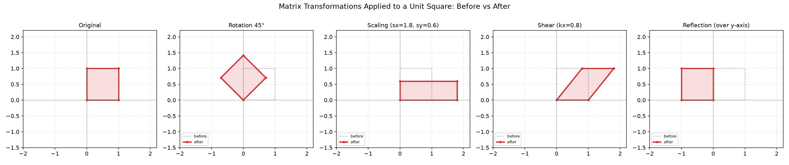
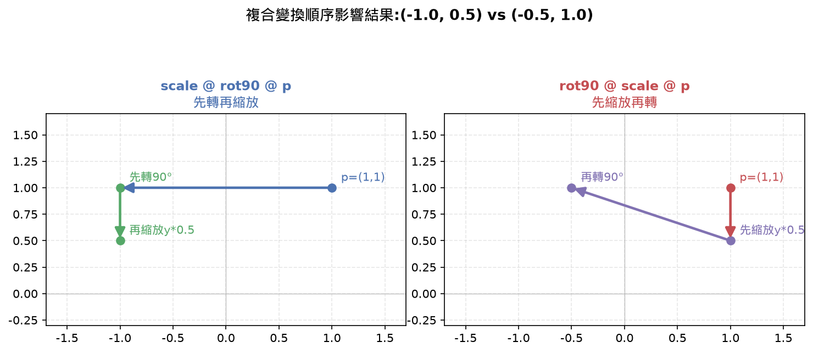
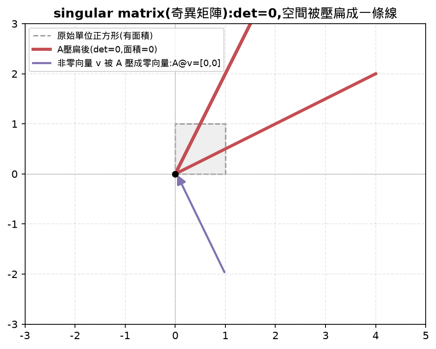
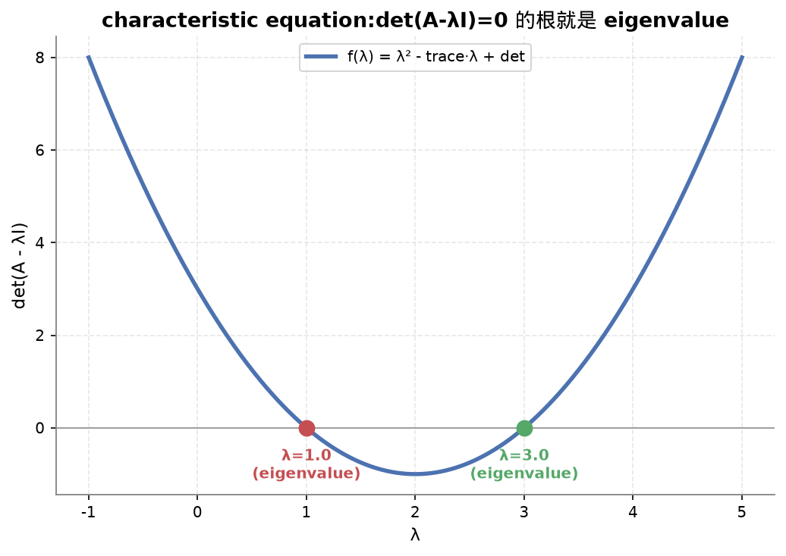
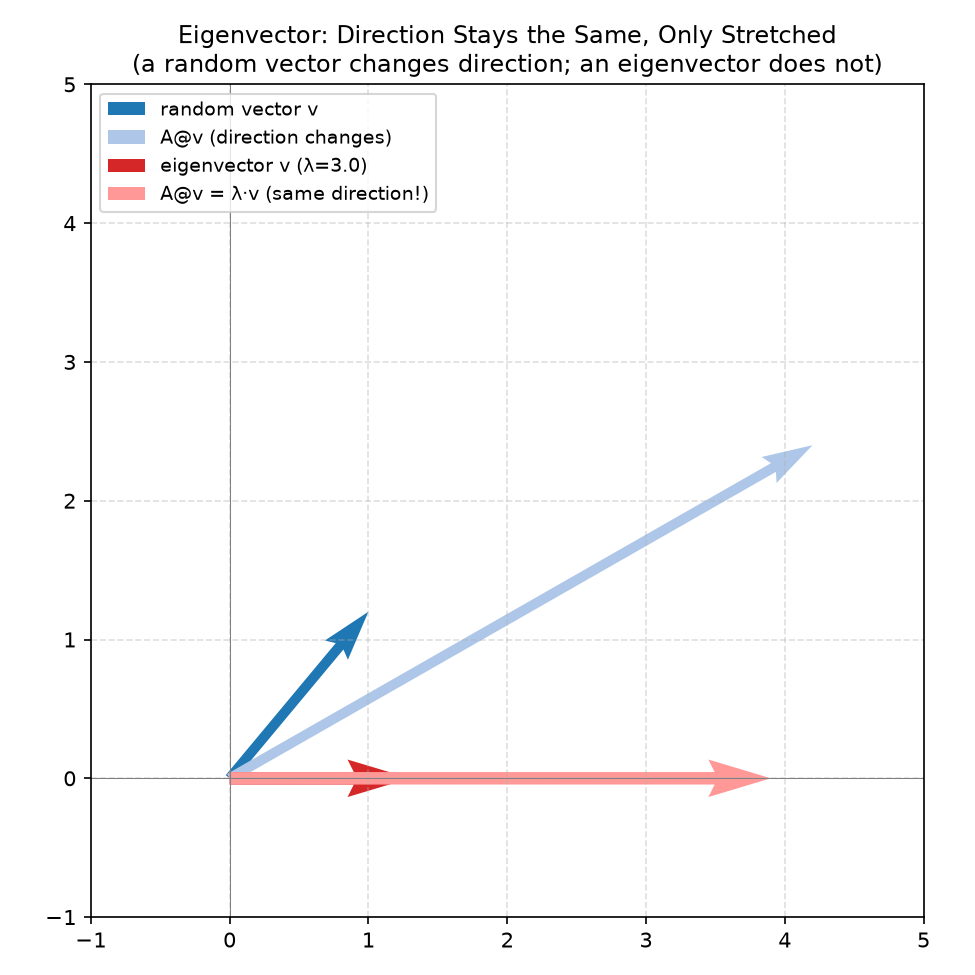
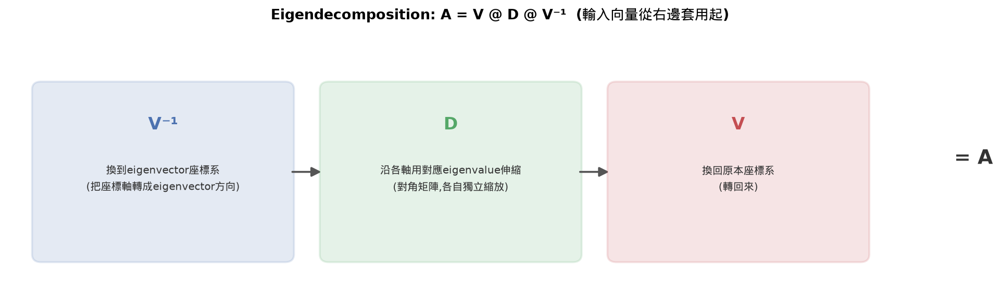
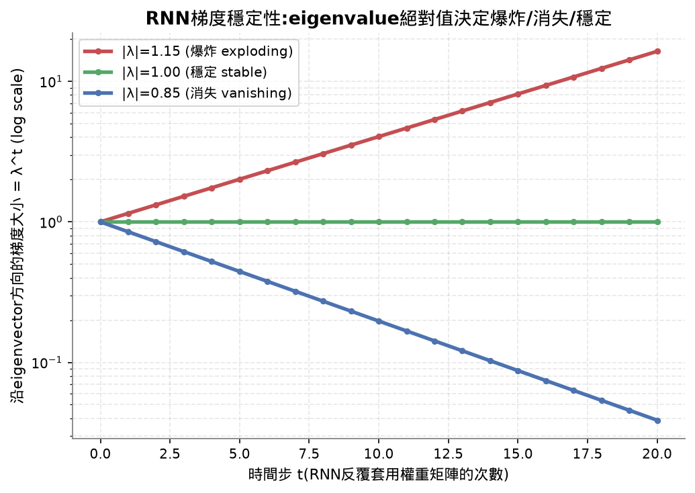
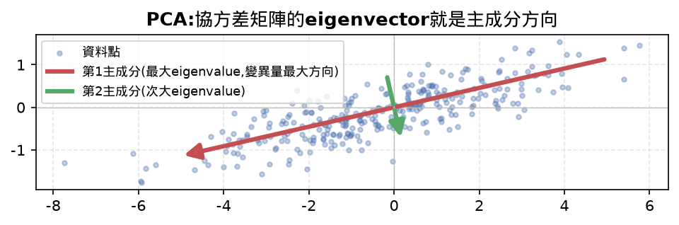

# Lesson 3 筆記:Matrix Transformations

## Learning Objectives 打勾清單

- [~] Construct rotation, scaling, shearing, and reflection matrices and apply them to 2D and 3D points — 2D 的旋轉/縮放/切斜/鏡射矩陣講得很清楚,每一種的直覺、判斷哪個位置放什麼數字都懂了。⚠️ 3D 的版本(繞x/y/z軸旋轉)這堂課完全沒教到,留到 review queue。
- [x] Compose multiple transformations by matrix multiplication and verify that order matters — 講清楚也親眼驗證過:先轉90度再縮放 vs 先縮放再轉90度,結果 (0,0.5) 跟 (0,2) 真的不一樣,親自理解「矩陣乘法從右邊先算」的順序規則。
- [x] Compute eigenvalues and eigenvectors of 2x2 matrices from the characteristic equation — 完整推導過一次(從 Av=λv 到 det(A-λI)=0 再到套用一元二次方程式公式解),親眼看過程式跑出來的 A@v 跟 λ*v 真的一樣。
- [~] Explain why eigenvalues determine PCA directions, RNN stability, and spectral clustering behavior — RNN 穩定性(eigenvalue絕對值>1會爆、<1會消失)講清楚也測驗答對。⚠️ PCA 只提過一句話(eigenvector是主成分方向),沒有真的展開講；spectral clustering 完全沒教,刻意標記成之後才需要懂的東西。

## 30秒抓重點(複習只看這裡就能想起整堂課在幹嘛)

- 旋轉/縮放/切斜/鏡射矩陣都是「對空間做某種固定操作」的說明書,各自固定的數字排法(旋轉用sin/cos、縮放放對角線、鏡射用正負1)
- 複合變換沒有交換律,順序不能換,而且矩陣乘法從右邊先算——先轉再縮放跟先縮放再轉,結果真的不一樣
- eigenvector是矩陣乘上去方向不變、只被拉伸的特殊向量,eigenvalue是拉伸倍數,推導路徑:`Av=λv → (A-λI)v=0 → det(A-λI)=0`
- eigendecomposition `A=V@D@V⁻¹`把矩陣拆成「換到eigenvector座標系→沿各軸伸縮→換回來」
- RNN權重矩陣的eigenvalue絕對值>1會梯度爆炸、<1會梯度消失;PCA則是協方差矩陣最大eigenvalue對應的eigenvector就是變異量最大的方向
- 3D旋轉矩陣跟spectral clustering這堂課沒教,留在review queue

## 公式速查表

| 用途 | 公式 |
|---|---|
| 旋轉矩陣 | `[[cosθ,-sinθ],[sinθ,cosθ]]` |
| 縮放矩陣 | `[[sx,0],[0,sy]]` |
| 切斜矩陣 | `[[1,k],[0,1]]`(切x)或`[[1,0],[k,1]]`(切y) |
| 鏡射矩陣 | `[[-1,0],[0,1]]`(對y軸)或`[[1,0],[0,-1]]`(對x軸) |
| 複合變換 | `B @ A @ 點` = 先套用A、再套用B(從右邊先算) |
| eigenvector定義 | `A @ v = λ * v`(v非零) |
| characteristic方程式 | `det(A - λI) = 0`,2x2展開後是`λ² - trace·λ + det = 0` |
| 解出λ | `λ = (trace ± √(trace² - 4·det)) / 2` |
| eigendecomposition | `A = V @ D @ V⁻¹` |
| 奇異矩陣(singular) | `det(A) = 0`,存在非零向量被壓成零向量 |

## 核心重點整理(這堂課在教什麼)

| 概念 | 是什麼 | 關鍵規則 / 幾何意義 |
|---|---|---|
| 旋轉矩陣 Rotation | `[[cosθ,-sinθ],[sinθ,cosθ]]` | 繞原點轉 θ 角度,距離角度都不變,det恆=1 |
| 縮放矩陣 Scaling | `[[sx,0],[0,sy]]` | 對角線放各軸的縮放倍數,x/y各自獨立,det=sx*sy |
| 切斜矩陣 Shearing | `[[1,k],[0,1]]`(切x)或`[[1,0],[k,1]]`(切y) | k放在哪個位置,誰就被另一軸拖著偏移,面積不變,det恆=1 |
| 鏡射矩陣 Reflection | `[[-1,0],[0,1]]`(對y軸)或`[[1,0],[0,-1]]`(對x軸) | 哪個軸不動,那個位置放1,另一個放-1,det恆=-1 |
| 複合變換 Composition | `B @ A @ 點` = 先套用A、再套用B | 矩陣乘法從右邊先算(對應函式合成f(g(x))先算g);順序不能換,矩陣乘法沒有交換律 |
| Eigenvector(特徵向量) | 矩陣乘上它,方向完全不變、只被拉長縮短的特殊向量 | 定義規定必須非零(零向量代入永遠成立,沒有篩選意義) |
| Eigenvalue(特徵值) | eigenvector被拉長縮短的倍數 | 可以是負數(方向翻面)或複數(旋轉矩陣的情況) |
| Characteristic equation | `det(A - λI) = 0` | 求eigenvalue的方程式,2x2矩陣展開後是 `λ²-trace·λ+det=0` |
| Eigendecomposition | `A = V @ D @ V⁻¹` | 把矩陣拆解成:換到eigenvector座標系→沿各軸用對應eigenvalue伸縮→換回來 |
| Singular matrix(奇異矩陣) | det=0的矩陣 | 存在非零向量被壓成零向量;空間被壓扁、資訊遺失、不可逆 |
| Determinant當面積縮放倍數 | \|det\|=變換把面積/體積放大縮小的倍數 | 旋轉/切斜恆=1(面積不變)、鏡射恆=-1(面積不變但翻面)、縮放=sx*sy |





#### 常見地雷

> 容易誤會成:矩陣乘法跟一般數字乘法一樣,`A@B`跟`B@A`結果應該相同。
>
> 實際上:矩陣乘法沒有交換律,順序不同代表變換套用的先後順序不同——這堂課已經親自驗證過「先轉90度再縮放」跟「先縮放再轉90度」,同一個點會落在不同位置。只有極少數特殊情況(例如兩個矩陣本身有特殊結構、彼此可交換)才會相等,不能預設順序無所謂。



### Eigenvalue 完整推導(用文字講,少符號版)

1. 要找的東西滿足:「矩陣乘上這個向量」等於「這個向量直接乘上一個數字」,寫成 `Av = λv`。
2. 改寫成:「矩陣減掉(這個數字乘上單位矩陣)之後,再乘上這個向量,結果是零向量」:`(A - λI)v = 0`。
3. 要找的 v 規定不能是零向量(零向量代入任何式子都成立,沒有篩選意義,是定義本身排除掉的,不是算出來才發現)。
4. 存在一個非零向量被某個矩陣壓成零向量,代表這個矩陣是奇異矩陣,也就是行列式=0。
5. 於是問題變成:找出讓 `det(A - λI) = 0` 成立的所有 λ,這個方程式叫 characteristic equation。
6. 對 2x2 矩陣展開這個行列式,會變成一個一元二次方程式:`λ² - trace·λ + det = 0`(trace=a+d、det=ad-bc,跟上一課學的行列式公式是同一個)。
7. 套用國高中的一元二次方程式公式解:`λ = (trace ± √(trace²-4·det)) / 2`。

算出兩個 λ 之後,各自代回 `(A-λI)v=0` 就能解出對應的 eigenvector v。







**為什麼「非零向量被壓成零向量」等於「奇異矩陣」:** 如果矩陣可逆(det≠0),代表每個輸出都能唯一還原回輸入,只有零向量乘上它才會得到零向量(因為 `矩陣@0=0` 這條路已經被0佔用,可逆代表不會有第二個輸入走到同一個輸出)。所以只要存在非零向量也被壓成零,就代表這個矩陣不是「每個輸出唯一對應一個輸入」,也就是不可逆、奇異、det=0。

#### 常見地雷

> 容易誤會成:任何一個方陣都一定有實數的eigenvector,而且一定可以做eigendecomposition(`A=V@D@V⁻¹`)。
>
> 實際上:像旋轉矩陣這類矩陣,eigenvalue是複數,沒有對應的「方向完全不變」的實數方向(這堂課的discriminant<0情況就是這樣);就算eigenvalue都是實數,如果某個eigenvalue對應的獨立eigenvector數量不夠(這種矩陣叫defective matrix),也湊不出完整的V去做eigendecomposition。這堂課練習的2x2矩陣多半是條件良好的情況,現實中的矩陣不一定滿足這些前提。

## 我自己手打的部分

這堂課完全是 Top-Down 討論 + 看程式碼跑真實輸出,沒有指定手打的核心邏輯行,`practice.py` 保持空白。整堂課的重點是把 eigenvalue/eigenvector 這個新概念的直覺跟推導搞懂,不是手刻程式。完整程式碼(旋轉/縮放/切斜/鏡射矩陣、eigenvalue求解、驗證邏輯)都在 `reference.py`,已經加好中文註解、跑過確認正確。

## 今天花的時間

計時器顯示 4:49:50,但中途離開處理其他事情約 2 小時 40 分,實際專注時間是 **2:09:50**。比 Lesson 2 的 2:16:30 差不多,這堂課概念密度比較高(eigenvalue是全新概念),花的時間主要在反覆確認推導邏輯跟語法問題上。(課程建議時間:約75分鐘,實際花費接近建議時間的1.7倍)

## 課程結尾理解確認題(先自己想過一遍,再點開看答案,這樣才是真的在複習)

<details>
<summary><b>Q1：什麼是 eigenvector(特徵向量)跟 eigenvalue(特徵值)?從定義式 `Av=λv` 出發,怎麼一步步推導出 characteristic equation `det(A-λI)=0`?</b></summary>

答案：eigenvector 是一個特殊的非零向量,矩陣 A 乘上它之後,方向完全不變,只有長度被拉伸或縮短;拉伸縮短的倍數就是 eigenvalue(可能是負數,代表方向翻面;也可能是複數,例如旋轉矩陣的情況)。推導過程：定義本身是「矩陣乘上這個向量」等於「這個向量直接乘上一個數字」,寫成 `Av=λv`。把等式兩邊移到同一側,改寫成 `(A-λI)v=0`(用單位矩陣 I 乘 λ 是為了讓「數字」跟「矩陣」可以相減)。因為題目規定 v 不能是零向量(零向量代入永遠成立,沒有篩選意義),所以要找的是「存在非零向量,被 `(A-λI)` 這個矩陣壓成零向量」的情況——而一個矩陣能把非零向量壓成零向量,代表這個矩陣是奇異矩陣(singular matrix),也就是行列式(determinant)等於0。於是問題就變成：找出所有讓 `det(A-λI)=0` 成立的 λ,這個方程式就叫 characteristic equation。對 2x2 矩陣展開後會得到一個一元二次方程式 `λ²-trace·λ+det=0`,可以直接套公式解出 λ,再把每個 λ 代回 `(A-λI)v=0` 解出對應的 eigenvector。

</details>

<details>
<summary><b>Q2：為什麼 RNN(循環神經網路)的權重矩陣,eigenvalue 絕對值大於1或小於1,會分別造成梯度爆炸或梯度消失?</b></summary>

答案：RNN 會把同一個權重矩陣反覆套用很多次(每一個時間步都乘一次),這跟 eigendecomposition(`A = V @ D @ V⁻¹`)的概念直接相關——如果沿著 eigenvector 的方向去看,矩陣反覆相乘的效果,等同於把 eigenvalue 反覆相乘。如果某個 eigenvalue 的絕對值大於1,重複乘上自己 t 次(對應 t 個時間步)會讓數值指數成長,沿著這個方向的梯度會越滾越大,最終爆炸到數值溢位,這就是梯度爆炸(exploding gradient)。反過來,如果 eigenvalue 絕對值小於1,重複相乘會讓數值指數縮小,越乘越接近0,沿著這個方向傳遞的梯度會消失不見,模型學不到「久遠之前」的資訊,這就是梯度消失(vanishing gradient)。只有 eigenvalue 絕對值剛好等於或接近1,重複相乘的結果才會保持穩定,不爆炸也不消失,這也是為什麼 LSTM/GRU 等設計會特別去控制這個機制。



</details>

<details>
<summary><b>Q3：PCA(主成分分析,Principal Component Analysis)裡,為什麼協方差矩陣最大的 eigenvalue 對應的 eigenvector,就是資料變異量(variance)最大的方向?</b></summary>

答案：PCA 要找的是「資料點分布最開、資訊量最豐富」的方向——把高維資料投影到這個方向上時,資料點彼此之間的差異保留得最多。協方差矩陣(covariance matrix)描述的正是資料在各個方向上如何一起變動(包含每個維度自己的變異數,以及維度之間的共變異數)。eigenvector 的定義是「矩陣作用在它身上時,方向不會被扭轉,只會被拉伸」——套用在協方差矩陣上,eigenvector 就是資料「自然分散」的那幾個特殊方向(不會因為套用協方差結構而被轉向其他方向),而對應的 eigenvalue,量的正是資料沿著這個方向的變異量有多大(eigenvalue 越大,代表資料沿著這個方向散得越開)。因此把所有 eigenvalue 由大到小排序,最大的那個對應的 eigenvector,就是「資料變異量最大的方向」,也就是 PCA 選出的第一個主成分(principal component);把資料投影到前幾個最大 eigenvalue 對應的 eigenvector 上,就能用更少的維度保留住資料裡大部分的資訊量。



</details>

## 今天評分

| 項目 | 說明 |
|---|---|
| 理解程度 | 8/10,eigenvalue/eigenvector 的核心直覺(特殊方向、方向不變只拉伸)、characteristic equation 的推導、複合變換順序規則,都是真的懂,能自己用一句話講出來 |
| 效率 | 這堂課中間卡在 Python 語法細節(解構賦值、函式多重回傳值)卡了一段時間,後來決定跳過逐行拆語法、只看懂邏輯,效率就回升了 |
| 完成度 | 核心 4 個 Learning Objectives 裡,2 個完全做到、2 個部分做到(3D 版本、PCA/spectral clustering 應用沒深入) |

## 這堂課的總結

這堂課先講矩陣的「幾何直覺」:旋轉、縮放、切斜、鏡射,這四種矩陣其實就是「對空間做某種固定操作」的說明書,每一種都有各自固定的數字排法(旋轉用sin/cos、縮放放對角線、切斜放偏移量、鏡射用正負1)。複合變換(把多個矩陣疊起來用)最重要的一課是:矩陣乘法沒有交換律,順序不能換,而且運算順序是從右邊先算——這件事親眼驗證過(先轉再縮放跟先縮放再轉,結果真的不一樣)。

這堂課真正的核心是 eigenvalue(特徵值)跟 eigenvector(特徵向量):在所有被矩陣變換的向量裡,存在幾個特殊方向,沿著這些方向的向量只會被拉長縮短、方向完全不變。找出這些特殊方向跟拉伸倍數的整套推導(`Av=λv → (A-λI)v=0 → det(A-λI)=0 → 一元二次方程式`),親手走過一次而且看程式碼驗證過答案是對的。Eigendecomposition(`A = V @ D @ V⁻¹`)則是把矩陣拆解成「换到eigenvector座標系→沿各軸伸縮→换回來」,這個概念後面 PCA、RNN穩定性分析都會用到。

3D旋轉矩陣跟PCA/spectral clustering的實際應用這堂課沒有深入,留在 review queue,不影響核心 eigenvalue/eigenvector 直覺的紮實程度。

**這堂課的關鍵公式,複習時直接看這幾條就夠:**

```
旋轉矩陣:            [[cosθ,-sinθ],[sinθ,cosθ]]
縮放矩陣:            [[sx,0],[0,sy]]
複合變換:            B @ A @ 點 = 先套用A、再套用B(從右邊先算)
eigenvector定義:     A @ v = λ * v(v非零)
characteristic方程式: det(A - λI) = 0,展開後(2x2)是 λ² - trace·λ + det = 0
解出λ:               λ = (trace ± √(trace² - 4·det)) / 2
eigendecomposition:  A = V @ D @ V⁻¹
奇異矩陣(singular):   det(A) = 0,存在非零向量被壓成零向量
```

## 面試向問題

- 為什麼RNN訓練久了容易梯度爆炸或梯度消失?這跟權重矩陣的eigenvalue有什麼關係?(對應「RNN梯度穩定性」那段)
- 對同一份資料先做旋轉、再做縮放,跟先縮放、再旋轉,結果會不會一樣?為什麼?(對應「常見地雷」那段:矩陣乘法沒有交換律)
- PCA為什麼要挑協方差矩陣最大eigenvalue對應的eigenvector當作第一主成分?(對應「PCA」那段)
- 不是每個方陣都能做eigendecomposition,這種情況實務上什麼時候會踩到?(對應「常見地雷」那段:defective matrix)

---

(下面不重複講數學/AI概念,只整理「程式語法」本身,之後忘記可以回來查。)

## 解構賦值(unpacking)複習

```python
a, b = matrix[0]
c, d = matrix[1]
```

右邊如果是一個裝了固定數量東西的 list/tuple,左邊可以直接用對應數量的變數名字、逗號隔開,一次把裡面的東西各自取出來存起來。等同分開寫 `a = matrix[0][0]`、`b = matrix[0][1]`,只是濃縮成一行。

對照 C++:類似 C++17 的結構化綁定 `auto [a, b] = matrix[0];`,或舊寫法用 `std::tie(a, b) = ...`,概念是把一個容器一次拆開存進多個變數。

## 函式回傳多個值

```python
def eigenvalues_2x2(matrix):
    ...
    return ((trace + sqrt_disc) / 2, (trace - sqrt_disc) / 2)

vals = eigenvalues_2x2(A)   # vals 是一個 tuple,裝了兩個 eigenvalue
```

```python
eigenvalues, eigenvectors = np.linalg.eig(A)   # 一次接住兩個獨立回傳值
```

Python 的 `return X, Y` 本質上是回傳一個 tuple(用逗號隔開兩個東西,自動包成一個容器)。呼叫的地方可以選擇:
- 只用一個變數接住整個 tuple(像 `vals = ...`,之後用 `vals[0]`、`vals[1]` 取值)
- 用多個變數名字直接解構接住(像 `eigenvalues, eigenvectors = ...`,兩邊各自對應一個東西)

對照 C++:C++ 要嘛包一個 struct/`std::pair`當回傳型別,要嘛用參考/指標當輸出參數;Python 不用額外定義型別,`return a, b` 就能一次回傳多個東西,呼叫端要不要拆開接,自己選。

## `complex()`:複數

```python
if discriminant < 0:
    real = trace / 2
    imag = (-discriminant) ** 0.5 / 2
    return (complex(real, imag), complex(real, -imag))
```

判別式是負的,代表這個一元二次方程式沒有實數解,eigenvalue 是複數(旋轉矩陣就屬於這種情況,因為旋轉矩陣把向量都轉向了,沒有真正「方向不變」的實數方向)。`complex(實部, 虛部)` 是 Python 內建的複數型態,這堂課沒深入用到,先知道「discriminant<0時eigenvalue會是複數」這個對應關係就好。

## `np.diag()`

```python
D = np.diag(eigenvalues)
```

把一串數字(這裡是 `[3.0, 1.0]`)放到一個新矩陣的對角線上,其餘位置補0,建出對角矩陣。是 eigendecomposition `A = V @ D @ V⁻¹` 裡 D 的建立方式。

## `np.linalg.eig()` / `np.linalg.inv()`

```python
eigenvalues, eigenvectors = np.linalg.eig(A)   # 一行算出所有eigenvalue+eigenvector
V_inv = np.linalg.inv(V)                        # 算逆矩陣
```

這兩個是 NumPy 現成的線性代數函式,把手動推導、手寫程式驗證的整套流程包成一行呼叫。`eigenvectors` 回傳的矩陣裡,**每一行(column)是一個eigenvector**,不是每一列,這跟平常「一列是一筆資料」的直覺相反,用的時候要注意。
