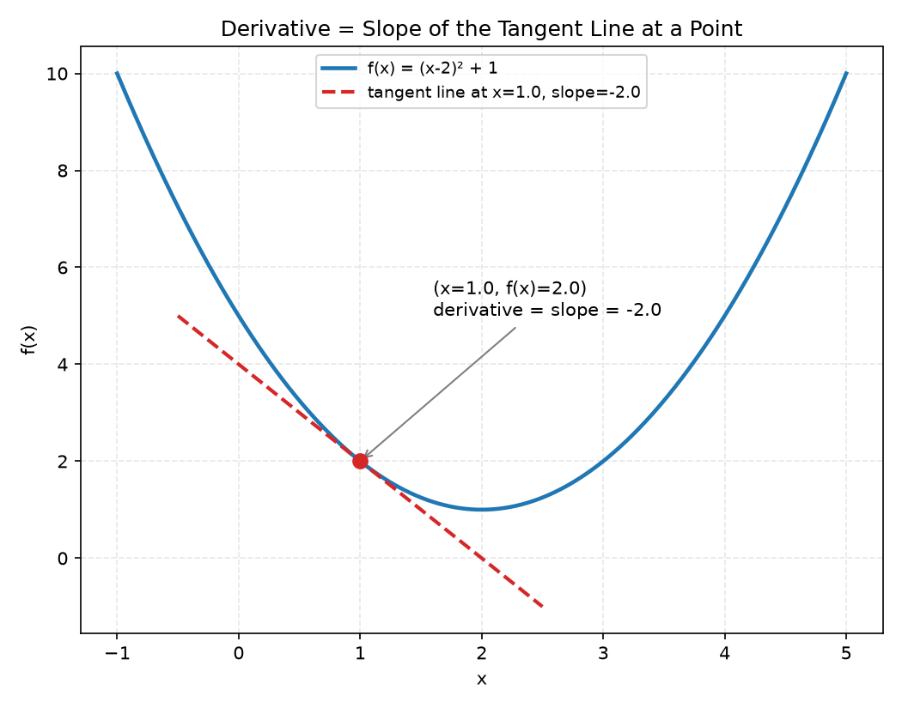
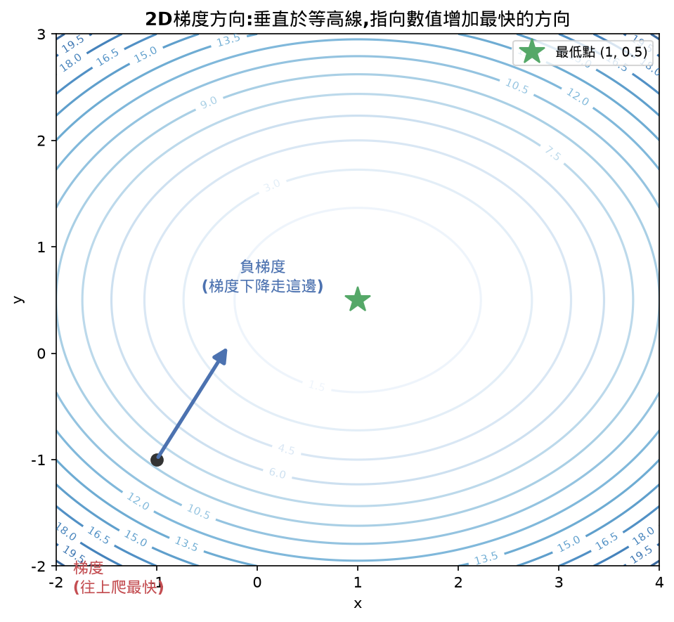
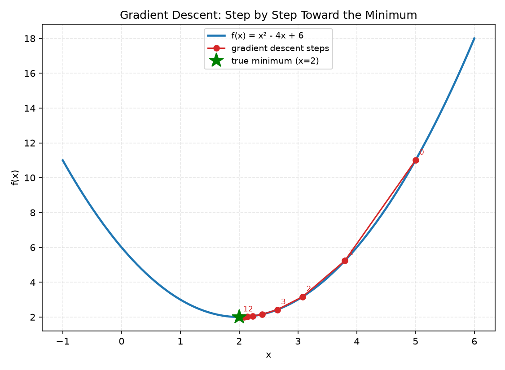
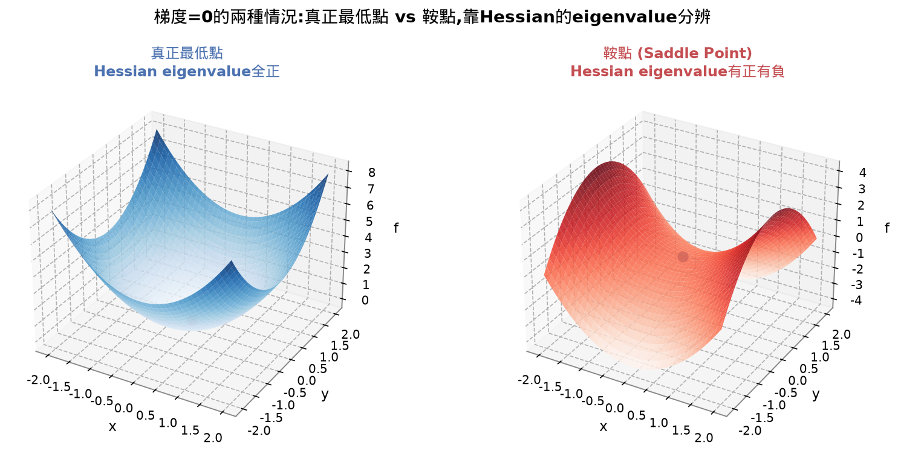
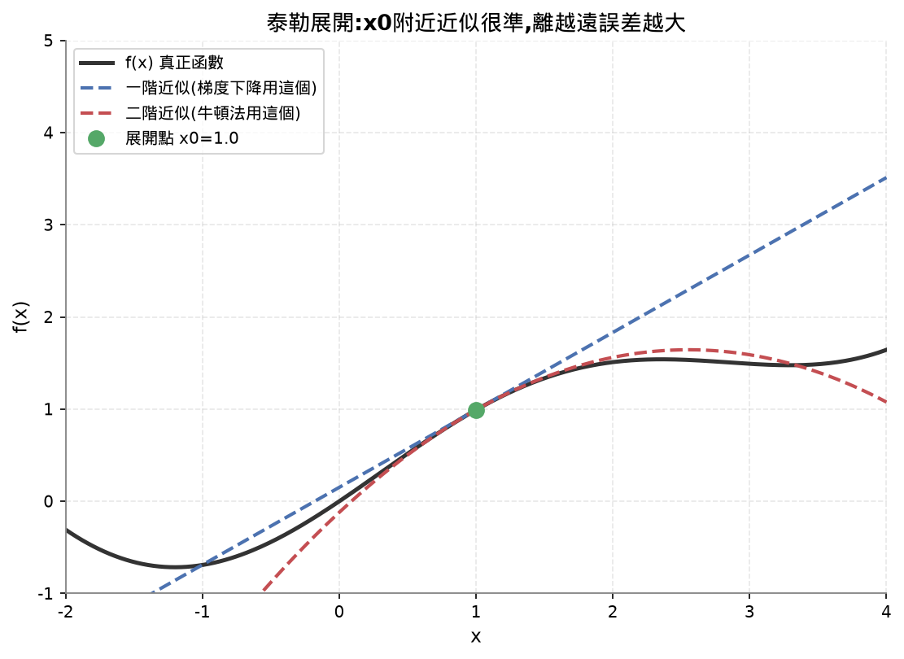
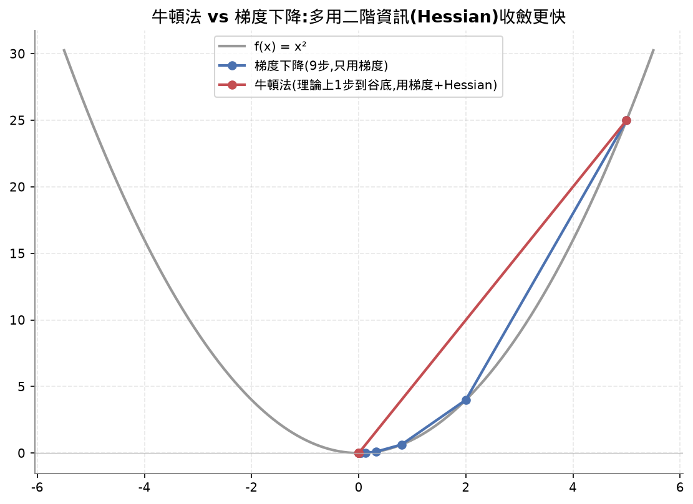
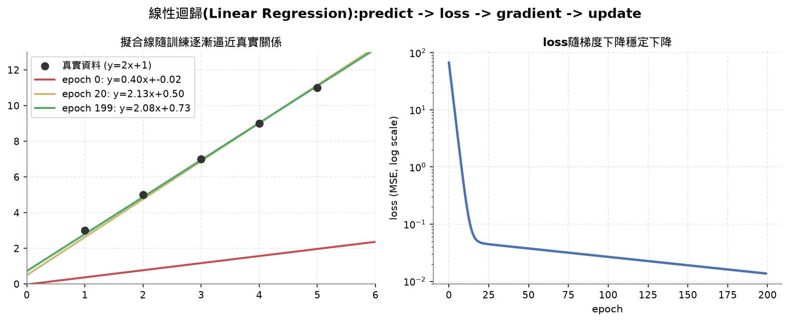
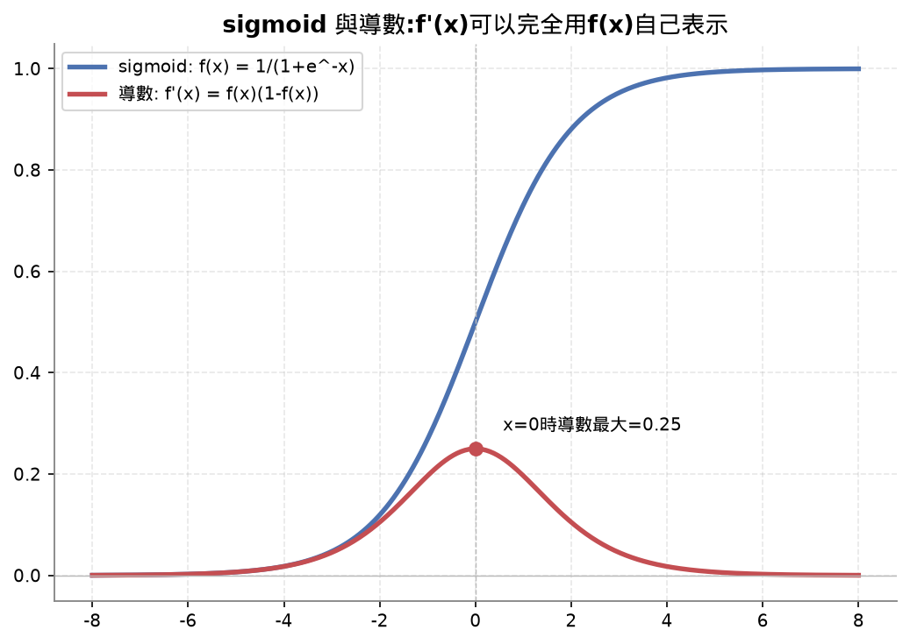

# Lesson 4 筆記:Calculus for ML(微積分)

## Learning Objectives 打勾清單

- [~] Compute numerical and analytical derivatives for common ML functions (x^2, sigmoid, cross-entropy) — x² 的數值法(Numerical)跟解析法(Analytical)導數完整講過、程式碼跑過驗證(誤差接近0),也對照過 x³/sin(x)/eˣ/1/x 這幾個函數。⚠️ sigmoid、cross-entropy 這兩個 ML 專用函數的導數,課程教材有列出公式(`sigmoid'(x)=f(x)(1-f(x))`),但這堂課沒有真的展開講解或驗證,留到之後遇到(邏輯迴歸/分類問題)再回頭補。
- [x] Implement gradient descent from scratch to minimize a loss function in 1D and 2D — 1D(f(x)=x²,從x=5走到接近0)自己手打+跑過;2D(f(x,y)=x²+y²)完整逐行拆解過(zip、list comprehension、numerical_gradient的中央差分公式),用具體數字追蹤過整個流程。
- [x] Derive the gradient of a linear regression model and train it via manual weight updates — 手推公式(dw=mean(2*error*x)、db=mean(2*error))看過懂邏輯,親眼驗證w、b從隨機亂猜(loss=67)收斂到接近真實答案(y=2x+1)的過程。
- [x] Explain the Hessian matrix, Taylor series approximations, and their connection to optimization methods — Hessian(瞎子下山比喻、跟Lesson 3 eigenvalue的連結、鞍點判斷)、泰勒展開(一階=梯度下降、二階=牛頓法)、牛頓法都講清楚,程式碼驗證過saddle跟bowl兩種地形算出的Hessian eigenvalue確實對應理論。

⚠️ 尚未完成:sigmoid/cross-entropy 的導數沒有實際展開講解,留到之後分類問題章節再補。

## 30秒抓重點(複習只看這裡就能想起整堂課在幹嘛)

- 導數告訴你「稍微調整一個東西,結果會變多少」,梯度就是把每個變數的偏導數收集成一個向量,指向「往上爬最快」的方向
- 梯度下降更新規則從頭到尾只有一條:`新值 = 舊值 − 學習率 × 梯度`,1個變數、2個變數、模型參數都是同一條規則
- 學習率太大會讓局部線性逼近失效甚至發散,太小收斂很慢
- 導數可以用數值法(動一點點看輸出差多少)或解析法(手推公式)算,兩者結果幾乎一致
- Hessian矩陣(二階導數)告訴你地形彎的程度,eigenvalue全正=真正最低點、全負=最高點、有正有負=鞍點(假的最低點),直接沿用Lesson 3的eigenvalue概念
- 泰勒展開把一階/二階近似串起來:梯度下降是一階近似,牛頓法(用Hessian)是二階近似,但Hessian太大深度學習用不起
- 「變數數量」跟「算到第幾階導數」是兩條互相獨立的軸線,不要搞混

## 公式速查表

| 用途 | 公式 |
|---|---|
| 數值導數(中央差分) | `f'(x) ≈ [f(x+h) - f(x-h)] / (2h)` |
| 梯度下降更新規則 | `新值 = 舊值 − 學習率 × 梯度` |
| 線性迴歸的梯度 | `dw = mean(2*error*x)`,`db = mean(2*error)` |
| Hessian(2變數) | `[[d²f/dx², d²f/dxdy], [d²f/dydx, d²f/dy²]]` |
| Hessian eigenvalue判斷 | 全正=最低點,全負=最高點,有正有負=鞍點 |
| 泰勒展開(到二階) | `f(x0+h) ≈ f(x0) + f'(x0)*h + 0.5*f''(x0)*h²` |
| 牛頓法更新規則 | `新值 = 舊值 − (Hessian反矩陣) × 梯度` |
| sigmoid導數 | `sigmoid'(x) = f(x)(1-f(x))` |

## 核心重點整理(這堂課在教什麼)

| 概念 | 是什麼 | 關鍵規則 / 幾何意義 |
|---|---|---|
| 導數 Derivative | 函數在某點的變化速度/斜率 | 幾何上是切線斜率;x稍微變動一點,y大概變多少 |


| 偏導數 Partial Derivative | 只動一個變數,其他變數固定不動,算出的變化率 | 神經網路裡每個權重各自的偏導數,分開算才知道各自該怎麼調 |
| 梯度 Gradient | 把每個變數的偏導數收集成一個向量 | 指向「往上爬最快」的方向;要下降就走它的反方向 |


| 梯度下降 Gradient Descent | 更新規則:新值=舊值−學習率×梯度 | 只需要一階導數,重複很多次就能逼近函數最低點 |


| 學習率 Learning Rate | 控制每一步跨多大 | 太大會讓局部線性逼近失效、甚至發散;太小收斂很慢 |
| 數值法 Numerical | 動一點點、看輸出差多少,逼近導數定義本身 | `[f(x+h)-f(x-h)]/(2h)`,任何函數都能用,但是逼近值有極小誤差 |
| 解析法 Analytical | 手推公式,精確算出導數 | 快、準,但要先會推導這個函數的公式 |
| Hessian 矩陣 | 二階偏導數湊成的矩陣,告訴你「地形彎的程度」 | eigenvalue全正=真的最低點;全負=最高點;有正有負=鞍點(假的最低點) |
| 鞍點 Saddle Point | 梯度=0但不是真正最低點的地方 | 前後平、左右也平,但其實旁邊還有更深的地方,靠Hessian的eigenvalue戳破 |


| 牛頓法 Newton's Method | 用梯度+Hessian一起算更新方向 | 理論上一步跳到谷底,但Hessian太大(N²),深度學習用不起 |
| 泰勒展開 Taylor Series | 用多項式局部逼近任何函數 | 一階近似=梯度下降在做的事;二階近似=牛頓法在做的事 |




| 線性迴歸 Linear Regression | y=wx+b,用梯度下降訓練w、b | predict→算loss→算梯度→更新,是所有神經網路訓練迴圈的縮影 |


| 連鎖律 Chain Rule | 複合函數的導數=各層導數相乘:df/dx = df/dg × dg/dx | 反向傳播的數學基礎,一路把每一層的導數乘回去 |
| 雅可比矩陣 Jacobian | 輸入輸出都是向量時,把所有輸出對所有輸入的偏導數排成矩陣 | 可以想成「向量版的梯度」,描述整個輸出向量怎麼隨輸入向量變化 |
| 反向傳播 Backpropagation | 從輸出往輸入方向,一層一層用連鎖律算梯度 | 神經網路實際「學習」時用的演算法,本質就是連鎖律的系統化應用 |
| 積分 Integral | 曲線下的面積,是「累積量」 | 機器學習裡機率分布、期望值、KL散度的定義都要靠積分 |

## 這堂課的總結

這堂課只圍繞一件事展開:**導數(Derivative)告訴你「稍微調整一個東西,結果會變多少」,把這個資訊反過來用,就能自動找到讓函數最小的位置**——這就是梯度下降(Gradient Descent)。整堂課的更新規則從頭到尾只有一條,反覆套用在不同情境:

```
新值 = 舊值 − 學習率 × 梯度
```

先套在1個變數(x²練習),再套在2個座標(x,y同時下降),最後套在真正的模型參數(w、b的線性迴歸)——變數數量不同,規則完全一樣。梯度本身是靠偏導數(Partial Derivative)湊出來的,偏導數又可以用數值法(動一點點看輸出差多少,`[f(x+h)-f(x-h)]/(2h)`)或解析法(手推公式)兩種方式算,兩者算出來的答案幾乎一致(誤差在1e-9等級)。

Hessian 矩陣(二階導數)是這堂課的進階延伸:它告訴你地形彎的程度,能戳破「梯度=0但其實不是真正最低點」的鞍點(Saddle Point)假象——判斷方式直接用上 Lesson 3 學的 eigenvalue(全正=最低點、有正有負=鞍點)。泰勒展開(Taylor Series)則把一階/二階近似的概念串起來:梯度下降是一階近似,牛頓法(用梯度+Hessian)是二階近似,但因為 Hessian 大小是參數量的平方,深度學習實務上幾乎只能用一階方法。

**這堂課的關鍵公式,複習時直接看這幾條就夠:**

```
數值導數(中央差分):    f'(x) ≈ [f(x+h) - f(x-h)] / (2h)
梯度下降更新規則:        新值 = 舊值 − 學習率 × 梯度
線性迴歸的梯度:          dw = mean(2*error*x),db = mean(2*error)
Hessian(2變數):         [[d²f/dx², d²f/dxdy], [d²f/dydx, d²f/dy²]]
Hessian eigenvalue判斷:  全正=最低點,全負=最高點,有正有負=鞍點
泰勒展開(到二階):        f(x0+h) ≈ f(x0) + f'(x0)*h + 0.5*f''(x0)*h²
牛頓法更新規則:          新值 = 舊值 − (Hessian反矩陣) × 梯度
```

**PyTorch/NumPy 對應:** 這堂課手刻的整套「算梯度→更新」流程,PyTorch 用 `loss.backward()`(自動微分算出所有梯度)+ `optimizer.step()`(套用更新規則)兩行取代,`torch.optim.SGD`/`Adam` 就是不同的更新規則實作。

**商業/工程價值:** 這是所有神經網路訓練的最底層機制——不管模型多大(從線性迴歸到GPT),訓練迴圈的骨架都是「predict→算loss→算梯度→更新」,學習率設定得好不好,直接決定一個模型能不能訓練成功、要花多少時間跟算力成本。

## 這堂課我卡住/搞混的地方(完整問答記錄,給複習用)

### 把「變數數量不同」跟「一階/二階導數不同」這兩件事搞混

這堂課從1個變數(x²)一路練到2個變數(x,y)、再練到Hessian矩陣,中途容易把「這次同時處理幾個變數」跟「這次算的是第幾階導數」這兩個完全獨立的維度混在一起,誤以為「變多了」都是同一種變多。實際上這是兩條互相垂直、互不影響的軸線,要分開看:

**軸線一:同時處理幾個變數(跟階數無關)**——這條軸決定的是「梯度(gradient)這個向量裡裝幾個數字」:

```
1個變數(x²):        梯度是單一個數字 f'(x) = 2x
2個變數(x²+y²):      梯度是2個數字湊成的向量 [∂f/∂x, ∂f/∂y] = [2x, 2y]
n個變數(線性迴歸的w、b): 梯度是n個數字湊成的向量,每個變數各自的偏導數(partial derivative)排一個位置
```
不管變數是1個還是100個,每個變數對應的都還是「一階導數」——只是把很多個一階導數收集起來變成一個向量而已,運算本身沒有變得更「高階」。更新規則從頭到尾都是同一條:`新值 = 舊值 − 學習率 × 梯度`,只是這裡的「梯度」從一個數字變成一個向量,對每個位置各自套用同一條規則。

**軸線二:算到第幾階導數(跟變數數量無關)**——這條軸決定的是「對同一個變數,還要不要繼續往下微分」:

```
一階導數(f'(x)):    函數在這一點的變化速度/斜率,梯度下降只用到這一階
二階導數(f''(x)):   一階導數「本身」的變化速度,告訴你這條斜率曲線彎的程度
Hessian矩陣:        多個變數情況下,把「所有兩兩變數之間的二階偏導數」湊成的矩陣
```
Hessian矩陣的每一格,是「先對一個變數微分、再對另一個變數(或自己)微分一次」算出來的二階偏導數——即使只有1個變數,也可以算到二階導數(`f''(x)`),跟這個函數裡有幾個變數完全無關;即使有100個變數,只算一階導數(梯度下降在做的事)也是完全合法、常見的做法,不是「變數多了就自動要算二階」。

**具體對照表(釐清兩條軸線互相獨立):**

| | 只算一階導數 | 算到二階導數(Hessian) |
|---|---|---|
| 1個變數 | `f'(x)=2x`(梯度下降用這個) | `f''(x)=2`(單一數字,判斷凹凸方向) |
| 2個變數 | `[∂f/∂x, ∂f/∂y]`(2個數字的梯度向量) | `[[∂²f/∂x², ∂²f/∂x∂y],[∂²f/∂y∂x, ∂²f/∂y²]]`(2×2的Hessian矩陣) |

表格裡「往右走」(一階→二階)是軸線二在變;「往下走」(1個變數→2個變數)是軸線一在變。兩個方向完全獨立,不會因為多了一個變數,就自動被算成二階,也不會因為算了二階導數,就代表變數變多了。之所以容易搞混,是因為2個變數+一階導數(梯度,一個向量)跟2個變數+二階導數(Hessian,一個矩陣)兩者都「看起來比1個數字複雜」,但複雜的原因其實不一樣——梯度變複雜是因為維度(軸線一)變多,Hessian變複雜是因為階數(軸線二)也往上走了一層,兩件事疊加在一起才會讓Hessian矩陣的格數等於「變數數量的平方」(n個變數,Hessian就是n×n),不是單純的n個。

## 我自己手打的部分

這堂課手打了 1D 梯度下降這段(`practice.py`):

```python
x = 5.0
lr = 0.1
for step in range(20):
    grad = 2 * x
    x = x - lr * grad
    print(f"step {step:2d}  x={x:8.4f}  f(x)={x**2:10.6f}")
```

其中 `for step int range(20)` 有個筆誤(`int` 應該是 `in`),自己抓出來後改對,跑出來確認 x 從 5 收斂到接近 0。print 那行格式化語法是我幫忙補的。2D 梯度下降跟線性迴歸那兩段,是看懂完整邏輯、逐行拆解過(包括 `zip`、list comprehension、`numerical_gradient`函式怎麼對應中央差分公式)。

**回頭補記(2026-09-07):** 這兩段(`numerical_gradient`、2D梯度下降、線性迴歸)當時確實逐行拆解過,不只是「看懂邏輯」層級,所以事後補進了 `practice.py`,補完後跑過確認輸出跟 `reference.py` 一致(2D點收斂到接近原點、線性迴歸學出 y≈2x+1)。

## 今天花的時間

計時器顯示 2:21:16。(課程建議時間:約60分鐘,實際花費超過建議時間的兩倍)

## 課程結尾理解確認題(先自己想過一遍,再點開看答案,這樣才是真的在複習)

<details>
<summary><b>Q1：梯度下降(gradient descent)的更新規則是什麼?學習率(learning rate)設太大或太小,分別會發生什麼問題?</b></summary>

答案：梯度下降的更新規則從頭到尾只有一條：`新值 = 舊值 − 學習率 × 梯度`。梯度(gradient)指向的是函數「往上爬最快」的方向,要讓函數的值變小,就要往梯度的反方向走,這就是公式裡那個負號的來源。學習率(learning rate)控制的是每一步跨多大——如果學習率設太大,每一步跨得太遠,會讓「局部線性逼近」這個假設失效(梯度只在很小的範圍內準確描述函數的走向,跨太遠就不準了),輕則在最低點附近來回震盪、重則整個發散(值越更新越大,完全跑飛)。如果學習率設太小,每一步跨得太保守,雖然穩定不會發散,但收斂速度會非常慢,可能要跑非常多步才能靠近最低點,浪費大量計算資源。這條規則不管套用在1個變數、2個變數,或是真正的模型參數(像線性迴歸的 w、b)上,邏輯完全一樣,只是同時更新的變數數量不同。

</details>

<details>
<summary><b>Q2：Hessian 矩陣(二階偏導數湊成的矩陣)的 eigenvalue,如何用來判斷一個梯度為0的點,究竟是真正的最低點、最高點,還是鞍點(saddle point)?</b></summary>

答案：梯度等於0只能告訴你「這個點附近往各個方向看起來都是平的」,但沒辦法分辨這是谷底、山頂,還是一個看起來平、其實只是某些方向平、另一些方向還在往下的「假谷底」(鞍點)。Hessian 矩陣記錄的是「地形彎的程度」(二階偏導數),把 Hessian 拿去算 eigenvalue,就能判斷這個平坦點周圍的地形真正長什麼樣：如果所有 eigenvalue 都是正的,代表沿著每一個方向看,函數都是往上彎(像碗一樣),這個點才是真正的最低點;如果所有 eigenvalue 都是負的,代表每個方向都往下彎,是最高點;如果 eigenvalue 有正有負,代表某些方向是谷(往上彎)、某些方向是山頂(往下彎),這就是鞍點——梯度在這裡是0,看似已經到底,但沿著 eigenvalue 是負的那個方向走下去,其實還能找到更低的地方。這正是 Lesson 3 學過的 eigenvalue 概念,在優化問題上的直接應用。

</details>

<details>
<summary><b>Q3：sigmoid 函數的導數為什麼可以寫成 `sigmoid'(x) = f(x)(1-f(x))` 這麼簡潔的形式?</b></summary>

答案：sigmoid 函數定義為 `f(x) = 1 / (1 + e^(-x))`,把它改寫成 `f(x) = (1+e^(-x))^(-1)` 再用連鎖法則(chain rule)加上除法的微分規則去推導,直接對 x 微分會得到 `f'(x) = e^(-x) / (1+e^(-x))^2`。這個形式看起來跟 `f(x)` 本身沒有明顯關係,但關鍵的代數技巧是把分子 `e^(-x)` 拆解成 `(1+e^(-x)) - 1`,於是：
```
f'(x) = [(1+e^(-x)) - 1] / (1+e^(-x))^2
      = (1+e^(-x))/(1+e^(-x))^2 - 1/(1+e^(-x))^2
      = 1/(1+e^(-x)) - [1/(1+e^(-x))]^2
      = f(x) - f(x)^2
      = f(x)(1 - f(x))
```
也就是說,`f'(x)` 本身可以完全用 `f(x)` 這一個值表示出來,不需要重新算一次 `e^(-x)`。這在工程實作上非常划算：神經網路做反向傳播時,正向傳播已經算出了 `f(x)`(也就是 sigmoid 的輸出值),反向傳播算梯度時直接拿這個已經算好的輸出值代入 `f(x)(1-f(x))`,就能得到導數,完全不用再重新計算一次指數函數,省下不少運算量,這也是很多常見的激活函數(包括 tanh)被設計成有這種「導數可以用自己的輸出值表示」性質的原因之一。



</details>

## 今天評分

| 項目 | 說明 |
|---|---|
| 理解程度 | 8/10,梯度下降的核心規則(新值=舊值−學習率×梯度)不管套用在幾個變數上都能講清楚,Hessian/鞍點/牛頓法/泰勒展開的關聯也接得起來 |
| 效率 | 中途在 `numerical_gradient`、`zip`、list comprehension 這幾段程式碼卡了一段時間,後來改用「先講數學公式、程式碼對應公式」的方式重講才順,也發現了自己容易把「變數數量不同」跟「一階/二階導數不同」這兩件事搞混,已經釐清 |
| 完成度 | 核心4個 Learning Objectives 裡3個完全做到,1個部分做到(sigmoid/cross-entropy導數留待之後補),測驗3/3 |

---

（下面不重複講數學/AI概念，只整理「程式語法」本身，之後忘記可以回來查。）

## List comprehension + zip:數值梯度更新那行

```python
point = [p - lr * g for p, g in zip(point, grad)]
```

### 對應的數學公式

梯度下降更新規則:`新位置 = 舊位置 − 學習率 × 梯度`,對每個變數(x、y)各自套用:

```
新x = 舊x − 學習率 × (x方向的梯度)
新y = 舊y − 學習率 × (y方向的梯度)
```

`point` 跟 `grad` 是分開存放的兩個 list,`zip` 負責把它們按位置配對起來(x配x的梯度、y配y的梯度),確保不會配錯對。

### 完整追蹤一次(用具體數字)

起始:`point = [4.0, 3.0]`,`grad = [8.0, 6.0]`,`lr = 0.1`

| Step | 動作 | 結果 |
|---|---|---|
| 1 | `zip(point, grad)` 先執行 | 按位置配對成兩組:`(4.0, 8.0)`、`(3.0, 6.0)` |
| 2a | 第1輪:`p=4.0, g=8.0` → 算 `p - lr*g` | `4.0 - 0.1*8.0` = `3.2` |
| 2b | 第2輪:`p=3.0, g=6.0` → 算 `p - lr*g` | `3.0 - 0.1*6.0` = `2.4` |
| 3 | 兩輪算出來的值收集成新 list | `[3.2, 2.4]` |
| 4 | 蓋回 `point` | `point = [3.2, 2.4]` |

跟實際跑出來的輸出一致:`step 0  point=(3.2000, 2.4000)`。

### 展開版(不用 list comprehension 的寫法)

```python
new_point = []
for p, g in zip(point, grad):
    new_value = p - lr * g
    new_point.append(new_value)
point = new_point
```

跟濃縮版做的事完全一樣,只是拆開成「宣告空list → 跑迴圈 → 每次append」三個動作。Python 工程師平常習慣用濃縮版(list comprehension),但意思上 100% 等價。

對照 C++:等同於 `vector<double> new_point; for(int i=0;i<point.size();i++) new_point.push_back(point[i]-lr*grad[i]); point=new_point;`。`zip` 相當於幫你把「同一個 index 的東西自動湊一對」做掉,不用自己管 index。

## `numerical_gradient` 函式對應的公式(中央差分法)

```python
def numerical_gradient(f, point, h=1e-7):
    gradient = []
    for i in range(len(point)):
        point_plus = list(point)
        point_minus = list(point)
        point_plus[i] += h
        point_minus[i] -= h
        partial = (f(point_plus) - f(point_minus)) / (2 * h)
        gradient.append(partial)
    return gradient
```

對應公式:對每個變數 i,`偏導數 ≈ [f(第i個變數多一點點) − f(第i個變數少一點點)] / (2×一點點的量)`。這就是導數定義本身,直接用數字逼近,不套用任何解析公式,對每個變數各做一次、收集成一個梯度向量回傳。

## f-string 格式化複習

```python
print(f"step {step:2d}  x={x:8.4f}  f(x)={x**2:10.6f}")
```

`{step:2d}` 整數至少佔2字元寬;`{x:8.4f}` 浮點數至少佔8字元寬、小數4位;`{x**2:10.6f}` 同樣道理、小數6位。純粹是排版對齊用,跟演算法邏輯無關。
