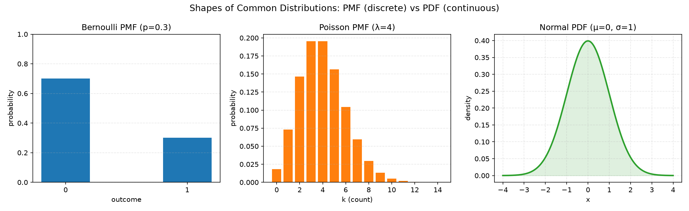
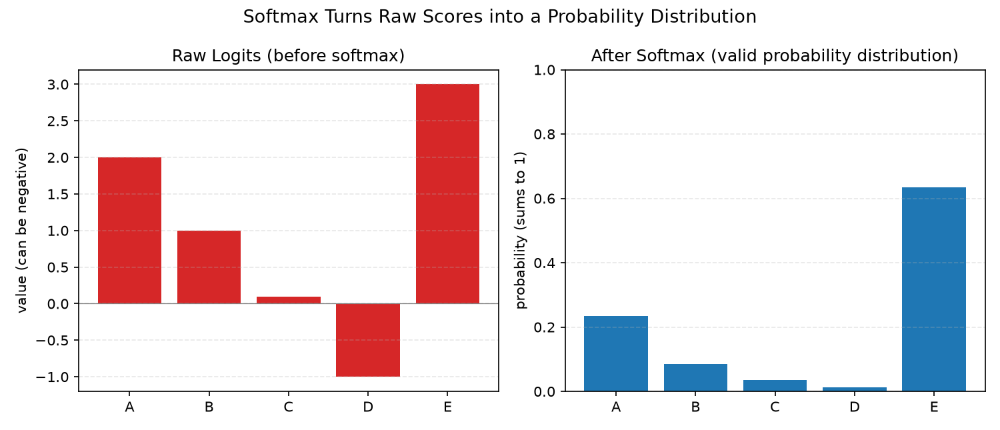

# Lesson 6 - Probability and Distributions（機率與分布）

## Learning Objectives 打勾清單
- [x] 從零實作 Bernoulli、categorical、Poisson、uniform、normal 的 PMF/PDF ⚠️(這幾個PMF/PDF屬於理解型分類,是用讀reference.py程式碼+跑demo驗證來理解邏輯,不是自己手打實作的)
- [x] 算期望值、變異數,並用中央極限定理(CLT)解釋為什麼常態分布無所不在
- [x] 用數值穩定技巧(減掉最大 logit)實作 softmax 跟 log-softmax
- [x] 從 logits 算 cross-entropy loss,並連結到 negative log-likelihood

## 這堂課的名詞總表(核心重點整理)

| 英文 | 中文 | 一句話定義 |
|---|---|---|
| Sample space (S) | 樣本空間 | 一件事所有可能結果的集合 |
| Event | 事件 | 樣本空間裡的一個子集合 |
| PMF (Probability Mass Function) | 機率質量函數 | 給離散變數每個結果的確切機率 |
| PDF (Probability Density Function) | 機率密度函數 | 給連續變數的密度函數,要積分才能得到機率 |
| Conditional probability | 條件機率 | P(A\|B),已知B發生的前提下A發生的機率 |
| Independence | 獨立事件 | 知道一件事發生不會改變另一件事發生的機率 |
| Expected value | 期望值 | 用機率加權平均後的「平均結果」 |
| Variance | 變異數 | 結果離期望值有多分散 |
| Normal distribution | 常態分布(高斯分布) | 鐘形曲線,由平均值跟變異數決定形狀 |
| Central Limit Theorem (CLT) | 中央極限定理 | 很多獨立隨機變數的平均值,最後都會趨近常態分布 |
| Log probability | 對數機率 | 取log後的機率,把連乘變連加,避免數值下溢 |
| Softmax | — | 把模型的原始分數(logits)轉成合法的機率分布 |
| Logits | — | 模型softmax之前吐出來的原始分數 |
| Cross-entropy | 交叉熵 | 衡量兩個機率分布差多少的損失函數 |
| Sampling | 抽樣 | 依照機率分布規則隨機抽出一個值 |

---

（以下為詳細教學內容,教學過程中補上）



### PDF 單一點的值不是機率

連續變數的 `P(X = 剛好等於某個值) = 0`,永遠是0——因為對一個寬度是0的區間積分,面積一定是0。`f(x)` 這個函數量的是**密度(density)**,不是機率,密度可以大於1(合理,不是錯誤),之後一定要對一段區間積分才能得到真正的機率。類比:人口密度可以是每平方公里1萬人(數字很大沒問題),但不會說「這一個點住了1萬人」,要問「這一整塊區域有多少人」才有意義。

### 變異數兩種公式是同一個東西

```
Var(X) = E[(X - mu)²]          ← 定義版:每個值減平均、平方、取期望值
       = E[X²] - (E[X])²       ← 展開版:平方的平均 減 平均的平方
```

代數證明兩者相等:
```
E[(X - mu)²]
= E[X² - 2·mu·X + mu²]        ← (a-b)² = a² - 2ab + b²
= E[X²] - 2·mu·E[X] + mu²     ← 期望值可以拆開對每一項各自算
= E[X²] - 2·mu·mu + mu²       ← E[X] 本身就等於 mu
= E[X²] - mu²
```

`practice.py` 裡的 `variance()` 用的是**定義版**(`E[(X-mu)²]`),不是展開版。原因:定義版邏輯直觀、照公式字面寫,不容易寫錯;展開版雖然步驟少,但要多寫一個「算X平方期望值」的函式,而且數值計算上有時候會因為兩個很接近的大數字相減產生精度誤差(細節留到Lesson 13數值穩定性再講)。

兩者數學上完全相等,只是代數整理的兩種寫法,不是多算了東西。



### Softmax 數值穩定的原理

減掉最大logit再取exp,結果跟原本完全一樣,因為這相當於分子分母同時除以同一個常數(`exp(c)`)——比例不變,但避免了 `exp(大數字)` 直接爆掉。代數證明:

```
exp(z_i - c) / Σ_j exp(z_j - c)
= [exp(z_i)/exp(c)] / [(1/exp(c))·Σ_j exp(z_j)]
= exp(z_i) / Σ_j exp(z_j)              ← 分子分母的 1/exp(c) 互相消掉
```

### Log-softmax 為什麼不能分開算

如果先 `softmax()` 得到機率,再對機率取 `log()`,遇到機率非常接近0的類別時,可能因為浮點數精度先被捨去成 `0.0`,這時候 `log(0)` 會是負無窮,程式壞掉。`log_softmax` 用log-sum-exp技巧把「取指數」跟「取log」合併成一步直接算,不會有這個風險。驗證過:`exp(log_softmax(x))` 完全等於 `softmax(x)`,兩者數學上等價。

### Cross-entropy loss 的直覺

`loss = -log(模型對正確答案給的機率)`。機率越接近1,loss越接近0;機率越接近0,loss趨近無窮大。loss值域是 `[0, +∞)`,理論最小值0代表模型100%確定且答對。這個設計讓訓練時的梯度會一直推著模型「提高正確答案的機率」。

### 為什麼要用log機率而不是原始機率

原始機率連乘(例如一句話裡每個詞的機率相乘),乘到幾十項後會因為浮點數下溢(underflow)直接變成0,而且不是「後面的詞被忽略」,是全部貢獻都塌陷成0一起消失。取log後乘法變加法,100個負數相加不會有這種指數級縮小到浮點數極限外的問題,而且保留了每個詞各自攜帶的資訊。

### Joint / Marginal 分布

Joint distribution `P(X,Y)` 描述兩個變數一起發生的機率。Marginal distribution 是把其中一個變數加總消掉:`P(X=x) = Σ_y P(X=x, Y=y)`,對應到聯合機率表格裡「每一列/每一欄的加總」。

## 這堂課的總結

這堂課要解決的問題:AI系統(尤其是分類模型跟語言模型)本質上都在跟「不確定性」打交道——模型輸出的是機率,訓練用的loss是機率的期望值,權重初始化靠機率分布,而背後撐起這一切的,就是機率論最基礎的那幾條規則。

**從三條公理出發,一路蓋到分類模型的loss函數:** 樣本空間跟事件定義了「所有可能結果」,三條公理(非負、全機率=1、互斥可加)是整個機率論的地基;條件機率跟獨立性讓我們能推理「已知部分資訊時的機率」;PMF/PDF讓我們能描述離散跟連續變數;期望值跟變異數量化「平均結果」跟「結果的分散程度」;CLT解釋了為什麼常態分布無所不在;softmax把模型的原始分數轉成合法機率分布,log_softmax用數值穩定的方式取log,cross-entropy loss則是「模型對正確答案有多沒信心」的量化——這一整條鏈,從最抽象的公理,直接連到訓練神經網路每一步在做的事。

**數值穩定是這堂課反覆出現的主題:** softmax的減最大值技巧、log_softmax合併exp跟log避免log(0)、log機率取代原始機率連乘避免下溢——這三個技巧背後都是同一個問題:電腦浮點數的表示範圍有限,數學上等價的兩種算法,在電腦上跑起來穩定性可能天差地遠。

**PyTorch對應:** `torch.softmax`、`torch.log_softmax`、`nn.CrossEntropyLoss` 都是這堂課手刻函式的現成版本,而且 `nn.CrossEntropyLoss` 內部就是直接呼叫 log_softmax + 取負號,跟今天手刻的邏輯完全一致。

## 我自己手打的部分

`expected_value`、`variance` 兩個函式自己手打並驗證過(骰子範例,E[X]=3.5, Var(X)=2.9167)。`softmax`、`log_softmax`、`cross_entropy_loss` 這三個函式因為當下要求直接寫,由我代打進 `practice.py`,但每一行都逐行拆解過,並用實際數字驗證過結果(跟scipy版本完全一致)。PMF/PDF(bernoulli/categorical/poisson/normal)、抽樣函式(sample_bernoulli/sample_categorical/sample_normal_box_muller)、CLT demo,都是理解型分類,看`reference.py`程式碼邏輯+跑demo驗證概念,沒有手打,完整版在`reference.py`。

## 今天花的時間

兩個半小時。

## 課程結尾理解確認題

**Q1：PDF(機率密度函數,Probability Density Function)在某一點的值,為什麼可以大於1?這是不是代表機率超過了100%?**

答案：不是,PDF 的值不是機率,而是「密度(density)」,兩者是不同的概念。對連續變數而言,`P(X = 剛好等於某個值)` 永遠等於0——因為要得到真正的機率,必須對一段區間去做積分(算面積),而寬度是0的一個點,不管密度多高,積出來的面積一定是0。密度可以想成人口密度：某個地方的人口密度是「每平方公里1萬人」,這個數字本身很大沒有問題,但不會有人說「這一個座標點住了1萬人」——要問「這一整塊區域住了多少人」才有意義,而且必須把密度乘上面積(對應到積分),才能得到真正的人數(對應到機率)。所以 PDF 在某一點算出大於1的值是完全合理的,不代表機率超過100%,只要整個函數對所有可能的 x 積分起來(算全部面積)等於1,就滿足機率分布「總機率=1」的要求;PDF 本身只是描述「機率在哪裡比較密集」的一個工具函數,不能直接讀成機率值。

**Q2：softmax 為什麼要先減掉最大的 logit 再取 exp?這個技巧為什麼在數學上等價於沒有做這個變換之前的結果?**

答案：softmax 的原始公式是 `exp(z_i) / Σ_j exp(z_j)`,如果 logit(模型輸出的原始分數)本身數值很大,`exp(大數字)` 在電腦裡很容易直接溢位(overflow)變成無限大,導致程式壞掉。數值穩定的做法是先把每個 logit 都減掉這一組 logits 裡最大的那個值 `c`,再取 exp：`exp(z_i - c) / Σ_j exp(z_j - c)`。這個技巧之所以不會改變最終結果,是因為它相當於把分子跟分母同時除以同一個常數 `exp(c)`：把 `exp(z_i - c)` 拆開寫成 `exp(z_i)/exp(c)`,分母也一樣拆開,整理後會發現分子分母裡的 `1/exp(c)` 可以互相消掉,最後剩下的還是原本的 `exp(z_i) / Σ_j exp(z_j)`,結果完全一樣。但因為減掉最大值之後,最大的那一項變成 `exp(0)=1`,其餘項的指數都是負數或0,exp 出來的值永遠落在 `(0, 1]` 之間,不會再有溢位的風險——同一個數學結果,換一種在電腦上算的順序,數值穩定性卻天差地遠。

**Q3：訓練語言模型時,為什麼要用「log 機率相加」而不是直接把每個詞的機率「連乘」?**

答案：一句話裡有幾十個詞,每個詞的機率本身都是小於1的小數字,如果直接把這些機率連乘,乘了幾十次之後,結果會小到超出電腦浮點數能表示的最小範圍,直接被當成0.0(這叫下溢,underflow)——而且這不是「後面的詞被忽略」,是整條連乘的貢獻全部塌陷成0一起消失,完全看不出原本每個詞各自帶來多少資訊。取 log 之後,乘法在數學上會變成加法(`log(a·b) = log(a) + log(b)`),幾十個負數(因為機率小於1,log 後是負數)相加,不會有指數級縮小到浮點數表示範圍之外的問題,而且 log 是單調遞增函數,不會改變「哪個結果機率比較高」這個相對排序。這也是為什麼 cross-entropy loss 的公式長得像 `-log(模型對正確答案給的機率)`,而不是直接用機率本身當 loss——用 log 機率不只是數學上等價的寫法,更是為了在有限精度的電腦上維持數值計算的穩定性。

## 今天評分

理解程度:softmax數值穩定技巧、cross-entropy loss的直覺(機率越低loss越高)、log機率解決連乘下溢問題這幾個核心概念,測驗3/3全對,能自己講出原理;PDF密度值可以大於1、變異數兩種公式為什麼等價這兩個地方一開始有誤解,後來用類比跟代數證明解決
效率:整體順暢,中間VS Code編輯器分頁顯示異常卡了一下(後來發現是WSL路徑轉換問題,改用Windows路徑格式`D:\...`解決)
完成度:4個Learning Objectives全部完成,其中PMF/PDF那項是照理解型分類完成(讀程式碼+跑demo,沒有手打實作),softmax/log_softmax由我代打完成

---

（下面不重複講數學/AI概念,只整理「程式語法」本身,之後忘記可以回來查。）

這堂課主要複習/加深了之前學過的語法,新東西不多,整理一下重點。

### `zip()` 配對兩個 list

```python
for v, p in zip(values, probabilities)
```

`zip()` 把兩個(或多個)list按照相同的索引位置配對起來,變成一串tuple。例如 `values=[1,2,3]`、`probabilities=[0.2,0.3,0.5]`,`zip()` 會依序產生 `(1,0.2)`、`(2,0.3)`、`(3,0.5)`。`for v, p in zip(...)` 這種寫法叫**tuple unpacking(元組解包)**,直接把每個tuple拆成兩個變數,不用寫 `pair[0]`、`pair[1]`。

C++對照:類似同時遍歷兩個vector,但C++通常要手動用index(`for(int i=0;i<n;i++)`)或者用 `std::views::zip`(C++23才有,更早版本沒有內建的zip)。

### Generator expression(生成器表達式)vs List comprehension(列表推導式)

```python
sum(v * p for v, p in zip(values, probabilities))
```

注意這裡**沒有方括號 `[ ]`**,只有小括號(其實連小括號都省了,直接傳進 `sum()` 裡)。這叫 generator expression,跟之前學過的 list comprehension(`[x for x in ...]`)不一樣:

- List comprehension `[x*2 for x in range(10)]` 會**先把整個list在記憶體裡建好**,才回傳。
- Generator expression `(x*2 for x in range(10))` 是**一邊要一邊算**,不會一次把整串資料都存進記憶體。

當你只是要把結果丟進 `sum()`、`max()` 這種「一次消耗掉」的函式,用generator比較省記憶體,因為根本不需要真的建一個完整的list出來。

### `math` 模組

```python
import math
math.exp(x)   # e的x次方
math.log(x)   # 自然對數(以e為底)
```

C++對照:對應 `<cmath>` 裡的 `std::exp`、`std::log`,用法邏輯一樣,只是Python要先 `import math` 才能用,而且呼叫時要加 `math.` 前綴(除非用 `from math import exp, log`)。

### List comprehension 拆步驟寫

```python
shifted = [z - max_logit for z in logits]
exps = [math.exp(z) for z in shifted]
```

這兩行分開寫(先算shifted、再算exps),沒有硬塞成一行巢狀的推導式(雖然技術上可以寫成 `[math.exp(z - max_logit) for z in logits]`)。分開寫可讀性更好,尤其是每一步都有明確的數學意義(先做數值穩定平移、再取指數),分開命名變數方便除錯跟理解。

### NumPy `np.average` 帶權重

```python
np.average(die_values, weights=die_probs)
```

`np.average` 預設是算普通平均(每個元素權重相等),但傳入 `weights=` 參數後,就變成**加權平均**——等同於我們手刻的 `expected_value`。這是NumPy函式常見的模式:同一個函式名稱,靠可選參數(optional argument)切換行為,不用另外寫一個新函式。

### SciPy `scipy.special.softmax` / `log_softmax`

```python
from scipy.special import softmax, log_softmax
```

這兩個函式內部已經內建了「減最大值做數值穩定」的邏輯,不需要自己再手動處理——這也是為什麼手刻理解底層邏輯很重要:知道函式庫幫你做了什麼,遇到數值不穩定的bug時才知道要往哪裡查。
