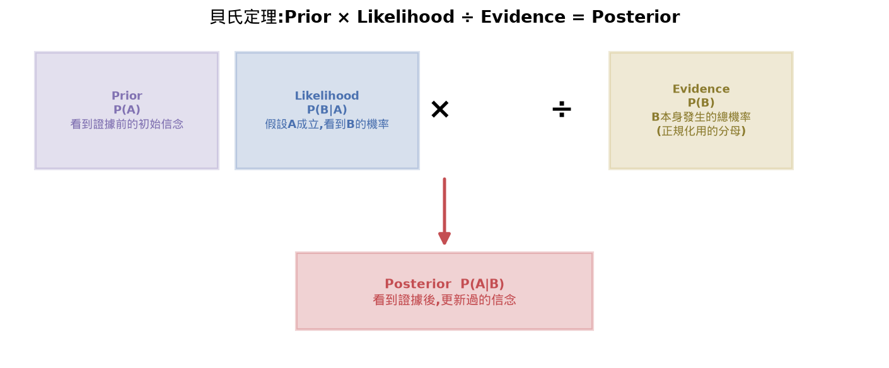
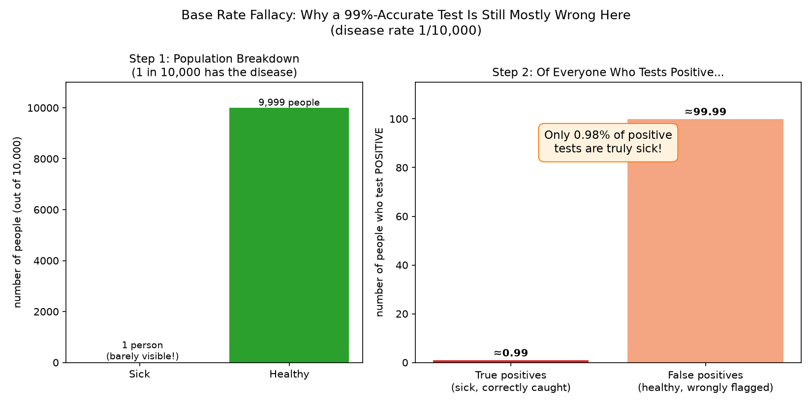
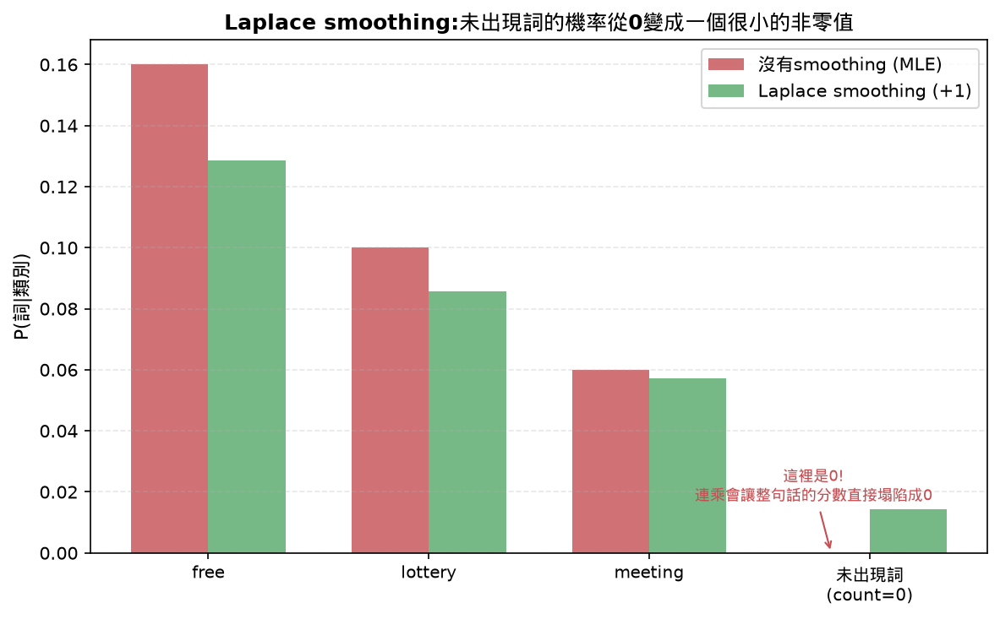
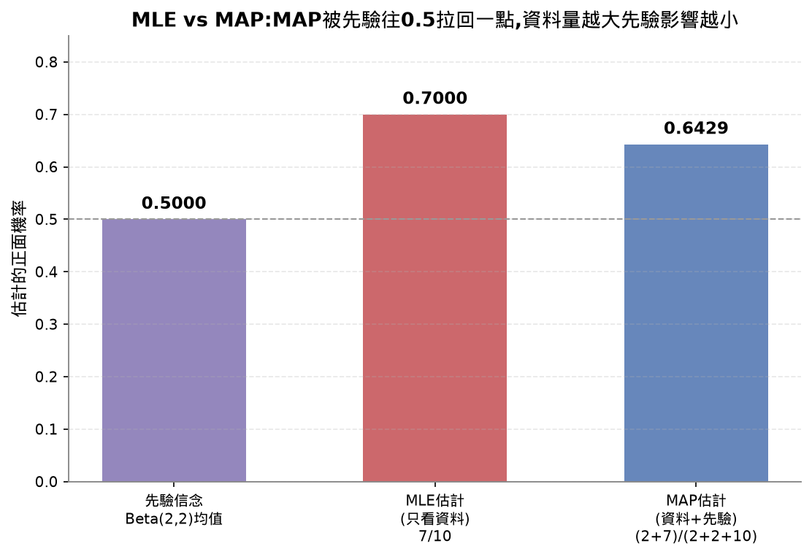
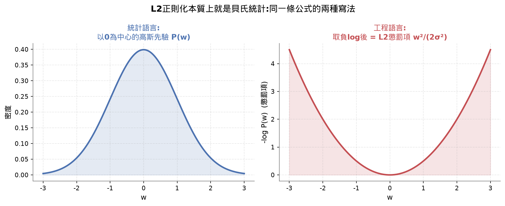
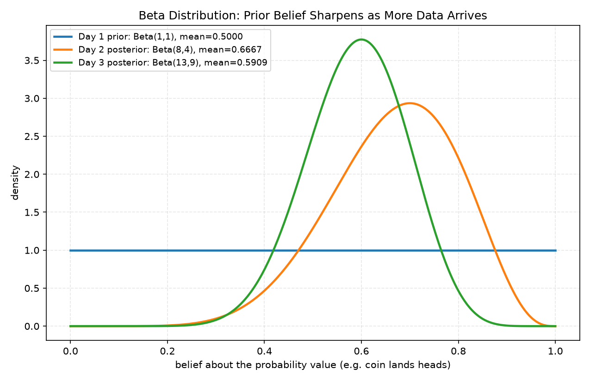

# Lesson 7 - Bayes' Theorem（貝氏定理）

## Learning Objectives 打勾清單
- [x] 從先驗、似然、證據算出後驗機率(貝氏定理本身)
- [x] 從零實作Naive Bayes文字分類器,含Laplace平滑跟log機率 ⚠️(照新的加快節奏,`NaiveBayes` class由我寫進`reference.py`+demo驗證過,但沒有真的帶你逐行看過,只有跑過的輸出結果;所以`practice.py`裡沒有放這個class,只留`bayes()`——你真的對照過公式讀過的部分)
- [x] 比較MLE跟MAP估計,並理解MAP為什麼等於L2正則化
- [x] 用Beta-Binomial共軛先驗做序列貝氏更新

## 30秒抓重點(複習只看這裡就能想起整堂課在幹嘛)

- 貝氏定理只是條件機率的兩種寫法互換角度而已:`後驗 = 似然 × 先驗 / 證據`
- 罕見疾病檢測反直覺:不是準確率不準,是「健康人口基數太大」把少數誤判撐成大多數陽性——分母效應
- Naive Bayes = 貝氏定理套進分類問題,靠「特徵獨立」這個天真假設把連乘變好算,再取log避免下溢
- MLE只看資料,MAP多了先驗;MAP搭配高斯先驗，數學上就是L2正則化——貝氏跟正則化是同一件事的兩種講法
- 共軛先驗(Beta先驗+二項觀察)讓貝氏更新變成純加法,是線上學習的數學基礎

## 公式速查表

| 用途 | 公式 |
|---|---|
| 貝氏定理 | `P(A\|B) = P(B\|A)·P(A) / P(B)` |
| 證據項展開(全機率公式) | `P(B) = P(B\|A)·P(A) + P(B\|not A)·P(not A)` |
| Naive Bayes分類分數 | `score(類別) = P(類別) × Π P(特徵ᵢ\|類別)`,實作時取log變成連加 |
| Laplace smoothing | `P(詞\|類別) = (count+smoothing) / (total+smoothing×詞彙表大小)` |
| MAP目標函數(高斯先驗) | `最小化 = loss(資料\|w) + w²/(2σ²)`,對應L2的`λ·w²`(`λ = 1/(2σ²)`) |
| Beta-Binomial共軛更新 | 先驗`Beta(a,b)` + 觀察`s次成功f次失敗` → 後驗`Beta(a+s, b+f)` |

## 這堂課的名詞總表

| 英文 | 中文 | 一句話定義 |
|---|---|---|
| Prior | 先驗機率 | 看到證據之前,你對一件事的初始信念 |
| Likelihood | 似然 | 如果假設成立,觀察到這個證據的機率有多高 |
| Posterior | 後驗機率 | 看到證據之後,更新過的信念 |
| Evidence | 證據項 | 證據本身發生的總機率,用來當分母做正規化 |
| Naive Bayes | 樸素貝氏 | 假設所有特徵互相獨立的分類器 |
| Laplace smoothing | 拉普拉斯平滑 | 給每個計數都加一個小數字,避免機率算出0 |
| MLE (Maximum Likelihood Estimation) | 最大似然估計 | 選一組參數,讓「觀察到的資料」發生機率最大,不考慮先驗 |
| MAP (Maximum a Posteriori) | 最大後驗估計 | MLE加上先驗,選讓後驗機率最大的參數 |
| Conjugate prior | 共軛先驗 | 先驗跟後驗屬於同一個分布家族,更新公式會變得超簡單 |
| Beta distribution | Beta分布 | 專門描述「一個機率值本身」的分布,常拿來當共軛先驗 |
| Base rate fallacy | 基本比率謬誤 | 只看準確率,忽略「這件事本身有多罕見」,導致誤判機率 |
| L2 regularization | L2正則化(weight decay) | 訓練時懲罰過大的權重,讓模型不要過度擬合 |
| Log-probability | 對數機率 | 用log(P)取代P,避免連乘很多小機率時發生浮點數下溢 |
| False positive | 偽陽性 | 檢測結果說「是」,但真實狀態其實是「否」,基本比率謬誤的成因之一 |

---

## 貝氏定理怎麼推出來的

從Lesson 6學過的條件機率出發,同一個「A且B」的聯合機率,可以從兩個方向拆解:

```
P(A|B) = P(A且B) / P(B)      ← 已知B發生,A發生的機率
P(B|A) = P(A且B) / P(A)      ← 已知A發生,B發生的機率
```

兩式的分子都是`P(A且B)`,設它們相等再整理:

```
P(A且B) = P(A|B)·P(B) = P(B|A)·P(A)

所以:
P(A|B) = P(B|A) · P(A) / P(B)
```

這就是貝氏定理。



四個量各自的意義:

| 符號 | 名稱 | 意思 |
|---|---|---|
| P(A\|B) | 後驗(Posterior) | 看到證據B之後,更新過的信念 |
| P(B\|A) | 似然(Likelihood) | 假設A成立,觀察到B的機率有多高 |
| P(A) | 先驗(Prior) | 看到任何證據之前,對A的初始信念 |
| P(B) | 證據(Evidence) | B本身發生的總機率,當分母做正規化 |

#### 常見地雷

> 容易誤會成:P(A|B)(已知B求A的機率)跟P(B|A)(已知A求B的機率)是同一個數字,可以互換著用。
>
> 實際上:這兩個條件機率一般完全不相等,這正是貝氏定理存在的理由。下面的罕見疾病檢測就是活生生的例子:P(陽性|生病)高達99%,但P(生病|陽性)卻不到1%,兩者差了快100倍——把兩者搞混,會直接導致「篩檢陽性=幾乎確定生病」這種嚴重誤判。

`P(B)`可以用**全機率公式**展開,不用另外估計:
```
P(B) = P(B|A)·P(A) + P(B|not A)·P(not A)
```

## 醫療檢測範例——反直覺結論的具體算法

一個病1萬人中1人得,測試準確率99%(抓到99%的病人,1%誤判成陽性)。用具體人數算一次,比公式更好懂:

```
10,000人裡面:
- 真正得病:1人
- 健康:9,999人

真病人測出陽性:1人 × 0.99 ≈ 0.99人(幾乎一定測出陽性)
健康人被誤判陽性:9,999人 × 0.01 ≈ 99.99人(約100個健康人假警報)

所有測出陽性的人 ≈ 0.99 + 99.99 ≈ 100.98人
其中真正有病的比例 = 0.99 / 100.98 ≈ 0.98%
```

跟用貝氏公式直接算的`P(sick|positive)=0.0098`完全一致。



**關鍵直覺**:健康人口基數(9,999)遠遠大於病人基數(1),就算只有1%的健康人被誤判,絕對人數(約100人)還是遠遠超過真正的病人數(1人)。不是99%的準確率不準,是**分母(健康人口)太大,1%乘上一個巨大數字,結果依然很大**。這叫「base rate fallacy(基本比率謬誤)」——只看準確率,忽略了「這個病本身有多罕見」這個前提,是人類直覺很容易踩的統計陷阱。實務上這也是為什麼醫生看到單次陽性不會馬上下結論,而是要求做第二次確認測試(用第一次的後驗當第二次的先驗,兩次一起算,準確度才會夠高)。

## Naive Bayes分類器邏輯

**核心公式**(用貝氏定理,把「特徵」當證據、「類別」當假設):
```
P(類別|特徵1,特徵2,...,特徵n) = P(類別)·P(特徵1|類別)·P(特徵2|類別)·...·P(特徵n|類別) / P(所有特徵)
```

「naive(天真)」指的是這裡假設每個特徵在已知類別的條件下互相獨立——現實中不成立(例如"free"後面常接"lottery",兩個詞明顯相關),但因為分類器只需要**排序**哪個類別分數最高,不需要機率本身多精確,這個簡化假設在實務上效果依然很好。既然分母`P(所有特徵)`對每個類別都一樣,可以直接忽略,只比較分子:

```
score(類別) = P(類別) × 每個特徵的P(特徵|類別)連乘
```

**為什麼用log機率相加,不能直接相乘**:一句話有幾十個詞,每個詞的機率都是小於1的小數字,連乘幾十次後浮點數會下溢變成0.0(跟Lesson 6學過的log-softmax同一個問題)。取log後乘法變加法(`log(a·b)=log(a)+log(b)`),不會有這個下溢風險,而且log是單調遞增函數,不會改變「哪個類別分數最高」這個排序結果。

**Laplace smoothing(拉普拉斯平滑)**:如果訓練資料裡某個詞從沒在某個類別出現過,MLE會直接把它的機率算成0,一旦這個詞出現在要分類的新句子裡,整個連乘(或log相加)就會被這個0污染,导致模型直接判死刑,即使句子裡其他詞都強烈指向另一個類別。解法是分子分母都加一個小常數:

```
P(詞|類別) = (count(詞,類別) + smoothing) / (total_words_in_類別 + smoothing × 詞彙表大小)
```

`smoothing`通常設1(所以也叫add-one smoothing),保證任何詞的機率都不會是0,但當這個詞出現次數夠多時,平滑的影響會被稀釋到可以忽略。



## MLE vs MAP

**MLE(最大似然估計)**:「完全相信眼前看到的資料」,選一組參數讓觀察到的資料發生機率最大。對離散計數問題,MLE的解就是直接算比例——例如丟10次硬幣7次正面,MLE估計就是`7/10=0.7`,沒有加入任何額外信念。

**MAP(最大後驗估計)**:「資料 + 先驗信念」一起考慮,選讓後驗機率`P(參數|資料) ∝ P(資料|參數)·P(參數)`最大的參數。如果你先驗相信硬幣接近公平(用Beta(2,2)當先驗,均值0.5),MAP算出來的估計會被拉回0.5一點:`(2+7)/(2+2+10)=0.6429`,比MLE的0.7更保守。**資料量越小,先驗的影響力越大**;資料量夠大時,MAP會趨近MLE(因為資料本身的證據力蓋過了先驗)。

| 估計方法 | 最大化的目標 | 對應到ML的意義 |
|---|---|---|
| MLE | P(資料\|參數) | 沒有正則化的訓練 |
| MAP | P(資料\|參數) × P(參數) | L2/L1正則化 |



## 為什麼「L2正則化本質上是貝氏統計」——完整推導

這句話的意思是:**MAP估計,配上「參數的先驗是以0為中心的常態分布(高斯分布)」,數學上跟訓練時加L2正則化完全等價**,不是比喻或類比,是同一條公式的兩種寫法。

高斯先驗的機率密度函數:
```
P(w) = (1 / √(2π·σ²)) · exp(-w² / (2σ²))
```

取負log(MAP要最大化`P(資料|w)·P(w)`,等於最小化`-log P(資料|w) - log P(w)`):
```
-log P(w) = w² / (2σ²) + 常數項(跟w無關,優化時可以忽略)
```

所以MAP要最小化的目標函數變成:
```
最小化目標 = loss(資料|w) + w² / (2σ²)
```

對照ridge regression(L2正則化)的損失函數:
```
最小化目標 = loss(資料|w) + λ·w²
```

兩式**完全一樣**,只是`λ`對應到`1/(2σ²)`。用白話講:「我相信權重應該集中在0附近、不要太大」這句話——

- 用**統計語言**講,叫做「給權重一個以0為中心的高斯先驗」
- 用**工程語言**講,叫做「訓練時加L2正則化懲罰項(weight decay)」

講的是同一件事,只是切入角度不同。這也是為什麼很多深度學習裡看似「工程技巧」的正則化方法,拆開數學推導後,背後都藏著一個隱含的貝氏假設——這條連結是這整堂課想教的「Bayesian thinking matters for ML」最具體的一個例子。



## 共軛先驗(Conjugate Prior)跟Beta分布

當「先驗」跟「後驗」屬於同一個分布家族時,這個先驗叫「共軛先驗」,好處是更新公式會變得超簡單,不用做任何積分或數值近似。**Beta分布**是Bernoulli/Binomial(丟硬幣型問題)最常用的共軛先驗,`Beta(a,b)`描述的是「你相信某個機率值本身長什麼樣子」,均值是`a/(a+b)`,`a+b`越大代表你越有信心(分布越集中)。

更新規則簡單到只是加法:
```
先驗: Beta(a, b)
觀察到: s次成功, f次失敗
後驗: Beta(a+s, b+f)
```

這堂課demo跑的序列更新範例:
```
Day 1 先驗: Beta(1,1),均值=0.5000        ← 完全沒資訊,均勻分布
Day 2 後驗: Beta(8,4),均值=0.6667        ← 觀察到7正3反,往正面偏
Day 3 後驗: Beta(13,9),均值=0.5909       ← 再觀察5正5反,被拉回中間一點
```



**這個機制在工程上最值錢的地方**:因為後驗永遠是同一個分布家族,你完全不需要保留原始的觀察資料——只要記住兩個數字(alpha、beta),新資料進來時直接加上去就是新的後驗。這是「線上學習(online learning)」的數學基礎:今天的後驗變成明天的先驗,模型可以不斷用新資料更新,不需要每次都拿全部歷史資料重新訓練一遍。Thompson sampling(bandit演算法)、串流異常偵測、A/B測試的貝氏版本,都是這個模式的應用。

## 這堂課的總結

貝氏定理解決的問題是:**怎麼用數學方式,把「看到新證據後更新信念」這件事寫成一個公式**。從條件機率的兩種寫法出發,推出一個公式,串起了整堂課:

- **Naive Bayes**把貝氏定理用在分類問題上,靠「特徵獨立」這個簡化假設,把原本複雜到算不完的聯合機率,變成一串連乘(或log連加)
- **MLE/MAP**是「怎麼估計機率參數」的兩種哲學,MAP多了先驗這個因子,直接對應到ML裡的正則化
- **共軛先驗**讓貝氏更新變成純粹的加法,是線上學習/串流系統的數學基礎

跟Lesson 6串起來看:機率論的公理跟PMF/PDF告訴你「怎麼描述不確定性」,softmax/cross-entropy告訴你「模型怎麼輸出跟評估不確定性」,這堂課的貝氏定理告訴你「看到新資料後,怎麼更新你的不確定性」——三堂課合起來,是機器學習裡處理不確定性的完整框架。

## 面試向問題

- 一個罕見疾病篩檢工具號稱準確率99%,業務想直接拿「陽性=確診」來做決策,你會怎麼解釋為什麼不能這樣用?(對應「醫療檢測範例——反直覺結論的具體算法」那段)
- 為什麼可以說「訓練時加L2正則化(weight decay)」等於「假設權重有一個以0為中心的高斯先驗」?這個連結對設定正則化強度λ有什麼啟發?(對應「為什麼「L2正則化本質上是貝氏統計」」那段)
- Naive Bayes分類器遇到訓練資料裡沒出現過的詞,為什麼不能直接讓那個詞的機率算成0?(對應「Laplace smoothing(拉普拉斯平滑)」那段)
- 什麼情境下你會特別偏好用共軛先驗(conjugate prior)而不是任意先驗分布做貝氏更新?(對應「共軛先驗(Conjugate Prior)跟Beta分布」那段)

## 課程結尾理解確認題(先自己想過一遍,再點開看答案,這樣才是真的在複習)

<details>
<summary><b>Q1：貝氏定理(Bayes' Theorem)是怎麼從條件機率(conditional probability)的兩種寫法推導出來的?</b></summary>

答案：條件機率有兩種等價的寫法,描述的是同一個「A且B」聯合機率,只是從不同方向去拆解：`P(A|B) = P(A且B)/P(B)`(已知B發生,A發生的機率)跟 `P(B|A) = P(A且B)/P(A)`(已知A發生,B發生的機率)。把這兩條式子分別移項,兩邊都變成 `P(A且B) = P(A|B)·P(B)` 跟 `P(A且B) = P(B|A)·P(A)`——因為左邊都是同一個 `P(A且B)`,所以右邊也必須相等：`P(A|B)·P(B) = P(B|A)·P(A)`。兩邊同除以 `P(B)`,就得到貝氏定理：`P(A|B) = P(B|A)·P(A) / P(B)`。四個量各自的角色：`P(A|B)` 是後驗(posterior,看到證據B之後更新過的信念)、`P(B|A)` 是似然(likelihood,假設A成立時觀察到B的機率)、`P(A)` 是先驗(prior,看到任何證據之前對A的初始信念)、`P(B)` 是證據(evidence,B本身發生的總機率,用全機率公式展開成 `P(B|A)·P(A) + P(B|not A)·P(not A)`,當分母做正規化)。

</details>

<details>
<summary><b>Q2：為什麼一個測試準確率99%的疾病檢測,在「1萬人中只有1人得病」的罕見疾病情境下,驗出陽性的人真正得病的機率卻不到1%?這個現象背後的道理是什麼?</b></summary>

答案：用具體人數算一次最清楚。10,000人裡,真正得病的只有1人、健康的有9,999人。真病人測出陽性：1人×0.99≈0.99人(幾乎一定測出陽性)。健康人被誤判成陽性：9,999人×0.01≈99.99人(約100個健康人假警報)。所有測出陽性的人加起來約 0.99+99.99≈100.98人,其中真正有病的只佔 0.99/100.98≈0.98%——跟用貝氏公式直接算出的 `P(sick|positive)≈0.0098` 完全一致。關鍵直覺在於：健康人口的基數(9,999)遠遠大於病人的基數(1),就算誤判率只有1%這麼低,乘上一個巨大的健康人口基數,算出來的絕對誤判人數(約100人)還是遠遠超過真正的病人數(1人)。不是99%的準確率不準,是分母(健康人口)太大,1%乘上一個巨大數字,結果依然很大。這個現象叫「base rate fallacy(基本比率謬誤)」——只看準確率,忽略了「這件事本身有多罕見」這個前提(也就是先驗機率),是人類直覺很容易踩的統計陷阱,這也是為什麼醫生看到單次陽性不會馬上下結論,而是要求做第二次確認測試。

</details>

<details>
<summary><b>Q3：為什麼可以說「MAP估計搭配一個以0為中心的高斯先驗」,在數學上跟訓練時加L2正則化(weight decay)完全等價?</b></summary>

答案：MAP(Maximum a Posteriori)估計要找的是讓後驗機率 `P(w|資料) ∝ P(資料|w)·P(w)` 最大的參數 w,等價於最小化它的負log：`-log P(資料|w) - log P(w)`。如果假設參數 w 的先驗是一個以0為中心的高斯分布(常態分布),它的機率密度函數是 `P(w) = (1/√(2π·σ²))·exp(-w²/(2σ²))`,取負log之後,常數項跟 w 無關可以在優化時忽略,剩下的部分是 `w²/(2σ²)`。所以 MAP 要最小化的目標函數就變成:`最小化目標 = loss(資料|w) + w²/(2σ²)`。對照 ridge regression(L2正則化)的損失函數 `最小化目標 = loss(資料|w) + λ·w²`,兩條式子的形狀完全一樣,只是 `λ` 對應到 `1/(2σ²)`——這不是比喻或類比,是同一條公式的兩種寫法,只是用的語言不同:用統計語言講,是「給權重一個以0為中心的高斯先驗,相信權重應該集中在0附近、不要太大」;用工程語言講,就是「訓練時加L2正則化懲罰項」。這也說明了很多看似純粹是工程技巧的正則化方法,拆開數學推導後,背後其實都藏著一個隱含的貝氏假設。

</details>

## 今天評分

| 項目 | 說明 |
|---|---|
| 理解程度 | 貝氏定理推導、醫療檢測的base rate fallacy(用具體人數算過)、Naive Bayes的log機率+Laplace smoothing、MAP等於L2正則化這幾個核心概念都講透了;共軛先驗/序列更新是理解型帶過,概念清楚但沒有深入到能自己推導Beta分布的積分證明 |
| 效率 | `bayes()`函式有逐行對照公式手打進practice.py。`NaiveBayes`類別當時沒有手打,只在reference.py留了一份參考,practice.py沒有這段——這是真實缺口,不是效率換算,已記進review-queue.md,之後要補成使用者自己手打的版本 |
| 完成度 | 4個Learning Objectives全部完成,Tier 2(MAP、共軛先驗、序列更新)理解型完成,Tier 3(A/B testing的Monte Carlo模擬、Exercise 2-4)記進review-queue.md,這次沒做 |
| 花費時間 | 1小時30分鐘(課程建議時間:約75分鐘,比建議時間長一些) |

---

（下面不重複講數學/AI概念,只整理「程式語法」本身,之後忘記可以回來查。）

### `defaultdict` 跟巢狀 `defaultdict`

```python
from collections import defaultdict
self.class_counts = defaultdict(int)
self.word_counts = defaultdict(lambda: defaultdict(int))
```

`defaultdict(int)`是一種特殊的dict,查詢一個不存在的key時,不會報`KeyError`,而是自動用`int()`(結果是0)當預設值建立這個key。`self.word_counts[label][word] += 1`如果`label`或`word`是第一次出現,會自動生成`0`再加1,不用手動判斷「這個key存在嗎」再決定要不要初始化。

`defaultdict(lambda: defaultdict(int))`是兩層巢狀:外層是「每個類別」對應到一個字典,內層才是「每個詞在這個類別出現幾次」。`lambda: defaultdict(int)`是因為`defaultdict`的參數需要一個「沒有參數、呼叫後回傳預設值」的函式,不能直接寫`defaultdict(int)`當外層的預設值(那樣的話所有類別會共用同一個內層字典,是常見的bug陷阱)。

C++對照:類似`std::unordered_map`,但C++預設查詢不存在的key會自動建立並用該型別的預設建構子初始化(`int`預設是0),某種程度上C++的`std::map`/`std::unordered_map`天生就有`defaultdict`的行為,不需要額外包一層。

### `set()` 集合,用來存不重複的詞彙表

```python
self.vocab = set()
self.vocab.add(word)
```

`set`是不重複、無序的集合,`.add()`加入元素,重複加入同一個值不會產生重複項。這裡拿來記錄「所有出現過的詞」,`len(self.vocab)`就是詞彙表大小。

C++對照:對應`std::set`或`std::unordered_set`,`.insert()`對應Python的`.add()`。

### `float("-inf")` 負無窮大

```python
best_score = float("-inf")
```

Python用`float("-inf")`表示負無窮大,拿來當「目前找到的最大值」的初始值,確保第一次比較時任何真實分數都會比它大。

C++對照:對應`-std::numeric_limits<double>::infinity()`或早期常見的`-DBL_MAX`寫法。

### `dict.get(key, 預設值)`

```python
count = self.word_counts[cls].get(word, 0)
```

跟直接用`self.word_counts[cls][word]`不同,`.get(word, 0)`如果`word`不存在,不會自動新增這個key,只是回傳預設值`0`,字典本身不會被修改。這裡故意用`.get()`而不是直接查詢,是因為`predict()`階段只是「讀取」,不應該因為查了一個沒看過的詞就把它意外加進詞彙表裡。
