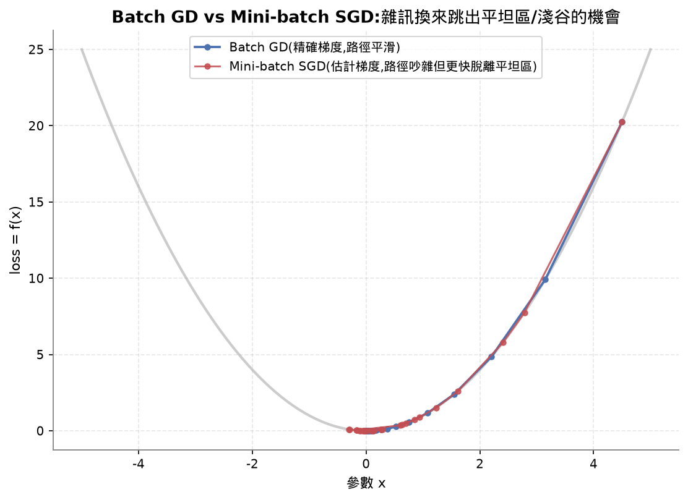
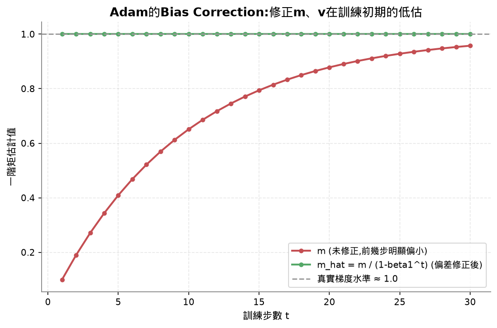
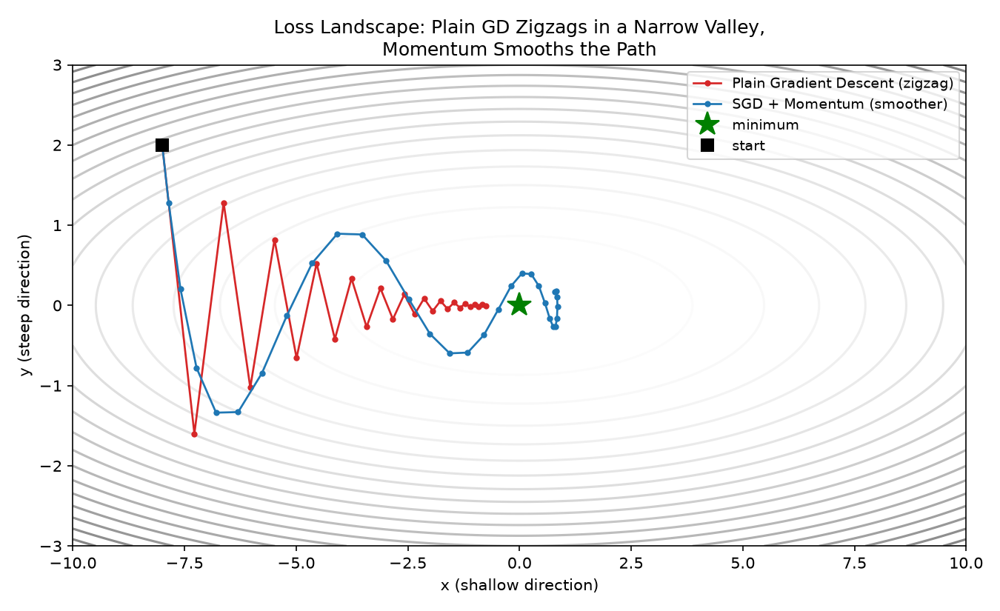
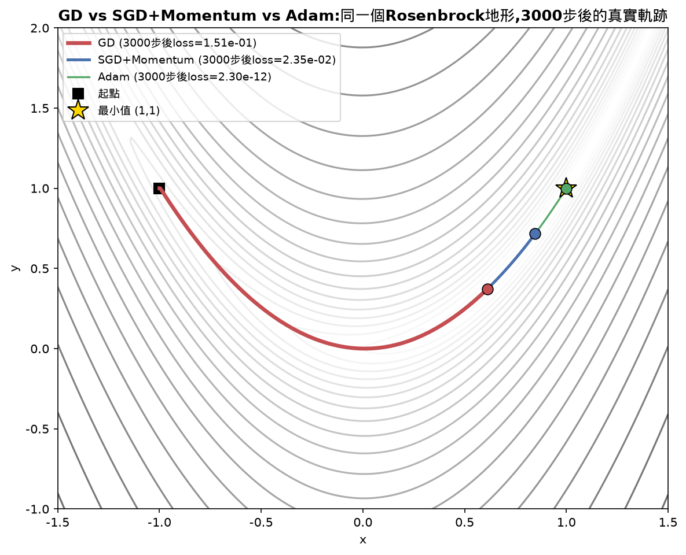
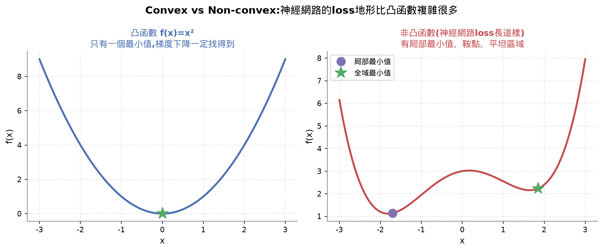
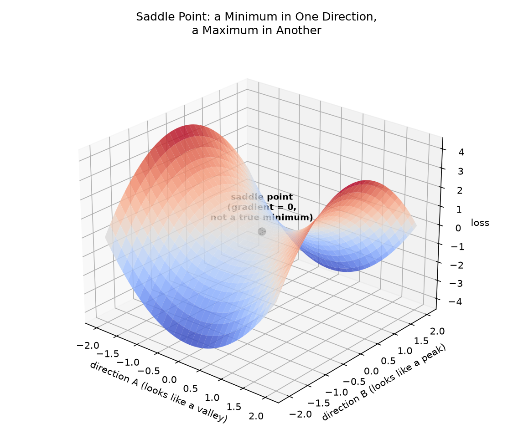
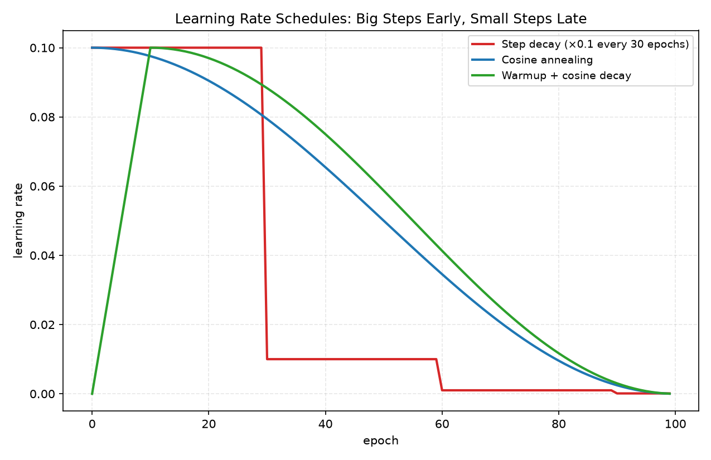

# Lesson 8 - Optimization(最佳化)

## Learning Objectives 打勾清單
- [x] 從零實作梯度下降、SGD with momentum、Adam ⚠️(`GradientDescent`真的看過對照公式;`SGDMomentum`、`Adam`寫在reference.py+跑過demo,沒有實際逐行帶著看,記進review-queue)
- [x] 比較三種optimizer在Rosenbrock函數上的收斂速度,解釋Adam為什麼能給每個權重自適應學習率
- [x] 分辨凸/非凸loss地形,解釋鞍點在高維度空間的角色
- [x] 認識學習率排程(step decay、cosine annealing、warmup)⚠️(只認識種類跟用途,沒有實作)

⚠️ **這堂課教得太快,post測驗5題裡3題完全沒印象(optimization定義、mini-batch雜訊為什麼有益、cosine annealing）。已經在課堂上重新用更短的版本補教過一次,但值得回頭日再確認一次是否真的記住。**

## 30秒抓重點(複習只看這裡就能想起整堂課在幹嘛)

- 三種optimizer是同一問題的三種答案:梯度下降(只看現在)、momentum(記住過去方向解決震盪)、Adam(momentum+每個權重自己的步伐大小)
- SGD/mini-batch用一小批資料估計梯度,犧牲準確度換速度;雜訊反而能把optimizer推出淺的局部最小值或鞍點
- Adam除以`sqrt(v_hat)`讓梯度大的權重步伐變小、梯度小的權重步伐變大,每個權重有專屬學習率;bias correction修正訓練初期m、v偏小的問題
- 凸函數只有一個最小值一定找得到,神經網路loss是非凸的;高維度空間裡鞍點比局部最小值更常見更麻煩,因為「所有方向都是谷底」機率很低
- 學習率排程在時間軸上動態調整步伐,cosine annealing前面大步後面小步,Transformer常搭配warmup使用
- 這堂課教得偏快,3個optimizer+凸非凸+鞍點+排程一次教完,post測驗3題沒印象,已重新補教過核心點

## 公式速查表

| 用途 | 公式 |
|---|---|
| 梯度下降 | `w = w - lr * gradient` |
| Momentum | `v = beta * v + gradient`;`w = w - lr * v` |
| Adam一階矩(方向) | `m = beta1 * m + (1 - beta1) * gradient` |
| Adam二階矩(梯度規模) | `v = beta2 * v + (1 - beta2) * gradient^2` |
| Adam偏差修正 | `m_hat = m / (1 - beta1^t)`,`v_hat = v / (1 - beta2^t)` |
| Adam更新規則 | `w = w - lr * m_hat / (sqrt(v_hat) + epsilon)` |

## 這堂課的名詞總表

| 英文 | 中文 | 一句話定義 |
|---|---|---|
| Gradient descent | 梯度下降 | 沿著梯度反方向更新權重,最基本的最佳化方法 |
| Learning rate | 學習率 | 控制每次更新走多大步的數字 |
| Momentum | 動量 | 把過去的梯度累積成速度,減少震盪、加速收斂 |
| SGD | 隨機梯度下降 | 用一小批資料(不是全部)估計梯度就更新,比較快但比較吵 |
| Mini-batch | 小批次 | 一次拿32~256筆資料算梯度,速度跟準確度的折衷 |
| Adam | — | 幫每個權重自動調整專屬學習率的最佳化方法 |
| Bias correction | 偏差修正 | Adam因為初始值是0,前幾步會偏小,除以修正項補回來 |
| Learning rate schedule | 學習率排程 | 訓練過程中動態調整學習率(前面大步,後面小步) |
| Convex function | 凸函數 | 只有一個最小值,梯度下降一定找得到 |
| Saddle point | 鞍點 | 梯度是0,但某些方向是最小值、某些方向是最大值 |
| Loss landscape | 損失地形 | 把loss函數畫成地形圖(高原、山谷、鞍點) |
| Convergence | 收斂 | 最佳化器走到一個點,之後再更新也不太能再有效降低loss |

---

（以下為詳細教學內容,教學過程中補上）

### 梯度下降(Gradient Descent)

```
w = w - lr * gradient
```

一行公式,對照Lesson 4手打過的1D梯度下降,邏輯完全一樣,差別是這裡同時處理多個參數(一個列表)。

### Momentum(動量)——解決什麼問題

梯度下降只看「現在」的梯度,如果遇到窄山谷,會左右震盪(之字形彈牆),浪費很多步在原地打轉。Momentum解決的正是這個**震盪**問題,不只是單純步子太小。

```
v = beta * v + gradient
w = w - lr * v
```

`beta`(通常0.9)代表這一步的方向,90%來自過去累積的速度、10%來自現在的梯度。比喻:像鐵球滾下山,遇到小凹凸不會停下重新出發,因為慣性把它帶過去了——左右互相抵消的力道會互相消掉,前後方向一致的力道會累積加速。

### SGD——解決什麼問題

梯度下降(GD)每走一步都要看過「全部」訓練資料才能走,資料量一大(百萬筆)會慢到不能用,而且記憶體塞不下。SGD的解法:只用一小批資料(mini-batch,32~256筆)估計一個大概的方向就走,犧牲一點準確度換取速度跟記憶體。這是機器學習能訓練巨型資料集的關鍵。

| 版本 | 每步看多少資料 | 梯度品質 | 速度 | 雜訊 |
|---|---|---|---|---|
| Batch GD | 全部資料 | 精確 | 慢 | 沒有 |
| SGD | 1筆 | 很吵 | 快 | 高 |
| Mini-batch | 32~256筆 | 估計值,還不錯 | 平衡 | 中等 |

**雜訊為什麼是好事,不是缺點**:mini-batch帶來的隨機震動,能把optimizer「推出」淺的局部最小值或鞍點,不會乖乖卡在那裡出不來。



### Adam——momentum + 自適應學習率

Adam = momentum(記住過去方向)+ 每個權重自己專屬的學習率(根據這個權重梯度通常多大來調整步伐)。

```
m = beta1 * m + (1 - beta1) * gradient          # 一階矩:方向,類似momentum
v = beta2 * v + (1 - beta2) * gradient^2        # 二階矩:這個權重梯度通常多大

m_hat = m / (1 - beta1^t)    # 偏差修正
v_hat = v / (1 - beta2^t)    # 偏差修正

w = w - lr * m_hat / (sqrt(v_hat) + epsilon)
```

除以`sqrt(v_hat)`是關鍵:梯度常常很大的權重,除以一個大數字,實際步伐變小(避免暴衝);梯度很小的權重,除以一個小數字,實際步伐變大(不會卡住不動)。每個權重因此有了自己專屬的學習率。`m_hat`/`v_hat`的偏差修正是因為`m`、`v`一開始都是0,訓練剛開始的前幾步會偏小,除以`(1-beta^t)`補回來,`t`是目前第幾步。

**Adam跟momentum比,多做了什麼**:momentum只解決「方向」的問題;Adam在這基礎上多做一件事——依照每個權重梯度的大小,自動調整它專屬的步伐大小。方向+步伐一起做。





demo跑出來的驗證(Rosenbrock函數,最小值在x=1, y=1, loss=0):
```
GD     -> loss=0.04083385
SGD+M  -> loss=0.00355685
Adam   -> loss=0.00000000   ← 幾乎完全收斂
```



### 三種optimizer對照:梯度下降 vs Momentum vs Adam

| | 梯度下降 GD | Momentum | Adam |
|---|---|---|---|
| 核心邏輯 | 只看現在的梯度 | 記住過去累積的方向(速度) | Momentum再加上每個權重自己的步伐大小 |
| 更新規則 | `w = w - lr * gradient` | `v = beta*v + gradient`<br>`w = w - lr*v` | `w = w - lr * m_hat / (sqrt(v_hat) + epsilon)` |
| 解決什麼問題 | 沒有,最陽春的版本 | 窄山谷裡左右震盪、原地打轉 | 不同權重需要不同大小的學習率 |
| 優點 | 邏輯最簡單、最好理解 | 遇到小凹凸不會停,收斂比GD快也比較平滑 | 每個權重自適應步伐,大多數問題不太用調參就堪用 |
| 缺點 | 窄山谷裡容易之字形震盪,慢 | 只解決方向問題,沒解決步伐大小 | 參數比較多、要存的狀態(m、v)也比較多 |
| Rosenbrock demo結果 | loss=0.04083385 | loss=0.00355685 | loss=0.00000000(幾乎完全收斂) |
| 什麼時候用 | 教學/理解原理用,實務很少單獨用 | 想要比GD快、又不想上Adam的複雜度時 | 預設優先試這個,Transformer類模型常用它的變形AdamW |

### 凸(Convex) vs 非凸(Non-convex)

凸函數只有一個最小值,梯度下降一定找得到,像`f(x)=x²`。神經網路的loss是非凸的,有很多局部最小值、鞍點、平坦區域。實務上高維度神經網路的局部最小值,loss通常都跟全域最小值差不多低,不是大問題。



### 鞍點(Saddle Point)——為什麼比局部最小值更麻煩

**局部最小值**:真的是山谷谷底,四面八方都是上坡,卡在這裡是「真的」卡住了。

**鞍點**:想像馬鞍形狀——中間那個點,前後方向看是往下凹的(像山谷),左右方向看反而是往上凸的(像山頂)。站在正中間,測出來的梯度是0(看起來像到底了),但其實往另一個方向走還能更低,只是當下這個點感覺不出來。



**為什麼鞍點更常見更麻煩**:局部最小值要求「所有方向都是山谷」,維度很多(神經網路動輒上萬個參數)時,這種「每個方向都剛好是谷底」的機率很低。相反地,「一部分方向是谷、一部分方向是山頂」(鞍點)在高維度空間裡反而超級常見。訓練神經網路時,卡住變慢最常見的原因不是局部最小值,而是鞍點——梯度在鞍點附近會變得很小很小,導致訓練停滯不前。Momentum跟mini-batch的雜訊都有助於衝出鞍點。

### 學習率排程(Learning Rate Schedule)

固定學習率是妥協——訓練初期想要大步快跑,後期想要小步精修。

| 排程 | 邏輯 |
|---|---|
| Step decay | 每N個epoch,學習率乘上一個係數(例如乘0.1) |
| Exponential decay | 平滑地按指數遞減 |
| Cosine annealing | 沿著cos曲線平滑遞減,前面大步後面小步,Transformer訓練常用 |
| Warmup + decay | 先線性拉升,再遞減,大模型防止一開始訓練不穩定 |



## PyTorch對應

```python
sgd = torch.optim.SGD(model.parameters(), lr=0.01, momentum=0.9)
adam = torch.optim.Adam(model.parameters(), lr=0.001)
adamw = torch.optim.AdamW(model.parameters(), lr=0.001, weight_decay=0.01)
scheduler = torch.optim.lr_scheduler.CosineAnnealingLR(adam, T_max=100)
```

實務經驗法則:先試Adam(lr=0.001,大多數問題不用調就堪用);要衝最好的最終準確度、且能花時間調參,換SGD with momentum(lr=0.01, momentum=0.9);Transformer用AdamW(decoupled weight decay);訓練超過幾個epoch一定要搭配學習率排程。

## 這堂課的總結

Optimization要解決的問題就是:給定loss函數(告訴你模型多爛)跟梯度(告訴你哪個方向會更爛),怎麼有效率地走到山谷底部。三種optimizer是同一個問題的三種答案——梯度下降(最陽春,只看現在)、momentum(記住過去方向,解決震盪)、Adam(momentum + 每個權重自己的步伐大小,解決「不同權重需要不同學習率」的問題)。凸/非凸、鞍點,講的是「山谷長什麼樣子」——神經網路的loss地形不是單純一個碗,鞍點比局部最小值更常見更麻煩,而momentum、mini-batch的雜訊剛好都有助於逃離鞍點。學習率排程則是在時間軸上動態調整步伐,前期快、後期穩。

## 課程結尾理解確認題(先自己想過一遍,再點開看答案,這樣才是真的在複習)

<details>
<summary><b>Q1：在機器學習的情境下,「optimization(最佳化)」具體是在解決什麼問題?</b></summary>

答案：optimization 要解決的問題是:給定一個 loss 函數(告訴你模型現在有多爛)跟它的梯度(告訴你往哪個方向調整參數會讓模型變得更爛或更好),要怎麼有效率地、一步一步找到能讓 loss 最小的那組參數。可以想成在一片高低起伏的「損失地形(loss landscape)」上找山谷谷底——梯度告訴你「現在腳下這個點,往上爬最快的方向是哪裡」,optimization 演算法要做的就是不斷沿著梯度的反方向調整參數,反覆更新,逐步逼近山谷底部。這堂課學的梯度下降(gradient descent)、momentum、Adam,是三種不同複雜程度的「怎麼決定每一步該往哪裡走、走多大步」的具體策略,解決的都是同一個核心問題:給定當下的梯度資訊,怎麼設計一套更新規則,讓模型的參數能又快又穩地收斂到讓 loss 夠低的地方。

</details>

<details>
<summary><b>Q2：為什麼 mini-batch SGD 帶來的「雜訊(noise)」反而對訓練有幫助,而不是缺點?</b></summary>

答案：Batch gradient descent 每走一步都要看過「全部」訓練資料才能算出梯度,梯度雖然精確,但資料量一大(百萬筆)會慢到不能用。SGD/mini-batch 的做法是只用一小批資料(mini-batch,通常32~256筆)去估計一個「大概」的梯度方向就更新,犧牲一點準確度換取速度跟記憶體。這帶來的副作用是:每一步算出來的梯度,跟用全部資料算出來的「真正」梯度會有一些隨機偏差,也就是雜訊。這個雜訊之所以是好事而不是缺點,關鍵在於損失地形裡有很多「淺的」局部最小值跟鞍點(saddle point)——如果梯度每一步都精準無誤,optimizer 走到一個梯度剛好等於或接近0的地方就會停滯不動,不管那裡是不是真正夠好的最低點。而 mini-batch 帶來的隨機震動,會讓每一步的方向稍微偏離「精確」的梯度,這種隨機擾動有機會把 optimizer 從這些淺的局部最小值或鞍點附近「推出去」,讓它繼續往更低的地方走,而不會乖乖卡在原地出不來。

</details>

<details>
<summary><b>Q3：cosine annealing 這種學習率排程(learning rate schedule)的邏輯是什麼?為什麼它在 Transformer 訓練中常被使用?</b></summary>

答案：固定不變的學習率其實是一種妥協——訓練初期,參數離最佳解還很遠,希望能大步快跑,加快收斂速度;訓練後期,參數已經很接近最佳解附近,這時候如果還跨大步,反而容易在最低點附近來回震盪、跨過頭,希望能小步精修,穩定收斂到更精確的位置。學習率排程要解決的正是「同一個訓練過程裡,不同階段需要不同大小的步伐」這個問題。cosine annealing 的做法,是讓學習率沿著一條餘弦(cosine)曲線平滑地從初始值遞減到接近0——因為 cosine 曲線的形狀是「兩端變化平緩、中間變化較快」,所以學習率在訓練剛開始跟快結束時下降得比較慢(維持較大的步伐或已經很小趨於穩定),在訓練中段下降得比較快,整體是一條平滑、沒有突然跳動的曲線,不像 step decay 那樣是階梯式的突然砍半或乘0.1。這種平滑遞減、前面大步後面小步的特性,搭配訓練初期常見的 warmup(先線性拉升學習率避免一開始訓練不穩定),是 Transformer 這種大模型訓練時很常見的排程組合,能在保有前期快速學習的同時,讓後期收斂得更穩定精確。

</details>

## 我自己手打的部分

`GradientDescent`(含`rosenbrock`/`rosenbrock_gradient`)真的對照公式看過,寫進`practice.py`,跑過驗證(x=0.798131, y=0.636104, loss=0.04083385,跟reference.py的GD結果一致)。`SGDMomentum`、`Adam`寫在`reference.py`+跑過demo驗證,沒有實際逐行帶著看,記進review-queue,之後真的要用再回來查。損失地形視覺化、Exercise 1-4、Ship It的prompt產出,這次都沒做。

## 今天評分

| 項目 | 說明 |
|---|---|
| 理解程度 | 這堂課教得太快,一次教完GD+momentum+Adam才確認,結果post測驗5題裡3題完全沒印象(optimization定義、mini-batch雜訊、cosine annealing)。已經用更短的版本重新補教過,momentum解決震盪、SGD解決資料量太大、Adam=momentum+自適應步伐、鞍點比局部最小值更常見,這幾個核心點課堂上確認過真的懂了 |
| 效率 | 內容偏多(3個optimizer+凸非凸+鞍點+排程),照加快節奏一次教完才檢查,反而retention不好。使用者確認之後**節奏不變,但每教完一個概念就要停下來確認,不要連續塞多個概念**(已寫進teaching-protocol記憶) |
| 完成度 | 4個Learning Objectives名義上都完成,但Adam/SGDMomentum屬於理解型(沒逐行看)、學習率排程只認識種類沒實作,損失地形視覺化跟全部Exercise都跳過記review-queue |
| 花費時間 | 20分鐘(課程建議時間:約75分鐘,遠低於建議時間——這跟上面「這堂課教得太快」的問題直接對應,3個optimizer+凸非凸+鞍點+排程塞進20分鐘教完,退步的post測驗結果不是意外) |
