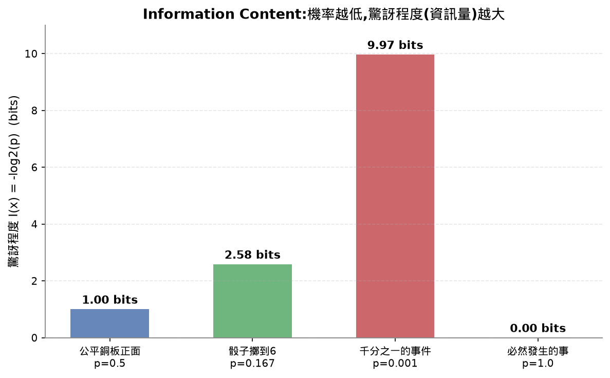
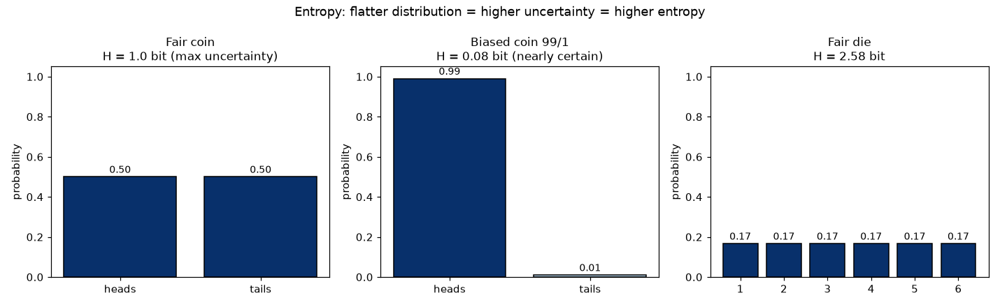
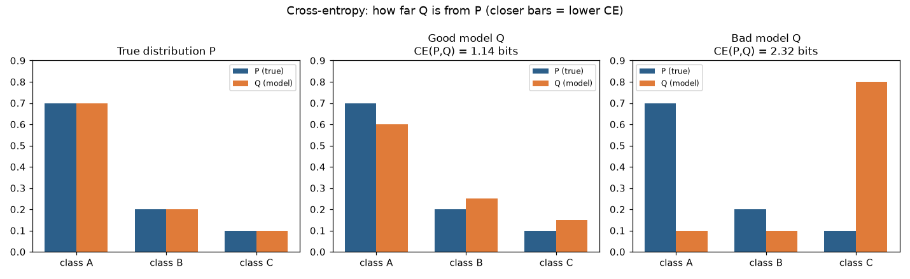
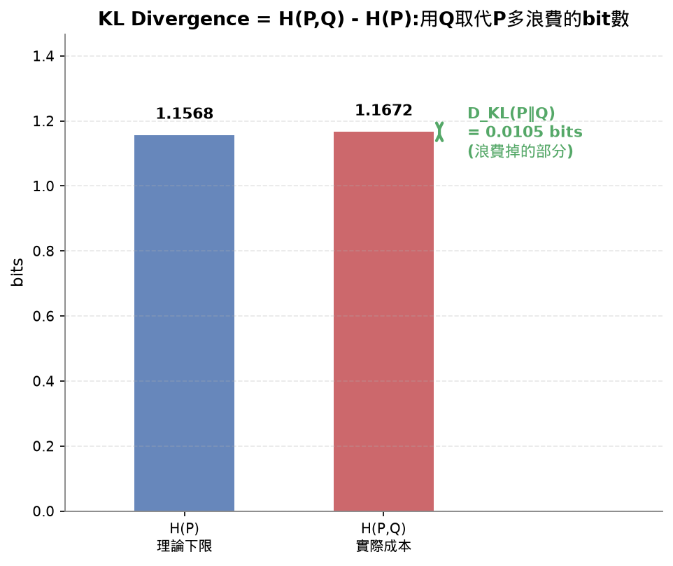
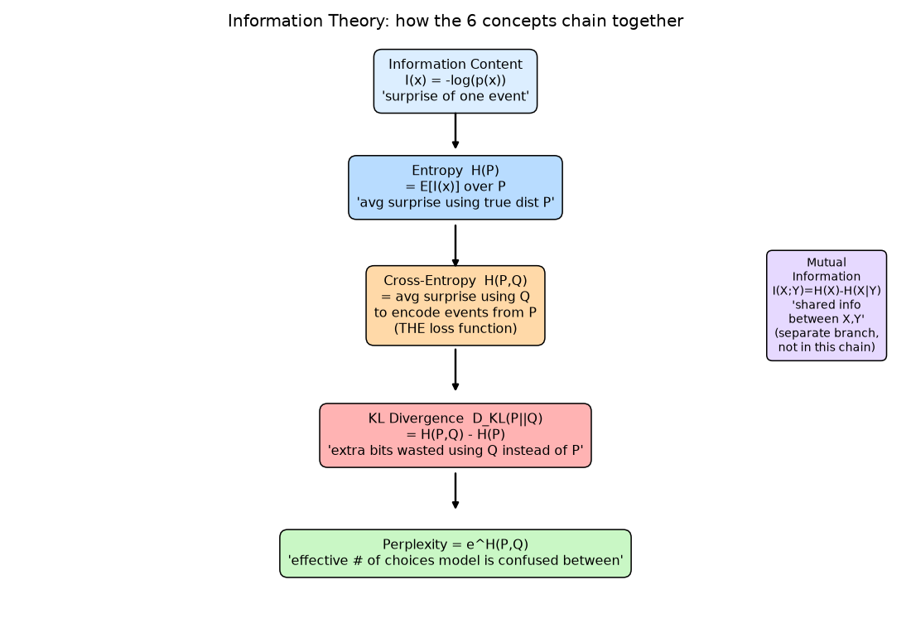
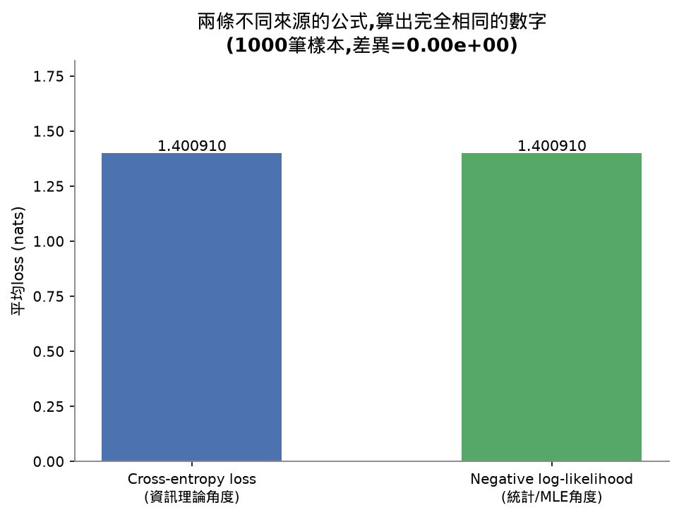
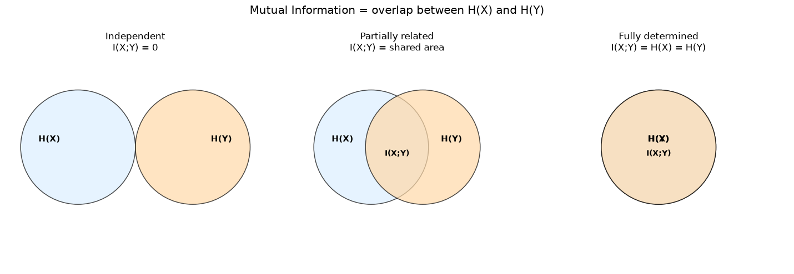
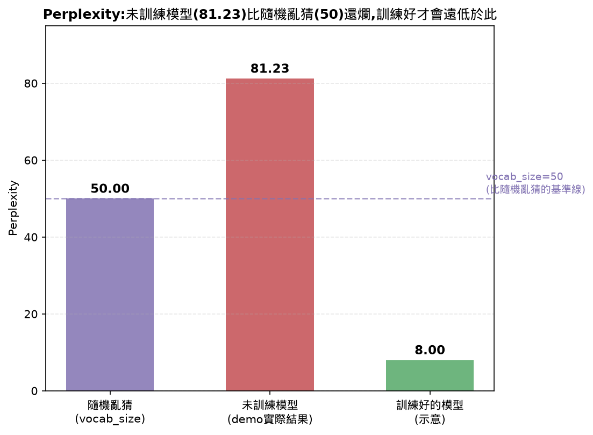
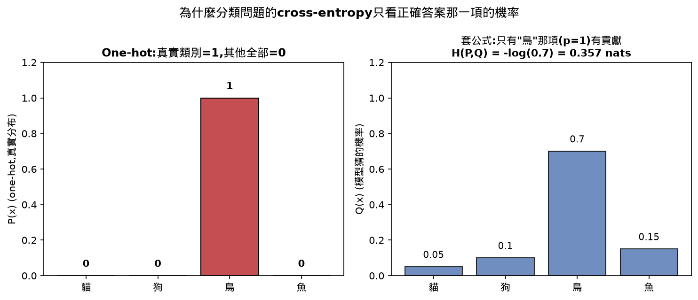

# Lesson 9 - Information Theory(資訊理論)

## Learning Objectives 打勾清單
- [x] 從零算出entropy、cross-entropy、KL divergence,解釋三者的關係
- [x] 推導為什麼「最小化cross-entropy loss」等於「最大化log-likelihood」
- [x] 算出特徵與目標之間的mutual information,用來排序特徵重要性 ⚠️(核心MI公式對過+跑過demo,`feature_selection_mi_demo`那個完整排序範例沒有實際帶過,記review-queue)
- [x] 解釋perplexity是「模型實際上在幾個選項裡猶豫」

## 30秒抓重點(複習只看這裡就能想起整堂課在幹嘛)

- Information content量單一事件的驚訝程度(`-log(p)`,機率越低越驚訝),entropy是整個分布的平均驚訝程度,是不確定性的下限
- Cross-entropy是用模型猜的Q去描述真實分布P,平均要花多少bit,分類問題P是one-hot時簡化成`-log(q(true_class))`,就是每天在用的loss function
- KL divergence = cross-entropy − entropy,是「用不完美的Q多浪費的成本」,不對稱不是真正的距離
- 因為H(P)訓練時是常數,最小化cross-entropy = 最小化KL散度 = 最大化log-likelihood,三件事是同一個優化問題
- Mutual information量兩個變數共享多少資訊,能抓到非線性關係,比只能抓線性關係的Pearson相關係數更全面
- Perplexity是cross-entropy取指數,代表模型實際上像在幾個選項間猶豫,比accuracy更能反映模型對整個機率分布的掌握程度

## 公式速查表

| 用途 | 公式 |
|---|---|
| Information content | `I(x) = -log(p(x))` |
| Entropy | `H(P) = -sum( p(x) * log(p(x)) )` |
| Cross-entropy | `H(P, Q) = -sum( p(x) * log(q(x)) )` |
| Cross-entropy(P是one-hot時) | `H(P, Q) = -log(q(true_class))` |
| KL divergence | `D_KL(P \|\| Q) = H(P, Q) - H(P)` |
| Negative log-likelihood | `NLL = -sum( log(q(y_i)) )` |
| Mutual information | `I(X;Y) = H(X) - H(X\|Y)` |
| Perplexity | `e^(交叉熵)`(nats)或`2^(交叉熵)`(bits) |

## 這堂課的名詞總表

| 英文 | 中文 | 一句話定義 |
|---|---|---|
| Information content | 資訊量/驚訝程度 | 單一事件的驚訝程度:-log(p(x)) |
| Entropy | 熵 | 整個分布的平均驚訝程度,不確定性的下限 |
| Cross-entropy | 交叉熵 | 用模型猜的Q去描述真實分布P,平均要花多少bit(=分類loss) |
| KL divergence | KL散度 | 用Q取代P多浪費的bit數,不對稱,不是真正的距離 |
| Mutual information | 互資訊 | 知道一個變數,能讓你對另一個變數的不確定性減少多少 |
| One-hot | 獨熱編碼 | 正確答案位置是1,其他全部是0的向量表示法 |
| Perplexity | 困惑度 | 交叉熵取指數,模型平均像在幾個選項間猶豫 |
| Softmax | — | 把任意實數向量轉成合法機率分布(總和=1) |
| Negative log-likelihood | 負對數概似 | 跟cross-entropy loss數學上完全相同 |
| Bits / Nats | — | log base 2 / log base e 的單位差別,PyTorch預設用nats |

---

### Information Content(驚訝程度)

```
I(x) = -log(p(x))
```

機率越低的事件,資訊量(驚訝程度)越大;必然發生的事(p=1)資訊量是0,因為你早就知道會發生,沒有帶來任何新資訊。

| 事件 | 機率 | 驚訝程度(bits) |
|---|---|---|
| 公平銅板正面 | 0.5 | 1.0 |
| 骰子擲到6 | 0.167 | 2.58 |
| 千分之一的事件 | 0.001 | 9.97 |
| 必然發生的事 | 1.0 | 0.0 |



### Entropy(熵)——整個分布的平均驚訝程度

```
H(P) = -sum( p(x) * log(p(x)) )   對所有x加總
```

把每個結果的驚訝程度(`-log(p)`)按機率加權平均。

```
公平銅板:    H = -(0.5*log2(0.5) + 0.5*log2(0.5)) = 1.0 bit
偏態銅板(99%正面): H = -(0.99*log2(0.99) + 0.01*log2(0.01)) = 0.08 bits
```



**規律**:分布越平(所有結果機率接近),熵越高;分布越集中(某個結果幾乎壟斷),熵越低。選項數越多,熵的上限也越高(6面骰子熵上限是log2(6)=2.58,比銅板的log2(2)=1還高)。熵衡量的是一個分布「本質上有多少不確定性」,是壓不掉的下限。

### Cross-Entropy(交叉熵)——你每天在用的loss function

```
H(P, Q) = -sum( p(x) * log(q(x)) )
```

P是真實分布(標籤),Q是模型猜的分布。Q跟P一樣時,交叉熵=熵本身;Q跟P差越多,交叉熵越大。

**手算例子**(true=[0.7,0.2,0.1], Q=[0.6,0.25,0.15]):

```
H(P,Q) = -[0.7*log2(0.6) + 0.2*log2(0.25) + 0.1*log2(0.15)]
       = -[0.7*(-0.737) + 0.2*(-2.0) + 0.1*(-2.737)]
       = 1.19 bits
```

**分類問題的簡化版**:P是one-hot向量(真實類別機率=1,其他=0)時,公式簡化成:

```
H(P, Q) = -log(q(true_class))
```

這就是`CrossEntropyLoss()`底層在算的東西。模型對正確答案猜得機率越高,loss越小;猜得越離譜,loss爆炸性變大。



上圖:好模型(橘色跟藍色柱子接近) → 交叉熵低(1.19 bits);壞模型(橘色跟藍色差很多) → 交叉熵高(3.02 bits)。**柱子越接近,交叉熵越低,代表模型猜得越準。**

### KL Divergence(KL散度)——多浪費了多少bit

```
D_KL(P || Q) = H(P, Q) - H(P)
```

`H(P)`是理論最低成本(用P自己編碼P的下限)。`H(P,Q)`是用不完美的Q去編碼P,實際要花的成本,一定≥H(P)。兩者的差,就是「猜不準多浪費的部分」。

```
H(true) = 1.1568 bits
H(true, good) = 1.1896 bits
KL(true || good) = 1.1896 - 1.1568 = 0.0328 bits   ← 猜得準,浪費很少
```

**KL散度不對稱**:`D_KL(P||Q) != D_KL(Q||P)`,驗證過(P=[0.9,0.1], Q=[0.5,0.5]時,KL(P‖Q)=0.531,KL(Q‖P)=0.737,兩個方向不一樣),所以KL不是真正的距離度量。



**訓練時的意義**:H(P)在訓練過程中是常數(標籤資料不變)。想成「總成本 = 固定成本 + 變動成本」——固定成本(H(P))不變,想壓低總成本(H(P,Q))就只能壓變動成本(KL)。所以「最小化交叉熵」跟「最小化KL散度」是同一個優化問題,本質上是把模型的Q推向真實的P。

### 六個概念怎麼串起來(整堂課最關鍵的一張圖)



`H(P)`(理論下限) → `H(P,Q)`(用Q實際要付出的成本) → 兩者差是`D_KL(P‖Q)`(猜不準浪費掉的部分) → 因為H(P)是常數,最小化交叉熵=最小化KL散度 → `Perplexity`是把交叉熵換算成更直覺的「困惑程度」數字。互資訊`I(X;Y)`是獨立的一支,不在這條鏈上。

### Entropy vs Cross-Entropy vs KL Divergence 對照

三個名字很像、公式也長得像,放在一起看差在哪:

| | Entropy `H(P)` | Cross-Entropy `H(P,Q)` | KL Divergence `D_KL(P\|\|Q)` |
|---|---|---|---|
| 量的是什麼 | 一個分布自己的平均驚訝程度 | 用Q去描述P,平均要花多少成本 | 用Q取代P多浪費的成本 |
| 公式 | `-sum(p(x)*log(p(x)))` | `-sum(p(x)*log(q(x)))` | `H(P,Q) - H(P)` |
| 需要幾個分布 | 1個(P) | 2個(P、Q) | 2個(P、Q) |
| 跟其他兩個的關係 | 是H(P,Q)的下限,H(P,Q)≥H(P)恆成立 | 等於H(P) + KL(P\|\|Q) | 就是H(P,Q)跟H(P)的差 |
| Q跟P一樣時 | 不受影響(本來就跟Q無關) | 等於H(P)本身 | 等於0 |
| 是不是對稱 | 只有1個分布,無所謂對稱 | 不對稱,`H(P,Q)≠H(Q,P)` | 不對稱,`D_KL(P\|\|Q)≠D_KL(Q\|\|P)`,不是真正的距離 |
| 在訓練裡對應什麼 | 標籤的熵,訓練時是常數 | 就是每天在用的分類loss function | 訓練時想壓低的「變動成本」,最小化它等於最小化cross-entropy |

### Cross-Entropy = Negative Log-Likelihood(MLE推導)

對N筆訓練樣本(真實類別y_i),假設樣本間獨立:

```
概似(Likelihood)     = product( q(y_i) )         所有樣本機率的連乘
對數概似(Log-likelihood) = sum( log(q(y_i)) )       連乘取log變連加
負對數概似(NLL)       = -sum( log(q(y_i)) )        取負號、加總
```

而`-log(q(y_i))`剛好就是`cross_entropy_loss`每一筆的值。所以NLL加總起來(取平均)就是交叉熵loss。**最小化交叉熵 = 最小化NLL = 最大化訓練資料的概似**,三件事是同一件事的不同講法。

demo驗證(1000筆隨機樣本):
```
Cross-entropy loss:      1.400910 nats
Neg log-likelihood:      1.400910 nats
Difference:               0.00e+00   ← 完全相同
```



### Mutual Information(互資訊)——知道X能讓你對Y少猜多少

```
I(X;Y) = H(X) - H(X|Y)
```

`H(X)`是原本對X的不確定性,`H(X|Y)`是已知Y後對X剩下的不確定性,差值就是Y幫你消除掉的不確定性。



- X、Y獨立(圖左,兩圓不重疊) → `I(X;Y)=0`
- X、Y部分相關(圖中,部分重疊) → 重疊面積就是`I(X;Y)`
- X完全決定Y(圖右,完全重疊) → `I(X;Y) = H(X) = H(Y)`

demo驗證:
```
Independent:   MI = 0.0000 bits
Dependent:     MI = 0.5310 bits
```

**跟Pearson相關係數的差別**:Pearson(-1到1)只抓得到「線性關係」,遇到非線性(比如U型)關係會誤判成無關;互資訊能抓到任何形式的統計關聯,不管線性非線性都算得出來。在特徵選擇上,MI分數越高代表這個特徵越有預測力,MI趨近0代表基本上是雜訊。

### Pearson相關係數 vs 互資訊 對照

兩個都是拿來量「兩個變數有沒有關聯」的指標,常常放在一起被拿來選特徵:

| | Pearson相關係數 | Mutual Information(互資訊) |
|---|---|---|
| 值域 | -1到1,有正負方向 | 0到正無窮,只有大小沒有方向 |
| 抓得到的關係 | 只有線性關係 | 任何形式的統計關聯,線性非線性都算得出來 |
| 遇到U型這種非線性關係 | 誤判成無關,算出接近0 | 抓得到,算出明顯大於0的值 |
| 兩變數獨立時 | 通常接近0(但不保證,可能剛好線性部分抵消) | 恆等於0 |
| 計算成本 | 低,公式簡單 | 較高,要先估計出entropy/條件entropy |
| 什麼時候用 | 快速篩選、關係大致是線性時 | 不確定關係形式、或懷疑有非線性關聯時 |

### Perplexity(困惑度)——模型「實際上在幾個選項間猶豫」

```
Perplexity = e^(交叉熵)   (nats)   或   2^(交叉熵)   (bits)
```

perplexity=50代表模型平均起來的猶豫程度,像是要從**50個選項裡均勻亂猜**一樣困惑。perplexity越低,模型越有把握。

**跟accuracy的差別**:accuracy是非黑即白(對/錯);perplexity量的是「機率分布有多集中」,同樣答對的兩個模型,一個給正確答案0.9的機率(很篤定),一個只給0.34(矇對的),accuracy一樣但perplexity差很多。perplexity比accuracy更嚴格,能捕捉模型對整個機率分布的掌握程度。

demo:未訓練的隨機模型,vocab_size=50,實際跑出來perplexity=81.23(比50還高,代表**比隨機亂猜還爛**——驗證了「perplexity < vocab size才代表比隨機好」這個判準)。



## 這堂課的總結

資訊理論的六個概念,其實是同一套邏輯的不同切面:Information content量單一事件的驚訝程度,Entropy把它平均成整個分布的不確定性下限,Cross-entropy是「用不完美的模型去猜」實際要付出的成本(=loss function),KL divergence是這中間多浪費的部分,Perplexity把交叉熵換算成更直覺的「困惑選項數」。因為標籤的熵H(P)訓練時是常數,最小化交叉熵、最小化KL散度、最大化log-likelihood,三件事在數學上是同一個優化問題。Mutual information是獨立的一支,量兩個變數共享了多少資訊,在特徵選擇上比Pearson相關係數更全面(抓得到非線性關係)。

## 課程結尾理解確認題(先自己想過一遍,再點開看答案,這樣才是真的在複習)

<details>
<summary><b>Q1：entropy(熵)、cross-entropy(交叉熵)、KL divergence(KL散度)三者之間是什麼關係?請用「理論下限」跟「實際花費」來解釋。</b></summary>

答案：entropy `H(P)` 是一個分布本身「理論上」最低要花的成本——用分布 P 自己去描述 P 自己,平均驚訝程度的下限,是壓不掉的極限值,分布越集中(某個結果幾乎壟斷)entropy 越低,分布越平均(每個結果機率接近)entropy 越高。cross-entropy `H(P,Q)` 描述的是「實際上」花的成本:如果不是用真實分布 P 自己去編碼,而是用一個不完美的猜測分布 Q(比如模型輸出的預測分布)去描述真實發生的 P,平均要付出多少成本——因為 Q 不完美,這個實際成本一定大於或等於理論下限 `H(P)`,兩者只有在 Q 跟 P 完全一樣時才相等。KL divergence `D_KL(P||Q) = H(P,Q) - H(P)` 量的正是這兩者的差:也就是「因為用不完美的 Q 去猜,多浪費掉的那一部分成本」。可以想成:H(P) 是固定成本(不管模型多好都省不掉),H(P,Q) 是總成本,KL 是浪費掉的變動成本——模型猜得越準,Q 越接近 P,KL 越小,浪費得越少;模型完全猜對,KL 變成0,總成本就等於理論下限。

</details>

<details>
<summary><b>Q2：為什麼「最小化cross-entropy loss」等價於「最大化log-likelihood」?</b></summary>

答案：對 N 筆訓練樣本(各自的真實類別是 y_i),假設樣本之間互相獨立,整批資料的 likelihood(概似,模型認為這整批真實答案發生的機率)是每一筆機率的連乘:`Likelihood = Π q(y_i)`。取 log 之後,連乘變成連加,得到 log-likelihood:`Σ log(q(y_i))`。如果在前面加上負號、把所有樣本的值加總,就得到 negative log-likelihood(NLL):`NLL = -Σ log(q(y_i))`。而 `-log(q(y_i))` 這一項,剛好就是 cross-entropy loss 在每一筆樣本上算出來的值(P是one-hot時,`H(P,Q) = -log(q(true_class))`)——所以把 NLL 對所有樣本加總(或取平均),數值上就等於整批資料的 cross-entropy loss。既然「最小化 NLL」等於「最小化NLL前面那個負號拿掉、變成最大化 log-likelihood」,三件事就是同一個優化問題的不同講法:最小化cross-entropy = 最小化NLL = 最大化訓練資料的log-likelihood,只是切入的角度(資訊理論的成本 vs. 統計的概似)不同。

</details>

<details>
<summary><b>Q3：perplexity(困惑度)要怎麼解讀?為什麼它比單純的accuracy(準確率)更能反映模型對機率分布掌握的好壞?</b></summary>

答案：perplexity 的定義是把 cross-entropy 取指數(`e^(交叉熵)` 用nats、`2^(交叉熵)` 用bits),可以直接解讀成「模型平均起來,實際上像是在幾個選項之間猶豫不決」——例如 perplexity=50,代表模型的猶豫程度,大約就像是要從50個選項裡均勻亂猜一樣困惑;perplexity 越低,代表模型對答案越有把握、機率分布越集中在正確答案上。accuracy 是非黑即白的指標,只看「模型猜的最高機率選項,是不是剛好等於正確答案」,答對就是答對,不管模型當時給正確答案的機率是0.99還是只是勉強超過其他選項的0.34。但 perplexity 量的是整個機率分布有多「集中」——同樣是答對的兩個模型,一個給正確答案0.9的高機率(很篤定地答對),另一個只給0.34的低機率(矇對的,只是剛好比其他選項高一點點),兩者 accuracy 完全一樣,但 perplexity 差很多,後者的 perplexity 會明顯高於前者。這代表 perplexity 能捕捉到「模型對整個機率分布的掌握程度」,而不只是「有沒有猜中」,是比 accuracy 更嚴格、也更能反映模型真實信心程度的指標。

</details>

## 這堂課我卡住/搞混的地方(完整問答記錄,給複習用)

### Pearson 跟 Poisson 搞混

這兩個字長得很像(都是P開頭、音節數也接近),測驗時把「Pearson correlation coefficient(皮爾森相關係數)」跟「Poisson distribution(卜瓦松分布)」搞混了一次,但兩者是完全不相關的兩個概念,分屬機率論裡不同的類別:

**Pearson correlation coefficient(皮爾森相關係數):** 這是這堂課「互資訊(Mutual Information)」小節裡拿來做對照的東西——一個介於 -1 到 1 之間的數字,量的是兩個變數之間**線性關係**的強弱跟方向(正相關/負相關/無關)。筆記裡明確寫過的重點是:Pearson 只抓得到「線性」的關係,遇到非線性關係(比如資料排列成U型曲線,兩個變數明顯有關聯,但不是「一個變大另一個就跟著等比例變大」這種直線關係)會誤判成「無關」,算出接近0的值,即使肉眼一看就知道兩者有很強的關聯。這是這堂課用互資訊(mutual information)跟Pearson做對比時,強調互資訊「不管線性非線性都算得出來」的那個對照組。

**Poisson distribution(卜瓦松分布):** 這是**機率分布**的一種(跟Lesson 6學過的Bernoulli、常態分布是同一個類別的東西),描述「單位時間/單位空間內,某件事發生次數」的分布,像是「一小時內客服電話進來的次數」、「一頁書裡打字錯誤的個數」這種計數型隨機變數。跟「兩個變數之間關不關聯」完全是不同層次的問題——Poisson分布回答的是「這件事發生幾次的機率有多高」,Pearson相關係數回答的是「兩件事有沒有一起變動」,兩者除了名字裡都帶「P」開頭的音,數學上沒有任何直接關係。

**怎麼避免以後又搞混:** 記法上可以把「-son結尾」跟「用途」綁在一起想——Pearson 的用途是「兩個變數的關係」(**關係型**),Poisson 的用途是「一個變數的次數分布」(**計數型**)。判斷題目在問哪一個,先問自己「這題在問的是『兩個東西有沒有關聯』,還是『一件事發生幾次的機率』」,問的是前者才是Pearson,問的是後者才是Poisson。

### one-hot 在cross-entropy簡化公式裡的角色需要補強

Cross-entropy的完整定義是 `H(P,Q) = -sum(p(x)*log(q(x)))`,對所有可能的類別x都要算一項再加總。但分類問題裡,程式碼跟公式常常直接寫成 `H(P,Q) = -log(q(true_class))`,只有一項,一開始不清楚這個簡化是怎麼跳出來的。

**答案在於「真實分布P」在分類問題裡,本身就是one-hot向量(獨熱編碼)**——真實類別的位置機率是1,其他所有類別的位置機率都是0。把這個特性代回完整公式:`sum(p(x)*log(q(x)))` 這個加總裡,除了「真實類別」那一項的`p(x)=1`,其餘所有項的`p(x)`都是0,而0乘上任何數字(包括`log(q(x))`)都是0,那些項直接整個消失,加總裡只剩下真實類別那一項:`1 * log(q(true_class))`,前面補上負號就是 `-log(q(true_class))`。所以「分類問題的cross-entropy只需要看模型對正確答案給的機率」這個簡化,不是額外發明的捷徑公式,而是完整定義套用在「P是one-hot」這個特殊狀況下,數學上自動化簡出來的結果——換一個問題,如果真實分布P不是one-hot(比如label smoothing之後,正確類別是0.9、其他類別平分剩下0.1),就不能再套用這個簡化版,要老實地把完整的加總公式算完。



## 我自己手打的部分

這堂課走Top-down策略(數學/理論課,不強制手打)。核心8個函式(`information_content`、`entropy`、`cross_entropy`、`kl_divergence`、`mutual_information`、`softmax`、`cross_entropy_loss`、`perplexity`)都對照公式讀過、跑過demo驗證數字一致,放進`practice.py`。`conditional_entropy`、`joint_entropy`、`label_smoothing_demo`、`feature_selection_mi_demo`這幾個屬於延伸內容(教學目標沒有明確要求),沒有實際帶過,記進review-queue。

## 今天評分

| 項目 | 說明 |
|---|---|
| 理解程度 | 6個核心概念都逐一講解+確認過,post測驗3題用問答方式都答對(中間有補強one-hot、perplexity vs accuracy的差別、Pearson vs Poisson的混淆)。整體理解紮實,沒有像Lesson 8那樣退步 |
| 效率 | 延續「每教完一個概念就停下確認」的節奏,這次retention明顯比Lesson 8好,沒有出現連續好幾個「不知道」的狀況 |
| 完成度 | 4個Learning Objectives都完成,MI的完整特徵排序demo跳過記review-queue;新增了配圖(entropy/cross-entropy/概念串連圖/互資訊Venn圖),也把Lesson 1-8的舊筆記回頭補了圖並推上GitHub |
| 花費時間 | 56分4秒(課程建議時間:約60分鐘,幾乎完全對上) |
