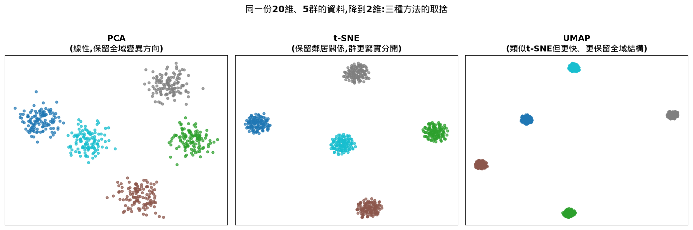
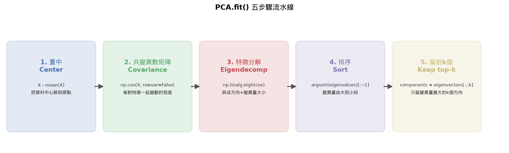
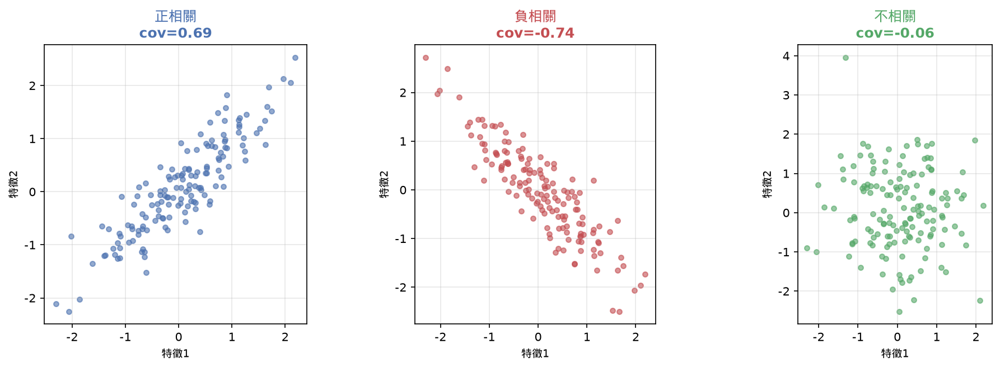
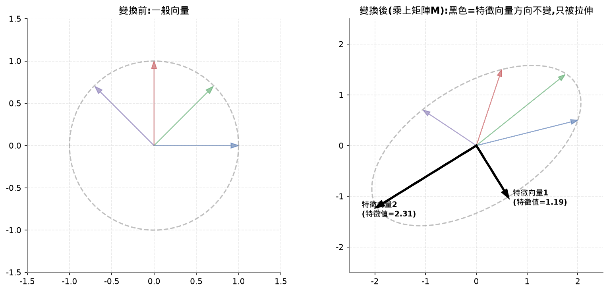
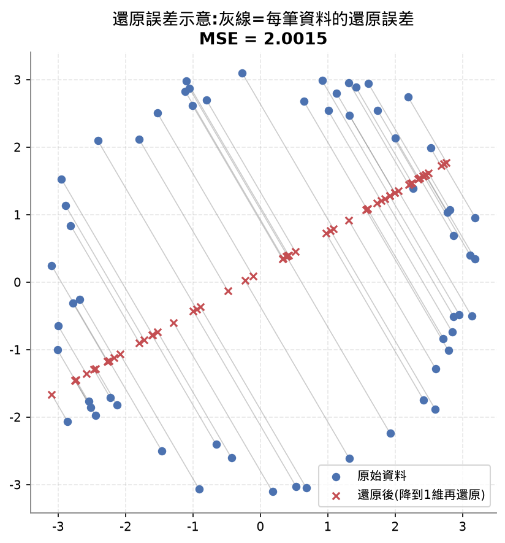
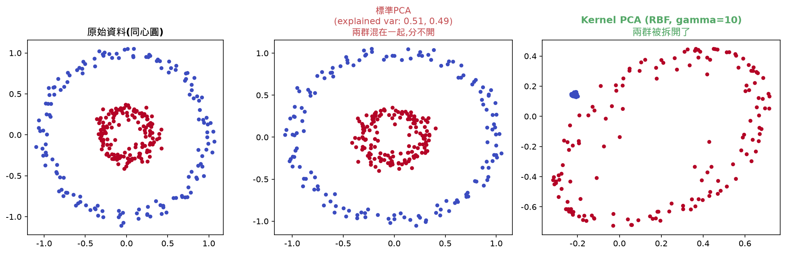
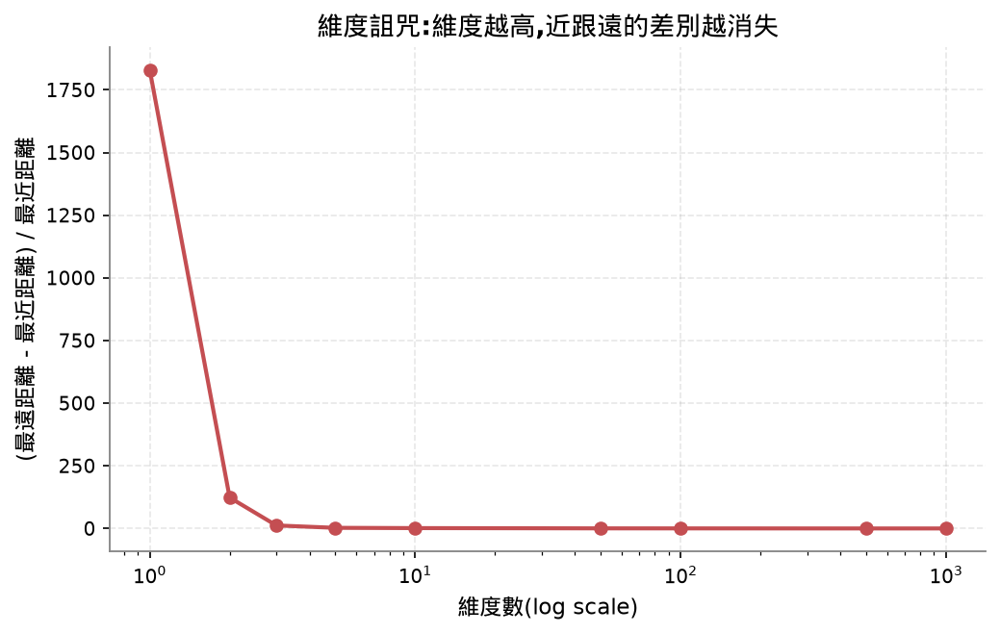
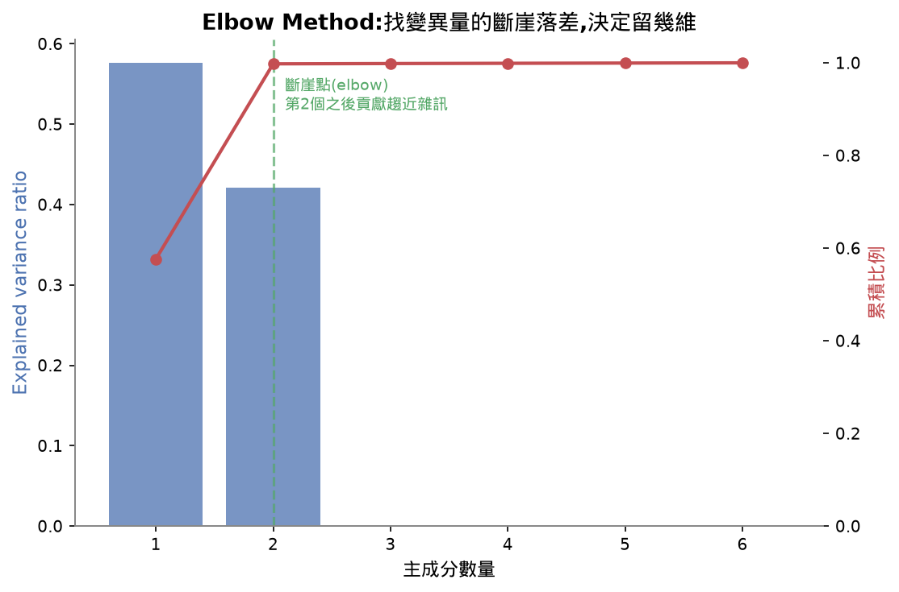

# Lesson 10 - Dimensionality Reduction(降維)

## 目錄

- [Learning Objectives 打勾清單](#learning-objectives-打勾清單)
- [30秒抓重點(複習只看這裡就能想起整堂課在幹嘛)](#30秒抓重點複習只看這裡就能想起整堂課在幹嘛)
- [公式速查表](#公式速查表)
- [這堂課的名詞總表](#這堂課的名詞總表)
- [PCA的fit方法,一步一步拆解](#pca的fit方法一步一步拆解)
- [這堂課我卡住/搞混的地方(完整問答記錄,給複習用)](#這堂課我卡住搞混的地方完整問答記錄給複習用)
  - [名詞總表的「留變異量大的還是小的」](#名詞總表的留變異量大的還是小的)
  - [np.mean(X, axis=0)到底在算什麼](#npmeanx-axis0到底在算什麼)
  - [共變異數矩陣](#共變異數矩陣)
  - [特徵向量/特徵值(eigenvector/eigenvalue)](#特徵向量特徵值eigenvectoreigenvalue)
  - [argsort重排(2D)](#argsort重排2d)
  - [「留前k個」跟explained_variance_ratio_是陣列還是單一數字](#留前k個跟explained_variance_ratio_是陣列還是單一數字)
  - [transform為什麼用fit時存的mean,不是這批新資料自己的mean](#transform為什麼用fit時存的mean不是這批新資料自己的mean)
  - [還原誤差(reconstruction error)為什麼要平方](#還原誤差reconstruction-error為什麼要平方)
  - [Kernel PCA:標準PCA為什麼分不開同心圓、Kernel PCA怎麼解決](#kernel-pca標準pca為什麼分不開同心圓kernel-pca怎麼解決)
  - [降維四種方法對照:PCA vs Kernel PCA vs t-SNE vs UMAP](#降維四種方法對照pca-vs-kernel-pca-vs-t-sne-vs-umap)
  - [維度詛咒(curse of dimensionality)](#維度詛咒curse-of-dimensionality)
- [這堂課的總結](#這堂課的總結)
- [相關概念(跨堂連結)](#相關概念跨堂連結)
- [面試向問題](#面試向問題)
- [課程結尾理解確認題(先自己想過一遍,再點開看答案,這樣才是真的在複習)](#課程結尾理解確認題先自己想過一遍再點開看答案這樣才是真的在複習)
- [我自己手打的部分](#我自己手打的部分)
- [今天評分](#今天評分)
  - [`.reshape(-1, 1)`:-1代表「這個維度大小你幫我算」](#reshape-1-1-1代表這個維度大小你幫我算)
  - [`np.column_stack()`:把多個1D陣列疊成2D矩陣的欄](#npcolumn_stack把多個1d陣列疊成2d矩陣的欄)
  - [`import ... as ...`:改名字避免命名衝突](#import--as-改名字避免命名衝突)
  - [`[::-1]`:切片語法的第三個位置是「步伐大小」,負數代表反著走](#-1切片語法的第三個位置是步伐大小負數代表反著走)

## Learning Objectives 打勾清單
- [x] 從零實作PCA:置中資料、算共變異數矩陣、特徵分解、投影
- [x] 用explained variance ratio跟elbow method選要留幾個主成分
- [ ] 比較PCA、t-SNE、UMAP在視覺化MNIST digits(2D)上的差異跟取捨 ⚠️(只講過t-SNE/UMAP的名詞定義,MNIST視覺化demo沒有實際帶過,記review-queue)
- [x] 用RBF kernel的Kernel PCA,分離標準PCA處理不了的非線性資料結構

## 30秒抓重點(複習只看這裡就能想起整堂課在幹嘛)

- PCA的fit流程:置中資料→算共變異數矩陣→特徵分解(eigh)→由大到小排序→留變異量最大的前k個方向
- 留哪個主成分看變異量大小,變異量大的方向才是資料真正在講的故事,資料維度間相關性/冗餘越高,少數主成分就能抓住大部分變異量
- explained variance ratio是陣列不是單一數字,加總起來才是「這次PCA保留了多少變異量」,elbow method看的是斷崖式落差不是接近程度
- transform用fit時存的mean,不能用新資料自己的mean,因為留下的方向是訓練資料座標系下定義的
- Kernel PCA用kernel trick,不用真算出高維座標,只算兩兩資料點的相似度(核矩陣)取代共變異數矩陣,能分開標準PCA分不開的同心圓
- 維度詛咒:維度越高,資料點之間的距離越趨於相同,「近」失去意義,是KNN/聚類這類依賴距離演算法失效的原因,跟大數法則同一套邏輯
- t-SNE/UMAP在MNIST視覺化上的實際比較這堂課沒有實際帶過,只講了名詞定義,留在review queue

## 公式速查表

| 用途 | 公式 |
|---|---|
| Explained variance ratio | 該主成分的特徵值 / 所有特徵值總和 |
| 距離公式 | `sqrt(每個維度差的平方和)` |
| RBF核函數 | `exp(-gamma * 距離平方)` |
| 還原誤差(reconstruction error) | 逐點相減後平方取平均(MSE);開根號後是RMSE |

## 這堂課的名詞總表

| 英文 | 中文 | 一句話定義 |
|---|---|---|
| Dimensionality reduction | 降維 | 把高維資料壓縮成低維,同時盡量保留有用資訊 |
| Curse of dimensionality | 維度詛咒 | 維度越高,資料點之間的距離越趨於相同,「近」失去意義 |
| PCA (Principal Component Analysis) | 主成分分析 | 找出資料變異最大的方向,依變異量排序,只留前k個方向 |
| Eigenvector / Eigenvalue | 特徵向量/特徵值 | 特徵向量是矩陣變換後方向不變的特殊方向,特徵值是那個方向被拉長/壓縮的倍數;PCA裡特徵向量=變異方向,特徵值=那個方向的變異量大小 |
| Covariance | 共變異數 | 量化兩個特徵是不是傾向一起變大變小(正相關)、一個大一個小(負相關),還是無關(接近0) |
| Covariance matrix | 共變異數矩陣 | 每對特徵之間共變異數排成的表格,一定是對稱矩陣(cov(i,j)=cov(j,i)),對角線是各特徵自己的變異數 |
| Explained variance ratio | 解釋變異比例 | 每個主成分佔總變異量的比例,判斷保留k個維度夠不夠 |
| Reconstruction error | 還原誤差 | 降維後再還原回原始維度,跟原始資料差多少(MSE) |
| Kernel trick | 核技巧 | 不用真的算出高維座標,只算兩兩資料點的相似度(核矩陣)就能做到等效的高維運算 |
| Kernel PCA | 核PCA | 用kernel trick在隱含的高維空間做PCA,能處理非線性資料(如同心圓) |
| t-SNE | — | 保留「鄰居關係」的非線性降維法,常用來畫圖視覺化,有perplexity參數(跟Lesson 9的困惑度只是同名,概念不同) |
| UMAP | — | 類似t-SNE但更快、更保留全域結構,常用n_neighbors/min_dist |
| Manifold | 流形 | 嵌在高維空間裡的低維曲面,例如一張紙揉皺後丟進3D空間,本質還是一個2D曲面 |



(這張圖是預覽,t-SNE/UMAP的內部演算法細節這堂課還沒有實際帶過,記review-queue,先看視覺對照有個直覺:同一份20維、5群的資料,PCA因為只找線性方向,群跟群還會有點重疊;t-SNE/UMAP保留的是「鄰居關係」,群通常分得更乾淨,但代價是失去了原始距離的絕對意義——t-SNE/UMAP圖上兩個群離多遠,不能直接解讀成「差多少」,只能看「誰跟誰比較像」。)

## PCA的`fit`方法,一步一步拆解

對照`reference.py`第21-46行。



| 步驟 | 程式碼 | 在幹嘛 |
|---|---|---|
| 1. 置中 | `self.mean = np.mean(X, axis=0)`<br>`X_centered = X - self.mean` | 對每個特徵(每一欄)分別算平均值,再讓每個特徵減掉自己的平均。PCA只關心資料怎麼變化,不關心資料原本座落在哪 |
| 2. 算共變異數矩陣 | `cov_matrix = np.cov(X_centered, rowvar=False)` | 算出每對特徵之間共變異數排成的表格,一定對稱。`rowvar=False`是告訴numpy「每一欄才是一個特徵」(不加的話numpy會誤把每一列樣本當成變數,算出形狀完全錯誤的矩陣) |
| 3. 特徵分解 | `eigenvalues, eigenvectors = np.linalg.eigh(cov_matrix)` | 把共變異數矩陣拆解成「方向(特徵向量)」+「每個方向的變異量大小(特徵值)」。用`eigh`(而非`eig`)是因為共變異數矩陣是對稱矩陣,`eigh`是對稱矩陣專用、更快更穩定 |
| 4. 排序 | `sorted_idx = np.argsort(eigenvalues)[::-1]`<br>`eigenvalues = eigenvalues[sorted_idx]`<br>`eigenvectors = eigenvectors[:, sorted_idx]` | `eigh`預設由小到大排序,要反過來變大到小。`argsort`回傳的是「排序後的索引位置」不是排序後的值本身。`eigenvectors[:, sorted_idx]`裡`eigenvectors`每一欄才是一個完整方向,要整欄一起搬,不能拆散重排 |
| 5. 留前k個 | `self.components = eigenvectors[:, :self.n_components].T`<br>`self.explained_variance_ratio_ = eigenvalues[:k] / eigenvalues.sum()` | 只留變異量最大的前k個方向。`explained_variance_ratio_`是每個留下方向的變異量佔全部方向總變異量的比例,這是一個陣列(留k個主成分就有k個數字),把它們加總可以知道「留下這k維總共保留了多少原始資訊」 |

## 這堂課我卡住/搞混的地方(完整問答記錄,給複習用)

### 名詞總表的「留變異量大的還是小的」

PCA的一句話定義提到「依變異量排序,只留前k個方向」,一開始沒搞清楚留大的還是小的。

**答案:留變異量大的。** 邏輯是PCA目標是「盡量保留資料裡的資訊,同時砍掉維度」。變異量代表「資料在這個方向上散開的程度」——變異量趨近0的方向,資料幾乎都是同一個值,丟掉不影響重建;變異量大的方向才是資料真正在講的故事。對應`fit`裡的`argsort(...)[::-1]`,把特徵值由大排到小,取前`n_components`個,永遠留的是變異量最大的方向。

延伸問題:「留變異量大的,是不是可以相對用比較少的維度?」**答案:對。** 因為變異量大的方向已經濃縮了大部分資訊,不需要留很多維度就能抓住大部分變異量。用demo的數字驗證:原始3維資料,只留2個主成分,就抓住99.93%的變異量,因為當初生成資料時`x3 = 0.5*x1 + 0.3*x2 + noise`,第3維幾乎是前兩維的線性組合,本身沒帶多少獨立資訊。反過來,如果資料的變異量在各方向上很平均(比如互相獨立的雜訊維度),就沒辦法只留少數幾個主成分還保住大部分變異量。**規律:資料維度之間相關性/冗餘越高,前k個主成分能抓住的變異量比例就越高。**

### `np.mean(X, axis=0)`到底在算什麼

**第一步,`axis`的意思**:假設`X`是身高體重的表格(3人,2特徵):

```
X = [[1, 10], [3, 20], [5, 30]]
```

`axis=0`代表「沿著欄的方向壓縮」,也就是對每一欄(每個特徵)分別算平均,不會把身高體重混在一起算:

```
身高平均 = (1+3+5)/3 = 3
體重平均 = (10+20+30)/3 = 20
結果: [3, 20]
```

對比`axis=1`(沒有用在`fit`裡,只是拿來對照):是把每一列(每筆樣本)自己的所有特徵平均起來,這裡身高體重單位不同混在一起平均沒有實際意義,只是示範`axis`參數的行為方向。

**第二步,為什麼`X`可以裝下這麼多維度**:一開始沒意識到`X`不是單一數字,是一個矩陣(二維陣列),概念上跟C++的`vector<vector<double>>`一樣——一個變數名字底下裝著整塊表格。`X`一列是一筆樣本、一欄是一個特徵,`X.shape`會是`(500, 3)`,500筆樣本、3個特徵,靠「形狀」組織1500個數字屬於哪一筆哪一維,不需要每個數字取一個變數名。

**第三步,為什麼函式裡的參數叫`X`**:`X`只是`fit(self, X)`這個方法內部拿來稱呼「傳進來的那份資料」的名字,呼叫端實際傳的是`X_synthetic`(500筆×3維的合成資料),跟外面變數叫什麼名字無關——機器學習領域慣例上輸入特徵矩陣習慣叫`X`(大寫)、標籤叫`y`(小寫),純粹是命名習慣,沒有數學上的特殊意義。

**第四步,`mean`這個英文字**:`mean`就是「平均值」,跟`average`同義,統計學裡比較常用`mean`。

**第五步,`np.mean`整體行為**:不指定`axis`時,把整個矩陣攤平成一串數字全部加總除以總個數;`axis=0`按欄分開算(對應`fit`裡的用法);`axis=1`按列分開算。

### 共變異數矩陣

**共變異數(covariance)的概念**:量化兩個特徵是不是傾向一起變大變小。身高體重這種例子,身高越高體重通常也越重,共變異數是正數;「唸書時數」vs「玩遊戲時數」通常一多一少,是負數;兩個不相關的東西(身高 vs 今天日期)共變異數接近0。`cov`是covariance的縮寫。



**共變異數矩陣一定對稱**:自己觀察出來的重點——「特徵i跟特徵j一起變動的程度」跟「特徵j跟特徵i一起變動的程度」是同一件事,沒有先後之分,所以矩陣裡(i,j)格跟(j,i)格永遠相等,沿對角線鏡像對稱。對角線是每個特徵自己跟自己的共變異數,其實就是它自己的變異數。這個對稱性質正好是下一步能用`eigh`(對稱矩陣專用)的關鍵前提。

**`rowvar=False`是什麼、怎麼判斷有沒有設對**:`np.cov`預設假設「每一列是一個變數、每一欄是一筆觀測值」,但我們的`X`是相反的(每一列是樣本、每一欄才是特徵),所以要加`rowvar=False`告訴它「照『每一欄是一個特徵』的方式算」。

一開始不知道怎麼判斷「有沒有設反」,後來理解成:不用感覺或用猜的,而是**自己先從「有幾個特徵」推論出共變異數矩陣理論上應該是幾乘幾**(比如3個特徵,矩陣定義上就該是3×3,不管有幾筆樣本),再實際印出`cov_matrix.shape`去對照——一致就是對的,像demo裡如果印出`(500,500)`而不是`(3,3)`,就代表`rowvar`設反了,numpy把500筆樣本誤當成500個變數去配對。這個「先從定義推論出應該長怎樣,再拿實際結果對照」的debug邏輯,跟寫C++時先手算小測資的預期輸出再跑程式比對是同一套方法。

### 特徵向量/特徵值(eigenvector/eigenvalue)

**直覺理解**:一個矩陣可以把空間裡的點做變換(拉長、壓扁、旋轉),大部分向量被變換後方向會改變。但對某個矩陣來說,存在幾個特殊方向,變換後**方向不變,只有長度變了**(可能拉長、可能壓縮)——這種方向叫特徵向量,它被拉長/壓縮的倍數叫特徵值。



**跟PCA的關係**:對共變異數矩陣做特徵分解,算出來的特徵向量剛好對應資料變異的主要方向,特徵值對應那個方向上變異量的大小——這是共變異數矩陣的數學性質決定的,不是巧合。

**`np.linalg.eigh`**:`eigh`的`h`代表Hermitian,是對稱矩陣專用版本(比通用的`eig`更快更數值穩定),正好對應到共變異數矩陣一定對稱這個前提。

#### 常見地雷

> 容易誤會成:PCA算出來的每個主成分方向是唯一固定的,同一份資料不管用哪個工具、跑幾次,理論上應該給出完全相同的向量。
>
> 實際上:eigenvector的方向本身正負號是任意的(`v`跟`-v`都滿足`Av=λv`,是同一個「方向」的兩種寫法),不同函式庫、不同次執行可能給出正負號相反的主成分,這不代表算錯。另外當兩個相鄰的eigenvalue非常接近時,對應的eigenvector方向會變得對資料裡的微小雜訊很敏感、不穩定,這也是為什麼比較PCA結果時不能直接比對某個主成分的正負號或些微方向差異。

### `argsort`重排(2D)

`eigh`回傳的特徵值預設由小到大排序,但PCA要的是由大到小,所以要自己重排。用小數字例子重講才懂:

```
eigenvalues = [1, 5, 3]
eigenvectors = [[0.1, 0.9, 0.4],
                [0.2, 0.8, 0.7],
                [0.3, 0.7, 0.6]]
```

**關鍵觀念:`eigenvectors`裡每一「欄」(直的)才是一個完整方向,不是每一列。** 第0欄`[0.1,0.2,0.3]`對應特徵值`1`,第1欄`[0.9,0.8,0.7]`對應特徵值`5`,第2欄`[0.4,0.7,0.6]`對應特徵值`3`——這三對(特徵值,方向)是綁定的組合,像一雙鞋左右腳配對,不能拆開。

`np.argsort`不是排序數值本身,是回傳「排序後的索引位置」。`argsort([1,5,3])`由小到大排列的索引是`[0,2,1]`,想要大到小再反過來變`[1,2,0]`——意思是「原本排第1的東西該搬到最前面、原本第2的搬第二、原本第0的搬最後」。

`eigenvalues[sorted_idx]`是直接用這個順序去陣列裡挑數字排成新陣列,很直覺。`eigenvectors[:, sorted_idx]`比較繞,因為要挑的是「整欄」而不是單一數字——`[列的選法, 欄的選法]`,`:`代表列全部不動,`sorted_idx`放欄的位置代表欄要照這個順序重排,把整欄(整個方向,3個數字一起)搬到新位置,不能拆散,才能保持「排序後的特徵值」跟「排序後的方向」還是正確配對。

### 「留前k個」跟`explained_variance_ratio_`是陣列還是單一數字

`explained_variance_ratio_`是**陣列**,不是單一數字——因為每個留下的主成分都對應一個獨立的特徵值(純量),換算成的比例自然也是每個主成分各有一個。留2個主成分,`explained_variance_ratio_`就有2個數字(比如`[0.59, 0.41]`),分別代表第1、第2主成分各自佔總變異量的比例。

「99.93%是加起來的嗎」——對,是把陣列裡所有比例`sum()`加總,代表「留下的這幾個主成分,總共抓住了原始資料多少百分比的變異量」。剩下沒加進去的部分,就是被丟掉的方向造成的資訊損失。

「那別人問PCA是多少呢」——這個問法本身不完整:**PCA是一個方法/演算法,不是一個數值**,就像不會問「梯度下降是多少」一樣。真正有數值可以回答的是「這次PCA保留了多少變異量」(explained variance ratio加總,例如99.93%)、「降到幾維」(`n_components`)、「各主成分各自佔多少」(那個陣列本身)。比較完整的講法會是:「原本3維的資料,用PCA降到2維,保留了99.93%的變異量,幾乎沒有損失資訊」——「PCA」是方法,「99.93%」才是這次PCA跑出來的結果數值。

### `transform`為什麼用`fit`時存的mean,不是這批新資料自己的mean

情境:先用一批資料(比如500筆)做`fit`,`fit`裡算出的`self.mean`是那500筆資料自己的平均值。之後如果有新的一批資料要做`transform`降維,要拿新資料去減「當初訓練資料算出來的mean」,不能自己重新算新資料的平均值。

原因:`self.components`(留下的k個方向)是根據訓練資料置中後算出來的,那些方向是「訓練資料座標系」下定義的。如果新資料用自己的mean置中,等於站在不同座標系原點上套用訓練資料算出來的方向,會對不齊、結果沒有意義。程式碼裡`transform`完全沒有重新計算mean,固定減掉`self.mean`(fit時存下的那個值),不管吃到的`X`是原本那批還是全新資料。

### 還原誤差(reconstruction error)為什麼要平方

**第一次疑問:還原誤差不是要比較還原後的數字嗎,為什麼要平方?**

因為單純相減會有正負抵消的問題。比如3個維度的差分別是`-0.1`、`+0.1`、`-0.2`,不平方直接加總:`-0.1+0.1+(-0.2)=-0.2`,看起來誤差很小,但其實是三個真實誤差互相抵消造成的假象。平方後`-0.1`跟`+0.1`都變成正的`0.01`,不會互相抵消,才能正確反映真實誤差大小。這也是為什麼統計上很多「差距」的衡量(MSE、變異數、標準差)都用平方而不是直接相減。

**第二次疑問:平方完不會讓差距變更小嗎(如果是小數點)?** 比如`0.1`平方後變成`0.01`,數值確實變小。但這不影響指標的意義,因為:①重點不是「數字本身還原成原始大小」,而是拿來互相比較(哪個模型/哪個k值誤差比較大),只要都用同一套平方公式,相對大小的排序關係還是對的;②如果想要「還原回原始尺度」的誤差,標準做法是最後再開根號,得到RMSE(均方根誤差)——`rmse = sqrt(reconstruction_error(X, X_hat))`,demo的`0.002424`開根號後大概是`0.049`,這個數字才貼近原始資料的單位尺度。**平方是為了不能讓正負抵消,不是為了保留原始尺度;要保留尺度做直覺解讀,業界標準是最後再開根號。**

具體逐步算法(用一筆資料`[1.0, 2.0, 3.0]`還原成`[1.1, 1.9, 3.2]`為例):逐點相減得`-0.1, 0.1, -0.2`→平方得`0.01, 0.01, 0.04`→取平均得`0.02`。`reconstruction_error(X, X_reconstructed)`對所有樣本、所有維度一起做這件事,`np.mean`把矩陣裡全部數字拉平算一個平均,得到一個總結性的單一數字。



### Kernel PCA:標準PCA為什麼分不開同心圓、Kernel PCA怎麼解決



想像一張紙上兩圈同心圓(內圈藍色、外圈橘色)。標準PCA在找一條直線方向,資料在這個方向上變異最大——但同心圓資料不管畫哪個方向的直線,藍橘兩色投影都混在一起(demo驗證:兩個主成分變異量`[0.508, 0.492]`幾乎一樣,PCA找不到特別重要的方向)。

Kernel PCA的想法:如果把這些點丟進更高維空間(想像把內圈點抬高、外圈點留在原地,變成碗狀的3D形狀),可能就能用一個平面把兩群點分開。但真的去算高維座標可能很貴甚至是無限維。**Kernel trick的巧妙之處是不用算出確切的高維座標,只需要知道「任兩點在高維空間裡有多相似」就夠了**,而這個相似度可以直接用原始低維座標算出來,數學上等價於真的跑去高維空間算距離。

RBF核函數`exp(-gamma * 距離平方)`:兩點原本離得近,相似度接近1;離得遠,相似度接近0。這個相似度矩陣(核矩陣)取代標準PCA裡的共變異數矩陣,後面特徵分解、留前k個方向做法完全一樣。跑完之後,Kernel PCA把同心圓資料轉到新的2維空間,藍橘兩色可以被一條直線分開,標準PCA做不到這件事。

### 降維四種方法對照:PCA vs Kernel PCA vs t-SNE vs UMAP

| | PCA | Kernel PCA | t-SNE | UMAP |
|---|---|---|---|---|
| 核心邏輯 | 找資料變異量最大的線性方向 | 用kernel trick,在隱含的高維空間裡做PCA | 保留資料點之間的「鄰居關係」 | 類似t-SNE,但演算法更快、更保留全域結構 |
| 能不能處理非線性結構 | 不行,同心圓這種資料分不開 | 可以,靠kernel把問題轉成高維空間裡的線性問題 | 可以,專門設計來處理非線性流形 | 可以 |
| 降維後的距離還有沒有意義 | 有,保留原始尺度的變異量 | 有(在kernel定義的相似度意義下) | 沒有,兩群離多遠不能直接解讀成「差多少」,只能看「誰跟誰比較像」 | 跟t-SNE一樣,距離不能直接解讀,但比t-SNE更保留一些全域結構 |
| 有沒有明確的`transform`(能套用到新資料) | 有,`fit`存下mean跟方向,新資料直接套用 | 有(理論上可以,但比PCA麻煩) | 通常沒有,每次都是重新對整份資料算一次 | 有,比t-SNE更適合套用到新資料 |
| 主要用途 | 降維、壓縮、去雜訊、當其他演算法的前處理 | 標準PCA處理不了非線性結構時的替代方案 | 視覺化(把高維資料畫成2D/3D圖) | 視覺化,也常拿來做一般的降維前處理 |
| 這堂課的完成度 | 從零實作過,fit五步驟逐步拆解 | 講過原理+demo驗證(同心圓分開) | 只講過名詞定義,MNIST視覺化demo沒帶過(review queue) | 只講過名詞定義,沒有實際帶過(review queue) |

**`gamma`是什麼**:控制「兩個點要多近才算相似」的超參數。`gamma`小,判斷相似的門檻寬鬆(離遠一點還是算相似);`gamma`大,門檻嚴格(稍微離遠相似度就迅速掉到接近0)。可以想成「視野放大鏡倍率」——`gamma`越大只關注非常局部的鄰居關係,越小越看重整體大範圍關係。實務上通常要試幾個值,沒有公式能直接算出正確答案。

### 維度詛咒(curse of dimensionality)

**第一次講解(數字直覺)**:在單位立方體裡隨機灑1000個點,量「最遠點」跟「最近點」的距離差距比例,維度越高差距越消失:

```
維度=1:    差距是最近距離的1830倍
維度=10:   差距剩1.5倍
維度=100:  差距只剩0.35倍
維度=1000: 差距只剩0.095倍(幾乎所有點都一樣遠)
```



**第二次重講(丟骰子類比)**:距離公式是`sqrt(每個維度差的平方和)`,可以把每個維度的差想成一個隨機丟出來的數字。丟一次骰子結果差很大(1或6),但丟1000次取平均,平均值會很穩定收斂到3.5附近,很難丟出極端的平均值——因為好運跟壞運互相抵消。維度增加對距離做的是同一件事:每增加一個維度就像多丟一次骰子,維度越多,每個點的總距離就越被拉向同一個穩定值,最近點跟最遠點的差距就消失了。**這個直覺自己想到的連結是「很像期望值/大數法則」,完全正確**——樣本數(這裡是維度數)越多,平均值越穩定收斂,是同一套統計邏輯。

**對演算法的影響**:KNN、聚類這類演算法的判斷基礎是「距離近=相似,距離遠=不相似」。維度一高,這個判斷基礎本身消失(每個點都差不多近/差不多遠),模型就找不到真正有意義的鄰居或群集,這也是為什麼要先降維再做這類依賴距離的演算法。

**補充角度(稀疏性/指數樣本需求)**:另一個查證資料(其他AI工具的解釋)補的角度——要在d維空間維持跟1維一樣的「資料密度」,需要的樣本數隨維度指數成長(1維10筆、2維100筆、3維1000筆、100維理論上要10^100筆)。現實中資料筆數不可能跟著指數成長,結果是任何真實資料集在高維空間永遠顯得極度稀疏。這跟「距離趨同」是同一個根本原因的兩種呈現方式:高維空間比想像中大太多太多,資料永遠填不滿它。深度學習裡常見的工程解法是用`nn.Linear`這類可訓練的embedding層,把高維稀疏特徵壓縮成低維密集向量(概念上跟PCA同樣是「高維壓低維」,但PCA是無監督線性代數解法,`nn.Linear`是靠梯度下降學出怎麼壓縮的可訓練參數,屬於之後神經網路階段的內容,這裡先知道這個連結就好)。

## 這堂課的總結

這堂課的核心問題是:高維資料裡有很多是雜訊或冗餘,能不能只留下真正重要的方向。PCA的做法是先把資料置中,再用共變異數矩陣抓出「哪些方向變異量大」——變異量大的方向才是資料真正在講的故事,靠特徵分解把這些方向(eigenvector)跟大小(eigenvalue)算出來,由大到小排序後只留前k個,用explained variance ratio跟elbow method判斷k要留多少。但PCA只能找一條直線方向,遇到同心圓這種資料就束手無策;Kernel PCA用kernel trick,不用真的算出高維座標,只靠兩兩資料點的相似度(核矩陣)取代共變異數矩陣,就能把非線性問題轉成隱含高維空間裡的線性問題解掉。

維度詛咒則是「為什麼要先降維」的另一半理由:維度一高,資料點彼此的距離會趨於相同,「近」失去意義,這跟大數法則是同一套邏輯——維度越多,等於加總越多個隨機差值,每個點的總距離都被拉向同一個穩定值。KNN、聚類這類靠「距離近=相似」判斷的演算法,在高維空間會直接失效,所以先降維再套用這類演算法,是很常見的前處理步驟。整堂課算是從Lesson 9的資訊理論(怎麼量化一份資料裡有多少資訊)往前走一步,變成「怎麼在盡量保留資訊的前提下,把資料的維度實際壓下來」。

## 相關概念(跨堂連結)

- **rank(秩)與資料的有效維度是同一個直覺**:PCA能用少數幾個主成分保留大部分變異量,靠的是「資料維度間相關性/冗餘越高,少數主成分就能抓住大部分變異量」 → 這個直覺第一次出現在 [Lesson 1](../01-linear-algebra-intuition/notes.md#這堂課的總結),那邊的rank(矩陣裡線性獨立的方向數)量的是同一件事:矩陣表面維度很大,但冗餘的列不增加真正的維度,LoRA就是利用這個特性省參數,PCA則是用變異量這個更貼近真實資料分佈的判準做同樣的事
- **Eigenvector/eigenvalue的完整推導**:這堂課直接對共變異數矩陣做特徵分解(`np.linalg.eigh`),eigenvector對應變異方向、eigenvalue對應變異量大小,但沒有重新推導`Av=λv`怎麼來的 → 完整推導在 [Lesson 3](../03-matrix-transformations/notes.md#eigenvalue-完整推導用文字講少符號版),那邊從`Av=λv`一路推到`det(A-λI)=0`再解出特徵值,這堂課PCA用到的整套eigendecomposition機制,數學根源就在那裡
- **變異數的定義跟共變異數矩陣**:這堂課的共變異數矩陣,對角線就是每個特徵自己的變異數,整個PCA演算法建立在「找變異量最大的方向」這個目標上 → 變異數的原始定義在 [Lesson 6](../06-probability-and-distributions/notes.md#變異數兩種公式是同一個東西),那邊推導了變異數的兩種等價公式(`E[(X-mu)²]`跟`E[X²]-(E[X])²`),是這堂課共變異數矩陣、explained variance ratio所有計算的起點

## 面試向問題

- PCA做完降維後,發現用不同套件、不同次執行,算出來的主成分方向正負號不一樣,這是bug嗎?(對應「常見地雷」那段)
- 資料集裡有兩群資料是同心圓分布,你會用標準PCA還是Kernel PCA?為什麼?(對應「Kernel PCA:標準PCA為什麼分不開同心圓、Kernel PCA怎麼解決」那段)
- 為什麼KNN這類依賴距離的演算法,在特徵維度很高時效果會明顯變差?(對應「維度詛咒(curse of dimensionality)」那段)
- 上線後要對一筆新資料做PCA降維,為什麼不能用這筆新資料自己重新算一次mean再置中?(對應「`transform`為什麼用`fit`時存的mean」那段)

## 課程結尾理解確認題(先自己想過一遍,再點開看答案,這樣才是真的在複習)

<details>
<summary><b>第1題:PCA前3個主成分的explained variance ratio是`[0.95, 0.03, 0.02]`,你會留幾維?為什麼?</b></summary>

答案:留**1維**就夠了。關鍵判斷點不是「第2、3名彼此接近」,而是**第1名跟第2名之間的斷崖式落差**(elbow method的核心精神)。第1主成分自己就已經抓住95%的變異量,已經非常高;第2、3個主成分合計只貢獻5%,等級接近雜訊。除非應用場景明確要求保留到98%以上,才會考慮留2維(0.95+0.03=0.98)。



用實際demo驗證同一個邏輯:6維資料,前2個主成分的explained variance ratio是`0.5764`、`0.4215`,累積到`0.9978`;第3個開始瞬間掉到`0.0006`——這就是圖上那個斷崖點,第2個主成分之後貢獻幾乎全是雜訊,elbow method會建議留2維。

</details>

<details>
<summary><b>第2題:同心圓資料,標準PCA為什麼分不開兩群?Kernel PCA靠什麼機制能分開?</b></summary>

答案:PCA只能找**一條直線方向**上變異量最大化的方向,同心圓資料沒有明顯的直線主軸(任何方向的變異量都差不多),所以PCA找不到能區分兩群的方向。Kernel PCA透過RBF核函數,把「兩點的距離」轉換成「兩點在隱含高維空間裡的相似度」,靠這個相似度(核)矩陣重新做一次類似PCA的運算——本質上是用kernel trick把非線性問題轉成一個高維空間裡的線性問題去解,不用真的算出高維座標。

</details>

<details>
<summary><b>第3題:維度詛咒具體是什麼現象?會讓哪類演算法失效,為什麼?</b></summary>

答案:維度詛咒是指——維度越高,所有資料點彼此之間的距離會趨向「差不多遠」,「近」跟「遠」的差別逐漸消失。原因跟大數法則類似:距離公式是`sqrt(每個維度差的平方和)`,維度越多,等於加總越多個隨機的差值,每個點的總距離會被拉向同一個穩定值(好運跟壞運互相抵消)。這會讓**KNN、聚類**這類依賴「距離近=相似」為判斷基礎的演算法失效,因為維度一高,這個判斷基礎本身就消失了。

補充角度(跟上面是同一個根本原因的另一種呈現):要在d維空間裡維持跟1維一樣的「資料密度」,需要的樣本數會**隨維度指數成長**(1維10筆、2維100筆、3維1000筆、100維理論上要10^100筆)。現實中資料筆數不可能跟著指數成長,結果就是任何真實資料集,在高維空間裡永遠顯得極度稀疏——不管是「距離趨同」還是「密度趨近於零」,講的都是同一件事:高維空間比你以為的大太多太多,資料填不滿它。

</details>

## 我自己手打的部分

`fit`方法(核心層)逐行講解過,對照練習放進`practice.py`。`transform`/`inverse_transform`/`reconstruction_error`/`KernelPCA`(理解層)講邏輯+demo驗證過,沒有逐行手刻但已同步進`practice.py`。`reference.py`依3層優先度(核心→理解層→之後有空再補)重新排版過。curse of dimensionality用實際demo(1000個隨機點在不同維度下的距離比例)講解過。

t-SNE / UMAP的內部演算法細節、課程的3個Exercises,沒有實際帶過,記進review-queue。

## 今天評分

| 項目 | 說明 |
|---|---|
| 理解程度 | PCA的`fit`5步驟(核心層)逐步拆解、反覆用小數字例子確認過,`axis`、矩陣形狀、`argsort`重排這幾個一開始卡住的地方後來都釐清;`transform`/`inverse_transform`/`reconstruction_error`/Kernel PCA(理解層)講邏輯+demo驗證過;curse of dimensionality用實際跑出來的距離比例數字帶過,3題理解確認題都答對(第1題判斷邏輯有小修正,第3題提示後自己想到大數法則的連結) |
| 效率 | 過程中反覆用「拆更小的具體數字例子」處理卡住的地方(np.mean的axis、共變異數矩陣形狀判斷、eigenvectors重排語法),比起直接看程式碼更有效 |
| 完成度 | 4個Learning Objectives裡,PCA從零實作、explained variance ratio/elbow method、Kernel PCA分離非線性資料 這3個做到;t-SNE/UMAP的MNIST視覺化比較沒有實際帶過,記進review-queue。另外這堂課也順手把Lesson 1-9的`reference.py`補上3層優先度標記並依標記重新排版、`practice.py`同步workflow標準化、`reference.py`分層排序標準化,都存成往後每堂課固定會做的習慣 |
| 花費時間 | 1小時31分鐘(課程建議時間:約90分鐘,幾乎完全對上) |

---

(下面不重複講數學/AI概念,只整理「程式語法」本身,之後忘記可以回來查。)

### `.reshape(-1, 1)`:-1代表「這個維度大小你幫我算」

```python
np.sum(X1 ** 2, axis=1).reshape(-1, 1)
```

`reshape` 是在不改變資料本身的前提下,重新指定陣列的形狀。這裡 `np.sum(X1 ** 2, axis=1)` 算出來的是一個1維陣列(形狀`(n,)`),但接下來要跟另一個陣列做broadcasting相減,需要它是「直的」一欄(形狀`(n, 1)`)才能對齊。`reshape(-1, 1)` 裡的 `1` 代表「第二維固定是1」,`-1` 則是告訴numpy「另一維的大小你自己算」——numpy會用「總元素數 ÷ 已知的維度大小」自動推算出來,不用自己先算好`n`是多少再手動填進去。這在C++裡沒有直接對應的東西,通常要自己先呼叫`.size()`拿到長度,再手動決定新形狀。

### `np.column_stack()`:把多個1D陣列疊成2D矩陣的欄

```python
X_synthetic = np.column_stack([x1, x2, x3])
```

`x1`、`x2`、`x3` 各是長度500的1維陣列(三個獨立特徵),`np.column_stack` 把它們「直著疊」,變成一個 `(500, 3)` 的2維矩陣,每個原本的1維陣列變成新矩陣的一欄(一個特徵)。跟只是把數字接在一起的 `np.concatenate` 不同,`column_stack` 專門用在「手上有好幾組同長度的1維資料,想拼成一張表格,每組資料各佔一欄」這種情境,是準備`X`(樣本×特徵矩陣)時常見的寫法。

### `import ... as ...`:改名字避免命名衝突

```python
from sklearn.decomposition import PCA as SklearnPCA
```

`as` 可以把匯入進來的名字重新命名,只在目前這支程式裡生效。這裡一定要重新命名,因為這支程式自己已經定義了一個叫 `PCA` 的class——如果直接寫 `from sklearn.decomposition import PCA`,sklearn的`PCA`會直接覆蓋掉前面自己寫的`PCA`,後面所有用到`PCA(...)`的地方都會變成在呼叫sklearn的版本而不是自己手刻的版本,而且Python不會對這種覆蓋發出任何警告。這跟開頭常見的 `import numpy as np` 不一樣——那裡的`as np`只是圖打字方便(慣例縮寫),不加也不會出錯;這裡的`as SklearnPCA`是必要的,不加會直接造成命名衝突、程式邏輯跑掉。

### `[::-1]`:切片語法的第三個位置是「步伐大小」,負數代表反著走

```python
sorted_idx = np.argsort(eigenvalues)[::-1]
```

Lesson 1 學過的切片 `[:]` 其實是省略版,完整寫法是 `[起始:結束:步伐]`,三個位置都可以省略。`[::-1]` 三個位置都省略了起始跟結束(代表整段都要),只指定步伐是 `-1`——步伐是負的,代表「從尾端往頭端走」,效果就是把整個陣列整個反過來排。這裡 `np.argsort(eigenvalues)` 算出來的是由小到大排序的索引,PCA要的是由大到小,直接在後面接 `[::-1]` 把這串索引整個反轉,不用另外呼叫函式或自己寫迴圈倒著存一份。

一般切片 `[start:stop]` 省略步伐時預設步伐是 `1`(照順序一個一個往前走);寫成 `[start:stop:step]` 才能自訂步伐,像 `[::2]` 是「每隔一個取一個」(步伐2),`[::-1]` 是「步伐-1,從尾端往回走」,效果等同整個反轉。這招不只能用在 numpy 陣列上,一般的 Python list、字串也都適用,例如 `"hello"[::-1]` 會得到 `"olleh"`。

C++對照:C++沒有這種切片語法,要反轉一個容器通常要呼叫 `std::reverse(v.begin(), v.end())`(會原地修改)或自己手動用 `std::vector<T>(v.rbegin(), v.rend())` 建一份反過來的複本;`[::2]` 這種「跳著取」也沒有直接對應語法,得自己寫迴圈用 `i += 2` 控制。
