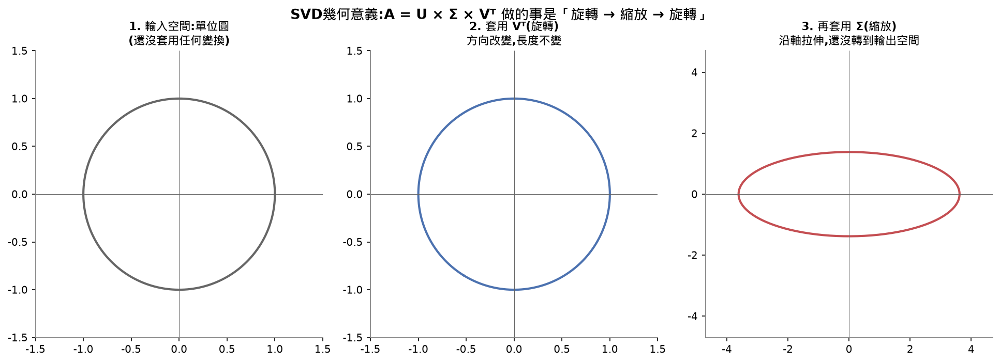
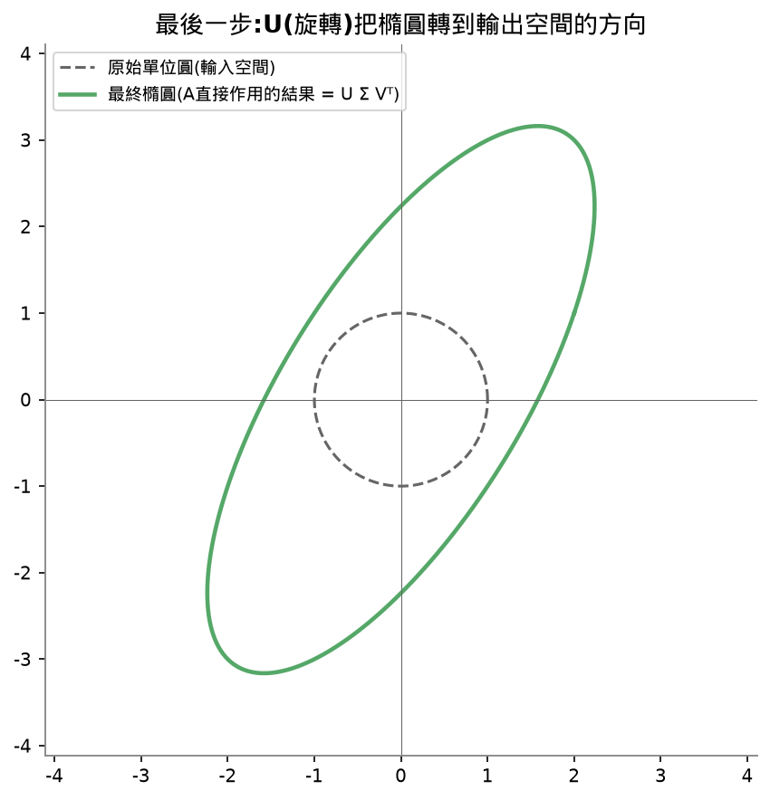
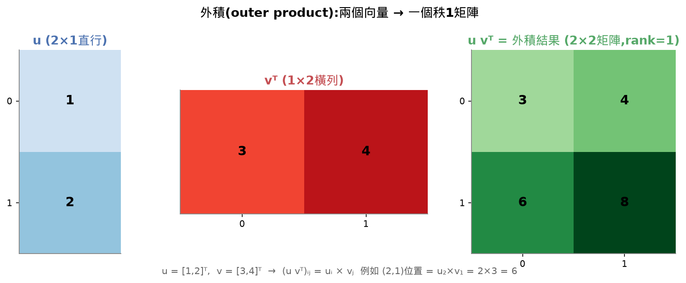
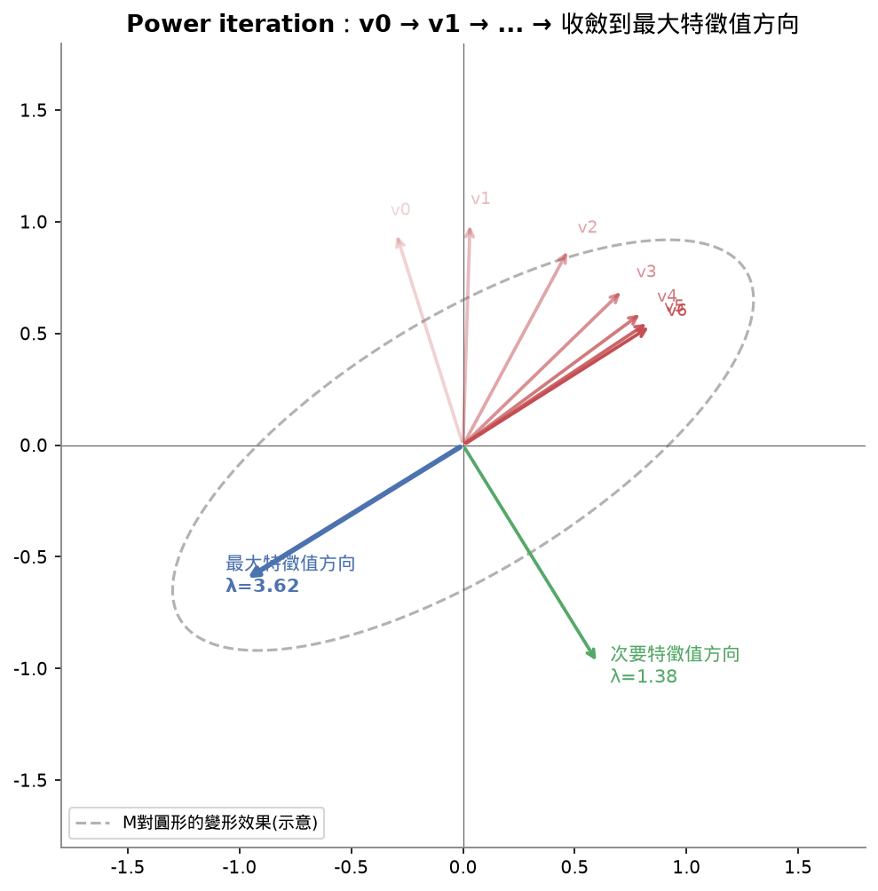

# Lesson 11 - Singular Value Decomposition(奇異值分解,SVD)

## 目錄

- [Learning Objectives 打勾清單](#learning-objectives-打勾清單)
- [30秒抓重點](#30秒抓重點)
- [公式速查表](#公式速查表)
- [這堂課的名詞總表](#這堂課的名詞總表)
- [SVD跟特徵分解的關聯(PCA=SVD)](#svd跟特徵分解的關聯pcasvd)
- [這堂課我卡住/搞混的地方(完整問答記錄,給複習用)](#這堂課我卡住搞混的地方完整問答記錄給複習用)
- [常見地雷](#常見地雷)
- [相關概念(跨堂連結)](#相關概念跨堂連結)
- [面試向問題](#面試向問題)
- [課程結尾理解確認題](#課程結尾理解確認題)
- [我自己手打的部分](#我自己手打的部分)
- [今天評分](#今天評分)
- [程式語法筆記](#程式語法筆記)

## Learning Objectives 打勾清單

- [x] 用power iteration從零實作SVD,解釋U、Σ、Vᵀ的幾何意義
- [ ] 用截斷SVD做圖片壓縮,量測壓縮比vs還原誤差 ⚠️(demo跑過、結果解讀過,但程式碼細節沒有完全看懂,記review-queue)
- [ ] 用SVD算Moore-Penrose偽逆矩陣解最小平方法系統 ⚠️(demo跑過驗證跟`np.linalg.lstsq`一致,但程式碼細節沒有完全看懂,記review-queue)
- [ ] 把SVD連結到PCA、推薦系統(latent factors)、NLP的LSA ⚠️(PCA=SVD的結論記住了,推導公式看不懂;推薦系統/LSA只講一句話,沒深入,都記review-queue)

## 30秒抓重點

- 任何矩陣不管形狀,都可以拆成「旋轉→縮放→旋轉」三個動作:`A = U × Σ × Vᵀ`
- Σ對角線上的數字(奇異值)由大到小排序,代表「這個方向對矩陣輸出結果的影響力有多大」,可以想成一份「重要性排行榜」
- 截斷SVD(只留前k個奇異值/向量重建)是數學上證明過的「最佳」低秩近似(Eckart-Young theorem),圖片壓縮、去噪、推薦系統背後都是同一招
- SVD跟特徵分解的關聯:右奇異向量V是`AᵀA`的特徵向量,奇異值平方是`AᵀA`的特徵值——**PCA本質上就是SVD**,只是繞了共變異數矩陣這一圈,sklearn的PCA底層直接用SVD算,不用特徵分解,因為算`AᵀA`會把條件數平方,精度變差
- 偽逆矩陣(pseudoinverse)可以對任何矩陣(不用是方陣、不用可逆)算出一個「最接近反矩陣」的東西,用來解沒有精確解的方程組(最小平方法)
- power iteration:反覆「乘上矩陣→normalize」,因為大特徵值方向每輪被放大得比小特徵值方向多,最後會收斂到最大特徵值的方向
- 這堂課用power iteration手刻SVD的核心函式`power_iteration`自己打完並驗證跟NumPy對上;`svd_from_scratch`跟三個demo函式因為卡住比較久,只到「懂大概邏輯、跑過demo」的程度,細節記review-queue

## 公式速查表

| 用途 | 公式 |
|---|---|
| SVD完整分解 | `A = U × Σ × Vᵀ`(U是m×m正交,Σ是m×n對角,V是n×n正交) |
| 奇異向量關係式 | `A × vᵢ = σᵢ × uᵢ` |
| 秩1矩陣的和(outer product form) | `A = σ₁u₁v₁ᵀ + σ₂u₂v₂ᵀ + ... + σᵣuᵣvᵣᵀ` |
| 截斷SVD(rank-k近似) | `A_k = U_k × Σ_k × V_kᵀ`,誤差 = `σ_{k+1}` |
| SVD跟特徵分解關聯 | `AᵀA = V Σ² Vᵀ`(V是AᵀA的特徵向量,σᵢ²是AᵀA的特徵值) |
| 偽逆矩陣 | `A⁺ = V × Σ⁺ × Uᵀ`(Σ⁺:非零項取倒數,零項不變) |
| 條件數(condition number) | `σ_max / σ_min` |
| power iteration收斂後反推特徵值 | `λ ≈ v @ M @ v`(Rayleigh quotient,v已normalize) |
| 外積(outer product) | `(u vᵀ)ᵢⱼ = uᵢ × vⱼ` |

## 這堂課的名詞總表

| 英文 | 中文 | 一句話定義 |
|---|---|---|
| SVD (Singular Value Decomposition) | 奇異值分解 | 把任何形狀、任何矩陣拆成 `U × Σ × Vᵀ`,沒有條件限制 |
| Singular value | 奇異值 | Σ對角線上的數字,代表矩陣沿某方向拉伸/壓縮的倍數,非負、由大到小排序 |
| Left singular vector | 左奇異向量 | U的每一欄,輸出空間的方向 |
| Right singular vector | 右奇異向量 | V的每一欄,輸入空間的方向 |
| Truncated SVD | 截斷SVD | 只留前k個奇異值/向量,數學上證明過的最佳rank-k近似 |
| Rank | 秩 | 非零奇異值的個數,矩陣真正用到的獨立方向數量 |
| Pseudoinverse | 偽逆矩陣 | `A⁺ = V Σ⁺ Uᵀ`,對任何矩陣都能算,解最小平方法問題 |
| Condition number | 條件數 | `σ_max/σ_min`,越大代表對誤差越敏感 |
| Latent factor | 潛在因子 | SVD找出的低維空間裡的隱藏變數,例如推薦系統裡的類型偏好 |
| Frobenius norm | Frobenius範數 | 矩陣所有元素平方和開根號,等於所有奇異值平方和開根號 |
| Eckart-Young theorem | Eckart-Young定理 | 截斷SVD是給定rank-k裡誤差最小的近似,證明過的最佳解 |
| Power iteration | 冪迭代法 | 反覆乘矩陣+normalize,收斂到最大特徵值方向 |
| Orthogonal matrix | 正交矩陣 | 每一欄互相垂直、長度都是1的矩陣;乘上它只旋轉,長度不變 |
| Outer product | 外積 | 兩個向量相乘變成一個矩陣(跟內積相反,內積是變成一個數字) |
| Deflation | 降階/扣除 | 找到一個主要方向後從矩陣扣掉,讓下一輪找到次要方向 |
| Residual | 殘餘矩陣 | 還沒被目前找到的方向解釋掉的剩餘部分 |
| Eigenvector | 特徵向量 | 被矩陣乘完只變長或變短、方向不變的特殊方向,倍數叫特徵值(Eigenvalue) |
| Main diagonal | 主對角線 | 矩陣從左上到右下那條斜線,奇異值就放在Σ的主對角線上 |
| Diagonal matrix | 對角矩陣 | 只有主對角線有數字、其他位置全是0的矩陣,效果是各方向各自縮放、互不影響 |
| Trace | 跡 | 主對角線上的數字加總,寫成tr(A) |
| Norm | 範數 | 「長度/大小」的正式數學名稱,預設(L2 norm)就是Lesson 1的向量長度 |

## SVD跟特徵分解的關聯(PCA=SVD)

<details>
<summary>公式推導(這段當時看不懂,只記結論就好,推導留給之後有空再看)</summary>

```
AᵀA = (UΣVᵀ)ᵀ(UΣVᵀ) = V Σᵀ Uᵀ U Σ Vᵀ

因為U是正交矩陣,UᵀU = I(單位矩陣),中間直接消掉:

AᵀA = V (Σᵀ Σ) Vᵀ = V Σ² Vᵀ
```

結論:V(右奇異向量)是`AᵀA`的特徵向量,σᵢ²(奇異值平方)是`AᵀA`的特徵值。PCA是對共變異數矩陣`C = XᵀX/(n-1)`做特徵分解找主成分方向,而根據上面的關係,直接對資料矩陣X做SVD,V就已經是主成分方向了——**PCA跟SVD算出來的東西完全一樣,只是PCA繞了共變異數矩陣這一圈**。

sklearn選擇直接用SVD實作PCA,原因是數值穩定性:算`AᵀA`會把奇異值平方,連帶把條件數也平方(範例:A的奇異值是`[1000, 0.001]`,條件數是`1000/0.001=10⁶`;`AᵀA`的條件數變成`10⁶/10⁻⁶=10¹²`,少了6位精度)。直接對A做SVD不需要先算`AᵀA`,精度更好。
</details>

## 這堂課我卡住/搞混的地方(完整問答記錄,給複習用)

<details>
<summary>PCA的transform為什麼要用fit時存的mean,不是新資料自己的mean(Lesson 10複習)</summary>

如果用新資料自己的mean,同一筆資料丟進去,今天單獨進來mean是它自己(結果變成[0,0]),明天跟別的資料一起進來mean會變(結果變成別的數字)——同一筆資料兩次結果不一樣,`transform`就沒有穩定意義了。正確做法:`fit`時算一次mean存下來,之後每次`transform`都用同一個存下來的mean,同一筆資料永遠對應同一個座標。這是更大的原則:任何從訓練資料學到的統計量(mean、標準差、PCA方向...),套用到新資料時要用訓練時存下來的值,不能用新資料自己重算。
</details>

<details>
<summary>Kernel PCA為什麼能分開同心圓(Lesson 10複習)</summary>

標準PCA只能找直線方向的變化,同心圓資料不管往哪個直線方向切都會混在一起。Kernel PCA用RBF核函數把資料隱含地丟到一個更高維空間(kernel trick,不用真的算出高維座標),在這個新空間裡原本繞成圈的結構會被攤開成可以用直線分開的樣子。
</details>

<details>
<summary>為什麼「先旋轉、再縮放、再旋轉」要拆成三步,不是一次性變形</summary>

一個任意矩陣的4個數字,人眼看不出幾何上做了什麼事。但拆成正交矩陣(旋轉,長度不變、只改方向)+對角矩陣(縮放,只是拉伸倍數)之後,每一塊單獨看都非常直接、乾淨——旋轉矩陣只轉方向,縮放矩陣的意義直接寫在對角線上。把複雜矩陣拆成幾個「乾淨」的動作組合,才能真正讀懂這個矩陣在幾何上做了什麼。




</details>

<details>
<summary>正交矩陣(orthogonal matrix)是什麼、為什麼不改變長度</summary>

正交矩陣:每一欄互相垂直(內積=0)、每一欄長度都是1。用90度旋轉矩陣`[[0,-1],[1,0]]`驗證:兩欄`[0,1]`跟`[-1,0]`內積=0(垂直),長度都是1。因為每一欄本身不拉伸(長度1)、欄與欄之間不互相干擾疊加(垂直),乘上這種矩陣只會轉方向,長度不變(驗證:`[3,4]`長度5,乘上這個旋轉矩陣變成`[-4,3]`,長度還是5)。反過來,如果某一欄長度不是1(例如矩陣`[[2,0],[0,1]]`),乘上去長度就不會保持不變(驗證:`[1,0]`長度1,乘完變成`[2,0]`長度2)。
</details>

<details>
<summary>外積(outer product)跟秩1矩陣</summary>

外積是兩個向量相乘變成一個矩陣(跟內積相反,內積是變成一個數字)。公式:`(u vᵀ)ᵢⱼ = uᵢ × vⱼ`。例如`u=[1,2]ᵀ`,`v=[3,4]ᵀ`,`u vᵀ = [[3,4],[6,8]]`——這種矩陣每一列都是v的倍數、每一欄都是u的倍數,只靠一個方向的資訊撐起來,所以叫「秩1(rank-1)矩陣」。SVD可以寫成好幾個秩1矩陣疊加:`A = σ₁u₁v₁ᵀ + σ₂u₂v₂ᵀ + ...`,截斷SVD就是只留前k項。


</details>

<details>
<summary>power_iteration為什麼會收斂到最大特徵值方向</summary>

任何起始向量都可以想成是「大特徵值方向的一點成分」+「小特徵值方向的一點成分」混在一起。每次乘上矩陣M,大特徵值方向的成分被放大得比小特徵值方向多(放大倍率就是各自的特徵值)。重複很多輪之後,大特徵值方向的成分遠遠超過小特徵值方向,整個向量幾乎完全被大特徵值方向主導——看起來就像「收斂」到那個方向了。用具體例子驗證過:矩陣`[[3,1],[1,2]]`,7輪迭代後向量從`[-0.30,0.95]`一路靠近真正的最大特徵值方向`[0.85,0.53]`。


</details>

<details>
<summary>eigenvalue = v @ M @ v 這行,為什麼可以省略轉置(vᵀ寫成v)</summary>

數學上寫`vᵀMv`需要轉置,因為矩陣乘法規則要求橫向量×矩陣×直向量才能算出純數字。但1維NumPy陣列的shape是`(n,)`,不是`(n,1)`或`(1,n)`,根本沒有「橫的/直的」這種固定身份,轉置對1維陣列沒有效果(`v.T`跟`v`完全一樣)。矩陣乘法真正在做的事永遠是「對應位置相乘再加總」,跟包裝成橫的還是直的無關——包裝方式只是給矩陣乘法形狀規則比對用的記帳規則,不影響實際數字。用程式碼驗證過:手動包成真正的橫向量`(1,2)`和直向量`(2,1)`算`vᵀMv`,跟直接寫`v @ M @ v`,兩者數字完全一樣(`3.6303`)。
</details>

<details>
<summary>svd_from_scratch的deflation跟residual邏輯(懂大概,細節還沒扎實)</summary>

power iteration每次只能找到目前最大的方向,但SVD要湊出k個不同的奇異值/向量,不能每次找到同一個。解法:找到一個方向後,用`A_residual = A_residual - sigma * np.outer(u, v)`把這個方向的貢獻(秩1矩陣)從矩陣裡扣掉(deflation),剩下的部分(residual,殘餘矩陣)自然就會讓下一輪power iteration找到次大的方向。重複k次湊出完整的U、Σ、V。跑demo驗證過跟NumPy內建SVD的奇異值完全一致,重建誤差趨近於0。
</details>

<details>
<summary>compress_image_svd等demo函式的程式碼邏輯(用重要性排行榜比喻)</summary>

`U, S, Vt = np.linalg.svd(A, full_matrices=False)` 就是呼叫套件做SVD,拿到U、奇異值陣列S(一維,不是完整Σ矩陣)、已轉置的Vt。`np.diag(S[:k])`把「前k個奇異值」包成對角矩陣。整段邏輯可以想成:SVD已經把矩陣的「貢獻」按重要性排好序(S由大到小),只要`U[:,:k]`、`S[:k]`、`Vt[:k,:]`各取前k個,乘回去就是「只用最重要的k份貢獻重新拼出一個逼近原矩陣的版本」。`compress_image_svd`跟`denoise_svd`程式碼完全一樣,只是套用場景不同。`pseudoinverse_via_svd`用`np.diag(1.0/S)`把每個奇異值取倒數,再用`Vt.T @ S_inv @ U.T`組合(對應公式`A⁺=VΣ⁺Uᵀ`)。用tiny example(`A=[[3,0],[0,1]]`)手算驗證過`k=1`截斷跟偽逆矩陣的每一步。
</details>

<details>
<summary>複習補充:奇異值放哪裡、為什麼丟最小的、power iteration/外積/deflation的數字版(2026-09-16複習)</summary>

**奇異值放在Σ的主對角線**(左上到右下那條斜線),其他位置全是0,這種矩陣叫對角矩陣。主對角線加總叫「跡」(trace)。對角矩陣的效果是第1個方向乘σ₁、第2個方向乘σ₂……各管各的,所以它才是「縮放」。

**只有縮放的矩陣不會改變方向**(只拉長或壓短箭頭);**只有旋轉的矩陣不會改變長度**。SVD把矩陣拆成這兩種各只做一件事的動作。三步裡決定「變長多少」的是第2步Σ。

**為什麼丟最小的奇異值**:奇異值`[10,5,0.001]`,拿點`(3,4,2)`看,三個方向分別乘10、5、0.001,輸出`(30,20,0.002)`。第3個方向被壓到接近0,不管輸入那個方向是2還是200,輸出都幾乎看不出差別。丟掉它等於把0.002當0,得到`(30,20,0)`,誤差只有0.002;反過來丟掉10,30變成0,損失很大。奇異值越小,那個方向的變化被壓得越小,丟掉越安全。

**奇異值差不多大就壓不動**:`[10,9,8]`三個方向都有明顯變化,丟掉任何一個都損失大。能不能壓、能壓多少,看奇異值掉得快不快。實際常看「前k個奇異值加總占全部幾%」,例如留到95%就停,跟Lesson 10挑保留幾個主成分是同一個想法。

**power iteration數字版**:`M=[[3,1],[1,2]]`從`[1,0]`開始,每輪乘M再normalize:`[1,0]→[0.95,0.32]→[0.89,0.45]→[0.87,0.50]→…→[0.85,0.53]`。M對最強方向拉3.618倍、對次強方向拉1.382倍,每輪最強方向多贏2.6倍,10輪後約贏14000倍,其他方向被淹沒。最後`v@M@v`算出的3.618就是那個方向被拉的倍數。

**e1、e2是什麼(特徵向量)**:大部分向量被M乘完方向會歪,但有少數特別方向,乘完只變長或變短、方向不變,這種方向叫特徵向量,倍數叫特徵值。`M=[[3,1],[1,2]]`驗證:`e1≈[0.851,0.526]`,`M@e1=[3.079,1.903]=3.618×e1`;`e2≈[-0.526,0.851]`,`M@e2=[-0.727,1.176]=1.382×e2`。算法是解`M@v=λ×v`,2×2得到λ=(5±√5)/2;程式用`np.linalg.eigh(M)`一行拿到。power iteration本身不知道e1、e2是誰,只是一直乘M;e1、e2是拿來解釋「為什麼會收斂」的分析工具。

**外積數字版**:`u=[1,2]`、`v=[3,4]`,第i列就是v乘上u的第i個數,得到`[[3,4],[6,8]]`,第二列永遠是第一列的2倍,只有一種花樣,所以是秩1。

**三件事的關係**:外積是「一層的形狀」,power iteration是「找出最大的那層」,deflation是「把那層剝掉好找下一層」,像剝洋蔥。三個合起來就是`svd_from_scratch`。
</details>

## 常見地雷

⚠️ **奇異值分布均勻(沒有明顯衰減)時,截斷SVD幫不上忙。** demo裡用純隨機矩陣(`np.random.randn`)模擬圖片,k=50(用了41.8%儲存空間)相對誤差還高達67%——因為隨機數字沒有結構性,奇異值不會集中在前幾個。真實照片因為像素之間高度相關,奇異值才會快速衰減,壓縮才有效。**SVD壓縮的前提是資料本身有低秩結構,不是對任何矩陣都有效。**

⚠️ **`np.linalg.svd()`回傳的是`Vt`(已經轉置過),不是`V`本身。** 如果要用公式`A⁺=VΣ⁺Uᵀ`,要記得用`Vt.T`轉回V,不能直接用`Vt`當V代入公式,方向會錯。

⚠️ **算`AᵀA`看似方便(方陣,可以直接特徵分解),但會把條件數平方,精度變差。** 這是為什麼dedicated SVD演算法(Golub-Kahan bidiagonalization)直接處理A、不形成`AᵀA`的原因,也是`np.linalg.svd(A)`要優先於`np.linalg.eig(A.T @ A)`的原因。

## 相關概念(跨堂連結)

- **Lesson 1(線性代數直覺)**:向量長度(`magnitude`/`norm`)、正規化(`normalize`)、內積、外積(跟內積相反)、矩陣乘向量——這堂課`power_iteration`跟`svd_from_scratch`全部建立在這些操作上
- **Lesson 3(矩陣變換)**:特徵分解(`Av=λv`)、旋轉矩陣、正交矩陣——SVD的U、V正是正交矩陣,奇異值跟`AᵀA`/`AAᵀ`的特徵值直接相關
- **Lesson 10(降維)**:PCA本質上就是SVD,只是繞了共變異數矩陣這一圈;截斷SVD留前k個 = PCA留前k個主成分,同一套「重要性排行榜」邏輯
- **Lesson 1 review-queue的rank**:今天`svd_from_scratch`裡`k=None`預設是`min(m,n)`,奇異值非零的個數就是矩陣的rank,跟Lesson 1提過的「LoRA用低rank矩陣逼近大矩陣」直接相關——LoRA的B@A低秩分解,跟這堂課的截斷SVD是同一個數學原理

## 面試向問題

<details>
<summary>Q1: 給你一個訓練好的權重矩陣,要怎麼用rank判斷這一層是不是存在參數冗餘、有壓縮空間?</summary>

對這個權重矩陣做SVD(或方陣的話直接做特徵分解),把奇異值(或eigenvalue)由大到小排序,看有多少個奇異值明顯大於0、其餘趨近於0。如果矩陣的「有效rank」(明顯大於0的奇異值個數)遠小於矩陣理論上的最大rank(`min(行數,列數)`),代表這一層雖然參數量看起來是m×n,但實際只用到了r維的獨立資訊,其餘的列/行都能被線性組合表示出來,是冗餘的——這跟PCA判斷保留幾個主成分的邏輯是同一套直覺,可以看「前幾個奇異值加起來佔總奇異值的比例」,如果佔比很高就代表可以用類似LoRA的B@A低秩分解、或直接用SVD取前r個奇異值重建,壓縮這一層而不會損失太多資訊。反過來,如果奇異值分布很平均、沒有明顯的斷崖式落差,代表這一層真的用滿了它的維度,壓縮空間有限。
</details>

<details>
<summary>Q2: 為什麼SVD可以用在任何矩陣上,但特徵分解不行?</summary>

特徵分解要求矩陣是方陣,而且要有一組完整的線性獨立特徵向量才能分解。SVD沒有這些限制:它分解的是`AᵀA`跟`AAᵀ`(這兩個一定是方陣、對稱、正半定的矩陣,不管原本A的形狀是什麼),所以不管A是什麼形狀、什麼rank,SVD永遠存在。這也是為什麼SVD被稱為線性代數裡最通用的分解方法。
</details>

<details>
<summary>Q3: 為什麼sklearn的PCA底層用SVD而不是對共變異數矩陣做特徵分解?</summary>

算共變異數矩陣`AᵀA`會把A的奇異值平方,連帶把條件數(sigma_max/sigma_min)平方。例如A的奇異值是`[1000, 0.001]`,條件數是`10⁶`;`AᵀA`的條件數變成`10¹²`,精度損失6位數。直接對原始資料矩陣做SVD不需要先形成`AᵀA`,數值上更穩定,這是sklearn選擇SVD實作PCA的真正原因,不是因為算得比較快。
</details>

## 課程結尾理解確認題

<details>
<summary>Q1: 如果一個矩陣的奇異值是[10, 0.001],要壓縮只留一個方向,該留哪個?為什麼?</summary>

留奇異值=10的方向。奇異值代表這個方向對矩陣輸出結果的影響力,10遠大於0.001,代表幾乎所有「資訊」都集中在奇異值=10的那個方向,留0.001那個方向資訊太少、幾乎沒用。
</details>

<details>
<summary>Q2: A=U×Σ×Vᵀ,U、Σ、Vᵀ分別是什麼幾何操作,順序是什麼?</summary>

Vᵀ先旋轉輸入空間的向量,Σ沿著這些方向縮放,U最後把結果旋轉到輸出空間。順序:旋轉→縮放→旋轉。
</details>

<details>
<summary>Q3: sklearn的PCA為什麼用SVD不用共變異數矩陣特徵分解?</summary>

算共變異數矩陣會把奇異值平方,連帶把條件數平方(範例:[1000,0.001]的條件數10⁶,平方後變10¹²,精度損失6位數),直接對原始矩陣做SVD更穩定。
</details>

## 我自己手打的部分

- `power_iteration` — 完整手打,反覆乘矩陣+normalize收斂到最大特徵值方向,用`M=[[3,1],[1,2]]`驗證跟NumPy的`np.linalg.eigh`算出的特徵值/特徵向量完全對上(只差正負號,正常現象)

`svd_from_scratch`因為要加快節奏,改成理解層(讀懂邏輯+跑demo驗證),沒有手打,完整版留在`reference.py`。三個應用demo(`compress_image_svd`/`denoise_svd`/`pseudoinverse_via_svd`)同樣是理解層,用tiny example手算走過但沒有手打進practice.py。

## 今天評分

| 項目 | 說明 |
|---|---|
| 理解程度 | `power_iteration`(核心層)手打完並驗證跟NumPy對上；`svd_from_scratch`跟三個demo函式一開始卡很久，公式推導(PCA=SVD)主動說看不懂只留結論，後來用「重要性排行榜」比喻+tiny example重新走過才抓到大概邏輯，細節還沒扎實；Quiz3題：第1題(SVD幾何意義)提示後自己想出來、第2題(sklearn用SVD原因)提示後想出來、第3題(推薦系統，深度沒教的內容)答不出來符合預期 |
| 效率 | 這堂課內容量是Phase 1目前最重的一堂，中途多次因為公式/新語法(`.T`、`norm`、`np.diag`)卡住，改用純數字驗證、比喻(重要性排行榜)、tiny example手算的方式才推進，比直接看公式有效 |
| 完成度 | 4個Learning Objectives裡，用power iteration實作SVD、解釋U/Σ/Vᵀ幾何意義這項做到；圖片壓縮/偽逆矩陣demo跑過但程式碼細節沒完全懂；SVD連結PCA/推薦系統/LSA，PCA=SVD結論記住但推導看不懂、推薦系統/LSA只講一句話沒深入——這3項都記review-queue |
| 花費時間 | 1.5小時(課程建議時間：約120分鐘，比建議時間快) |

## 程式語法筆記

(下面不重複講數學/AI概念，只整理「程式語法」本身，之後忘記可以回來查。)

### `np.diag()`：把一串數字放到對角線上

```python
np.diag([5, 2, 9])
```

輸出：
```
[[5, 0, 0],
 [0, 2, 0],
 [0, 0, 9]]
```

輸入一串數字，回傳一個把這些數字排在對角線、其他位置補0的矩陣。`np.linalg.svd()`回傳的奇異值是一維陣列，要先用`np.diag()`包成真正的對角矩陣，才能跟U、Vᵀ做矩陣乘法。

### 為什麼1維陣列可以省略`.T`(轉置)

數學公式寫`vᵀMv`需要轉置符號，是因為矩陣乘法規則要求「橫向量×矩陣×直向量」才能算出純數字。但NumPy的1維陣列shape是`(n,)`，不是`(n,1)`或`(1,n)`，沒有固定的橫/直身份，`v.T`對1維陣列完全沒有效果。NumPy的`@`運算子會依照兩邊陣列的維度，自動判斷該怎麼乘(兩個1維陣列做內積；1維配2維時自動當橫向量或直向量用)，所以程式碼裡`v @ M @ v`不用寫`.T`，跟數學課本上的`vᵀMv`是等價的。

### `linalg`是什麼

`linalg`是`linear algebra(線性代數)`的縮寫，`numpy.linalg`(通常寫`np.linalg`)是NumPy專門處理線性代數運算的模組，例如`np.linalg.norm()`(向量長度)、`np.linalg.svd()`(今天教的SVD)、`np.linalg.eig()`/`eigh()`(特徵分解)、`np.linalg.pinv()`(偽逆矩陣)、`np.linalg.lstsq()`(最小平方法)都在這個模組底下。

### `norm`是什麼

Norm是數學上「長度/大小」的正式名稱。Lesson 1手刻的`magnitude`(`sqrt(x²+y²+...)`)就是最常見的一種norm，正式名稱叫歐幾里得norm(Euclidean norm)，也叫L2 norm。`np.linalg.norm(v)`預設就是算這個歐幾里得長度，跟手刻的`magnitude`算出來的數字一樣。

### `sklearn`是什麼

`sklearn`(全名scikit-learn)是Python最常用的機器學習套件，裡面已經寫好大量演算法(PCA、線性迴歸、分類器、聚類...)，呼叫函式就能用，不用自己從零刻。Lesson 10、這堂課都用它來對照自己手刻的版本。
