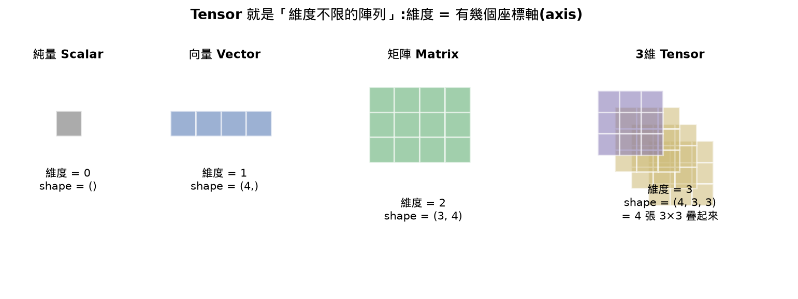
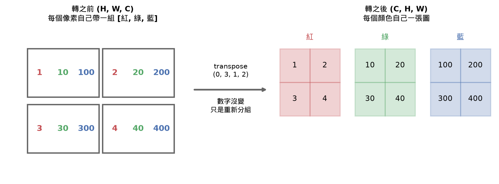
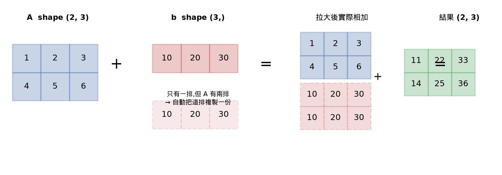
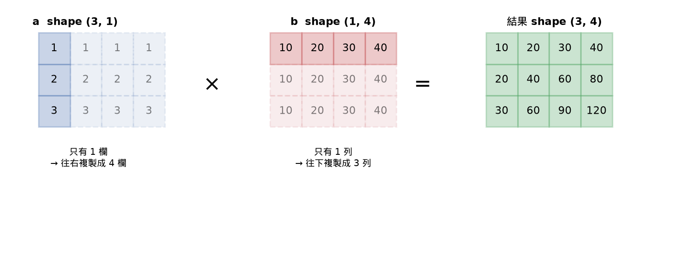
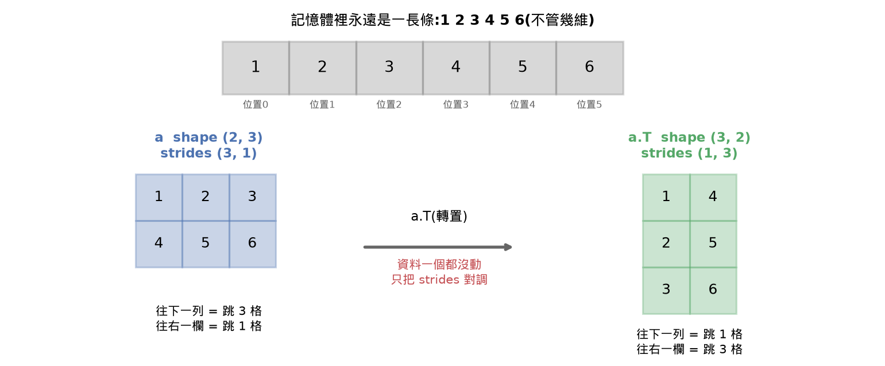
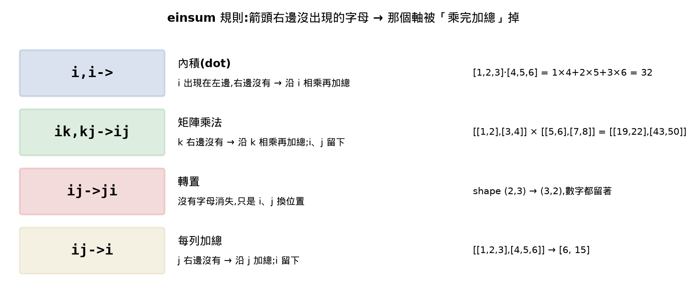
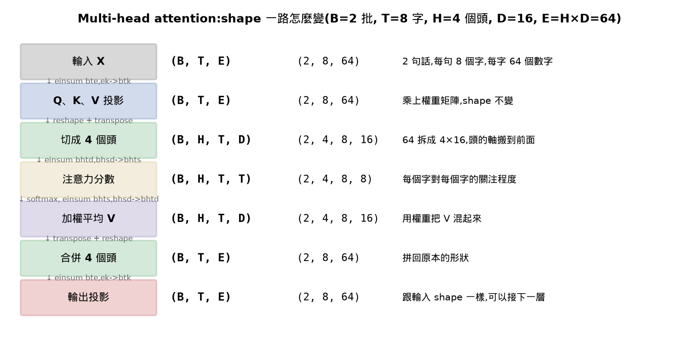

# Lesson 12 - Tensor Operations(張量運算)

## 目錄

- [Learning Objectives 打勾清單](#learning-objectives-打勾清單)
- [30秒抓重點](#30秒抓重點)
- [公式速查表](#公式速查表)
- [這堂課的名詞總表](#這堂課的名詞總表)
- [這堂課我卡住/搞混的地方(完整問答記錄,給複習用)](#這堂課我卡住搞混的地方完整問答記錄給複習用)
- [常見地雷](#常見地雷)
- [相關概念(跨堂連結)](#相關概念跨堂連結)
- [面試向問題](#面試向問題)
- [課程結尾理解確認題](#課程結尾理解確認題)
- [我自己手打的部分](#我自己手打的部分)
- [今天評分](#今天評分)
- [程式語法筆記](#程式語法筆記)

## Learning Objectives 打勾清單

- [ ] 從零實作一個有shape、strides、reshape、transpose、element-wise運算的Tensor class ⚠️(刻意分到🟢之後再補,只用NumPy版本理解同樣的概念,沒有手寫class)
- [x] 用broadcasting規則讓不同shape的tensor直接運算(補1、從右往左比、一樣大或有一邊是1)
- [ ] 用einsum寫出內積、矩陣乘法、外積、批次運算 ⚠️(規則看懂了、用小數字驗證過,但沒有自己手打練習)
- [ ] 逐步追蹤multi-head attention每一步的tensor shape ⚠️(跟著走過一遍,但attention本身還沒教,這段沒懂,記review-queue,Phase 7再回來看)

## 30秒抓重點

- Tensor就是「維度不限的陣列」:純量0維、向量1維、矩陣2維、一批圖片`(32,3,224,224)`是4維;跟C++的`a[i][j][k]`是同一回事
- 寫深度學習程式最常見的bug是shape對不上,這堂課練的是「看shape的眼力」:每個運算前後shape怎麼變
- `reshape`只換切法、元素總數不變;`-1`代表「這格你幫我算」(總數 ÷ 其他軸的乘積),一次只能有一個
- `transpose(...)`括號裡是「新的第0、1、2、3位,依序放舊的第幾軸」;資料數字不變,只是換排法
- broadcasting規則:左邊補1、從右往左比、每個位置必須「一樣大或其中一邊是1」,是1的那邊被拉大;不符合就報錯,因為對齊方式不唯一
- stride是「往某方向走一步要在記憶體裡跳幾格」;transpose不搬資料,只對調stride,所以快,但會變成non-contiguous(PyTorch的`view`會因此報錯)
- einsum規則只有一條:箭頭右邊沒出現的字母,那個軸被「相乘再加總」掉;`i,i->`是內積、`ik,kj->ij`是矩陣乘法、`ij->ji`是轉置
- multi-head attention的shape追蹤(切頭、算分數、合併頭)用的全是reshape+transpose+einsum,但attention本身的意義Phase 7才教,這堂沒懂就先放著

## 公式速查表

展開:公式速查表

| 用途 | 寫法 |
|---|---|
| 元素總數 | 所有軸大小相乘,`(2,3,4)` → 24 |
| 補通道軸(unsqueeze) | `x.reshape(8, 1, 28, 28)` 或 `x[:, np.newaxis, :, :]` |
| 攤平成一排 | `x.reshape(8, -1)` → `(8, 784)` |
| 直排/橫排 | `v.reshape(-1, 1)` → `(N,1)`;`v.reshape(1, -1)` → `(1,N)` |
| 軸順序轉換(NHWC→NCHW) | `x.transpose(0, 3, 1, 2)` |
| broadcasting規則 | 左邊補1 → 從右往左比 → 一樣大或有一邊是1 → 是1的拉大 |
| 外積(broadcasting版) | `a.reshape(-1,1) * b.reshape(1,-1)` |
| 內積 | `np.einsum("i,i->", a, b)` |
| 矩陣乘法 | `np.einsum("ik,kj->ij", A, B)` |
| 批次矩陣乘法 | `np.einsum("bij,bjk->bik", A, B)` |
| 注意力分數 | `np.einsum("bhtd,bhsd->bhts", Q, K)` |
| 切頭 | `x.reshape(B, T, H, D).transpose(0, 2, 1, 3)` |
| 合併頭 | `x.transpose(0, 2, 1, 3).reshape(B, T, H*D)` |
| stride(row-major) | shape `(2,3)` → strides `(3,1)`(元素為單位;NumPy顯示位元組) |

## 這堂課的名詞總表

展開:名詞總表

| 英文 | 中文 | 一句話定義 |
|---|---|---|
| Tensor | 張量 | 維度不限、資料型態一致的陣列,有shape、strides和運算 |
| Rank | 階/維度數 | 有幾個座標軸;注意跟Lesson 11「矩陣的秩」是兩回事 |
| Axis | 軸 | 其中一個座標軸,從第0軸開始編號 |
| Shape | 形狀 | 每個軸的大小組成的tuple,`(2,3)`是2列3欄 |
| Stride | 步幅 | 在記憶體裡沿某個軸走一步要跳過幾個元素 |
| Broadcasting | 廣播 | shape不同的tensor運算時,自動把大小為1的軸拉大去對齊;規則嚴格,對不齊就報錯 |
| Contiguous | 連續 | 元素在記憶體裡照邏輯順序依序排,沒有跳來跳去 |
| View | 視圖 | 同一塊記憶體、不同的shape/stride看法;對non-contiguous的tensor會失敗 |
| Einsum | 愛因斯坦求和 | 用字母替每個軸命名,一行寫出內積、矩陣乘法、外積、轉置等運算 |
| Contraction | 縮併 | 兩個tensor共用的軸被相乘再加總掉,結果維度變低 |
| NCHW / NHWC | 圖片軸順序 | 通道在前(PyTorch)或在後(TensorFlow)的排法 |
| Squeeze / Unsqueeze | 壓縮/展開軸 | 移除或插入一個大小為1的軸,元素不變 |
| Permute | 重排軸 | 一次重新排列所有軸的順序;transpose是只交換兩個軸的特例 |
| Reduction | 歸約 | sum、mean、max等把一個或多個軸「收掉」的運算 |
| Main diagonal / Trace | 主對角線/跡 | (Lesson 11複習時補的)跡是主對角線的加總 |

## 這堂課我卡住/搞混的地方(完整問答記錄,給複習用)

tensor是什麼、shape怎麼讀

一批8張灰階、28×28的圖片,shape寫`(8, 28, 28)`是對的,資料本身就是這樣排。但PyTorch的卷積層要`(B, C, H, W)`,所以要補通道軸變成`(8, 1, 28, 28)`。多出來的1不增加任何資料,只是補一個座標軸讓shape符合規定。這就是unsqueeze。

`shape = (4, 3, 3)`讀作「4張、每張3列3欄」,元素數 4×3×3 = 36,跟C++的`int a[4][3][3]`一樣。

reshape跟-1是什麼意思

reshape只換切法,元素總數必須不變。`-1`代表「這個位置你幫我算」:NumPy用「總數 ÷ 其他位置的乘積」算出來。`x = np.zeros((8,28,28))`共6272個元素,`x.reshape(8, -1)`算出 6272÷8=784,結果`(8, 784)`,也就是每張圖攤平成一排。

`a = np.array([1,2,3]).reshape(-1, 1)`:共3個元素,`(?, 1)`的?×1=3,所以?=3,得到`(3,1)`。`b.reshape(1, -1)`同理得到`(1,4)`。

不直接寫`reshape(3,1)`的原因:用`-1`不用先數有幾個元素,同一行程式對任何長度都能用。一次只能有一個`-1`,兩個都不知道就算不出來。

transpose的(0,3,1,2)是什麼意思、為什麼要轉

情境:圖片函式庫讀進來是`(B, H, W, C)`(一個像素一組RGB),PyTorch卷積層要`(B, C, H, W)`(一個顏色一張圖),要把通道軸搬到前面。

括號`(0, 3, 1, 2)`是「新的順序點名單」:新的第0位放舊的第0軸(B)、新的第1位放舊的第3軸(C)、新的第2位放舊的第1軸(H)、新的第3位放舊的第2軸(W)。舊編號:0=B、1=H、2=W、3=C。

用小數字看一張2×2像素的圖:轉之前是每個像素自己帶`[紅,綠,藍]`,轉之後變成紅表`[[1,2],[3,4]]`、綠表`[[10,20],[30,40]]`、藍表`[[100,200],[300,400]]`。數字一個都沒變,只是重新分組。同一個像素轉前是`img[0,0,1]=[2,20,200]`,轉後取`c[0,:,0,1]`還是`[2,20,200]`。

**陷阱:** `(8,28,28,3)`做`transpose(0,2,1,3)`,shape還是`(8,28,28,3)`,因為H和W剛好一樣大。shape沒變不代表資料沒變,資料實際上被對角翻轉過了。換成`(8,20,30,3)`就看得出來會變成`(8,30,20,3)`。

為什麼broadcasting的規則是「一樣大,或其中一個是1」

因為只有這兩種情況「怎麼對齊」才唯一。用3桌客人送菜比喻:
- 3桌、3道菜:一對一,清楚
- 3桌、1道菜:每桌都送同一道,答案只有一種
- 3桌、2道菜:第3桌送哪一道?沒有標準答案,程式不能猜,所以報錯

猜錯的話資料會悄悄變成另一個結果而你不知道,所以寧可報錯。`4`對`2`看起來重複2次剛好,但規則只認1,不做這種特殊推測。

規則三步:①左邊補1讓兩邊一樣長 ②從右往左一個位置一個位置比 ③是1的那邊拉大。例:`(5,1,3)`+`(4,3)` → 補成`(1,4,3)` → 結果`(5,4,3)`。

「拉大」只是概念上的說法,NumPy實際上不複製資料,不佔額外記憶體。

跟Lesson 2的關係:同一個東西,Lesson 2只知道「1會延伸」,這堂補完整規則並多練了外積和三維的情況。

兩個軸都要拉大:外積為什麼要塞reshape

`a=[1,2,3]`的shape是`(3,)`、`b=[10,20,30,40]`的shape是`(4,)`,直接相乘會報錯 `operands could not be broadcast together with shapes (3,) (4,)`:3對4不一樣也都不是1。

reshape是在告訴NumPy「a是直的、b是橫的」:`a.reshape(-1,1)`→`(3,1)`、`b.reshape(1,-1)`→`(1,4)`。這樣每個位置都有一邊是1,規則通過,結果`(3,4)`,是一張乘法表,第`(i,j)`格=`a[i]×b[j]`。

一句話:reshape在指定「哪個方向可以被複製拉大」。1維陣列`(3,)`沒有橫直身份(Lesson 11提過),想得到乘法表要自己指定。

方括號裡的冒號是什麼意思

方括號裡單獨一個`:`是「這個軸,全部都要」。`a=[[1,2,3],[4,5,6]]`:`a[0,1]`→2(一格)、`a[0,:]`→`[1,2,3]`(第0列所有欄)、`a[:,1]`→`[2,5]`(所有列的第1欄)。方括號裡每個位置對應一個軸,寫數字是只要那一個,寫`:`是整個軸。

`c[0,:,0,1]`意思是:第0張圖、所有通道、第0列、第1欄,也就是那個像素的三個顏色。另一種用法`[:3]`是「從頭拿到第3個之前」,Lesson 11的`S[:k]`就是這個。

stride和記憶體:為什麼transpose很快

電腦記憶體只有一長條,不管tensor幾維,實際上都是同一排數字`1 2 3 4 5 6`(跟C++的`int a[2][3]`在記憶體裡是連續6個int一樣)。shape是「怎麼切這一長條來看」,stride是「沿某個軸走一步要在這一長條上跳幾格」。

`a`的shape`(2,3)`、strides`(3,1)`:往右一欄跳1格、往下一列跳3格。`a.T`的shape`(3,2)`、strides`(1,3)`:資料一個都沒動,只是把兩個stride對調。驗證過`np.shares_memory(a, a.T)`是`True`。

代價是non-contiguous:轉置後走一列要跳來跳去。PyTorch的`view`要求連續,對轉置過的tensor會報錯,要先`.contiguous()`(真的重排一份)或改用`reshape`。NumPy的strides用位元組(int64每個8位元組,所以看到`(24,8)`),PyTorch用元素個數(`(3,1)`),意思一樣。

einsum怎麼讀(🟡理解層,沒手打)

規則只有一條:每個軸用一個字母命名,**箭頭左邊有、右邊沒有的字母,那個軸被相乘再加總掉**;右邊有的字母保留。字母同名代表兩個tensor的這個軸要對齊。

| 寫法 | 意思 | 小數字 |
|---|---|---|
| `i,i->` | 內積 | `[1,2,3]·[4,5,6]=32` |
| `ik,kj->ij` | 矩陣乘法(沿k加總) | `[[1,2],[3,4]]×[[5,6],[7,8]]=[[19,22],[43,50]]` |
| `ij->ji` | 轉置(沒有字母消失) | shape `(2,3)`→`(3,2)` |
| `ij->i` | 每列加總(沿j) | `[[1,2,3],[4,5,6]]`→`[6,15]` |

看`bhtd,bhsd->bhts`:b、h、d同名,d右邊沒有所以沿d加總,t和s留下,得到每個字對每個字的分數表。

multi-head attention的shape追蹤(這段沒懂,留給Phase 7)

範圍:attention本身的意義Phase 7才教,這堂只追蹤shape。一句話直覺:一句話裡每個字要決定「我該多參考哪些字」(例如「貓坐在墊子上,它很軟」,讀到「它」要回頭看「墊子」),attention讓每個字給其他所有字打分數再照分數混資訊;multi-head是同時用好幾組不同眼光看。

追蹤:B=2、T=8、H=4、D=16、E=64。輸入`(2,8,64)` → Q/K/V投影`(2,8,64)` → 切4個頭`(2,4,8,16)`(reshape成`(2,8,4,16)`再transpose) → 注意力分數`(2,4,8,8)`(每個字對每個字) → 加權平均V`(2,4,8,16)` → 合併頭`(2,8,64)` → 輸出投影`(2,8,64)`。

縮小版(1句、3字、每字4個數字、2個頭):`X=[[1,2,3,4],[5,6,7,8],[9,10,11,12]]`,切頭是每個字的4個數字分兩半,前兩個給頭0、後兩個給頭1,再把同一個頭的資料放一起:頭0`[[1,2],[5,6],[9,10]]`、頭1`[[3,4],[7,8],[11,12]]`,shape`(1,2,3,2)`。頭0的分數表是3×3:`[[5,17,29],[17,61,105],[29,105,181]]`。合併就是倒著做一遍。

使用者這段看了兩輪縮小版還是沒懂,原因是同時要懂「attention在幹嘛」和「shape怎麼變」,而前者還沒教。決定先放掉,Phase 7學attention時再回來看這張表。

第2題答成反方向(0,2,3,1)

題目:`(32,224,224,3)`要轉成`(B,C,H,W)`。使用者第一次答`(0,2,3,1)`,這其實是反方向(把`(B,C,H,W)`轉回`(B,H,W,C)`)用的:套用到這題會變成`(32,224,3,224)=(B,W,C,H)`,不對。

正確做法是一個位置一個位置點名:新第0位要B(舊0)、新第1位要C(舊3)、新第2位要H(舊1)、新第3位要W(舊2),所以是`(0,3,1,2)`。使用者點名後自己答對。**記法:括號裡的數字,是新排法從左到右依序是舊的第幾軸。**

## 常見地雷

⚠️ **shape沒變不代表資料沒變。** H和W一樣大時(例如28×28),`transpose(0,2,1,3)`前後shape一樣,但每張圖已經被對角翻轉。搞錯軸順序時shape也不會報錯,程式照跑,結果是悄悄算出垃圾。這是課程說的「有些shape錯誤不會報錯」。

⚠️ **1維陣列`(3,)`沒有橫直身份,要用reshape指定。** 想做外積/乘法表要`reshape(-1,1)`和`reshape(1,-1)`,不然`(3,)`×`(4,)`直接報錯。

⚠️ **PyTorch的`view`對non-contiguous的tensor會失敗。** transpose之後`view`會報錯,要用`reshape`或先`.contiguous()`。NumPy通常自己處理。

⚠️ **transpose括號的方向別搞反。** `(0,3,1,2)`是NHWC→NCHW,`(0,2,3,1)`是NCHW→NHWC,兩個互為反向。用「新位置依序點名舊的第幾軸」一個位置一個位置查最不會錯。

## 相關概念(跨堂連結)

- **Lesson 2(向量、矩陣、運算)**:broadcasting第一次出現(bias加到一批資料);這堂補完整規則,並把矩陣乘法用einsum的`ik,kj->ij`重新讀一次(列×欄做內積=沿k相乘再加總)
- **Lesson 1、Lesson 11(外積)**:外積是`u vᵀ`,這堂用broadcasting的`(3,1)×(1,4)`和einsum的`i,j->ij`寫出同一個東西;Lesson 11的秩1矩陣就是這樣造出來的
- **Lesson 3(矩陣變換)**:transpose(轉置)在那堂教過2維版本,這堂推廣到任意多軸的permute
- **Lesson 11(SVD)**:`S[:k]`、`U[:,:k]`用的就是這堂的切片冒號;`np.diag`、外積都是同一批工具
- **Phase 7(attention,尚未學)**:這堂追蹤的multi-head attention shape,到那時要回來對照;現在沒懂的部分記review-queue

## 面試向問題

Q1: PyTorch的view和reshape差在哪?什麼時候會出錯?

`view`只換shape/stride的看法,不複製資料,所以要求tensor是contiguous(元素在記憶體裡照邏輯順序排)。`transpose`或`permute`之後tensor變成non-contiguous(只是對調了stride,資料沒動),這時`view`會報錯。`reshape`比較寬容:能不複製就當view用,不行就自動複製一份再換shape。所以不確定時用`reshape`,或先呼叫`.contiguous()`再`view`。代價是`reshape`可能偷偷複製資料,多花記憶體和時間。

Q2: 為什麼說broadcasting是bug的常見來源?怎麼防?

因為broadcasting會在shape「剛好能對齊」時自動運算,不報錯。例如本來想把`(B,)`的損失和`(B,)`的權重逐項相乘,結果其中一個不小心變成`(B,1)`,相乘就悄悄變成`(B,B)`的矩陣,程式照跑但結果是錯的。防法:①在關鍵位置用`assert x.shape == (B, T, D)`檢查 ②用小數字在腦中或紙上先算一次shape ③需要拉大的軸明確用reshape/`unsqueeze`指定,不要依賴自動補1。

Q3: transpose為什麼很快?代價是什麼?

因為它不搬資料,只把shape和strides的順序對調(例如`(2,3)`、strides`(3,1)`變成`(3,2)`、strides`(1,3)`),是O(1)操作,轉置前後共用同一塊記憶體。代價是tensor變成non-contiguous:沿新的軸走一步要在記憶體裡跳來跳去,cache命中率差,某些運算(像`view`、部分GPU kernel)要求連續,這時要`.contiguous()`真的重排一份,才會付出搬資料的成本。

## 課程結尾理解確認題

Q1: shape`(5,1,3)`和`(4,3)`的兩個tensor相加,能不能加?結果shape是什麼?

能加,結果`(5,4,3)`。步驟:`(4,3)`左邊補1變`(1,4,3)`;從右往左比:3對3一樣大→3;1對4有一邊是1→拉大成4;5對1有一邊是1→拉大成5;結果`(5,4,3)`。使用者第一次算成元素個數(`3*2`),補上三步提示後自己填出`4`和`5`,已用程式驗證輸出`(5,4,3)`。

Q2: `(32,224,224,3)`要轉成`(批次,通道,高,寬)`,transpose括號填哪四個數字?

`(0, 3, 1, 2)`。舊編號:0=批次、1=高、2=寬、3=通道。新的第0位放批次(0)、第1位放通道(3)、第2位放高(1)、第3位放寬(2)。使用者第一次答`(0,2,3,1)`(反方向),看過「新位置依序點名舊的第幾軸」的表後自己答出`0 3 1 2`。

Q3: `(8,28,28)`要把每張圖攤平成一排,reshape怎麼寫?`-1`做了什麼?

`reshape(8, -1)`。第一個軸指定成8,`-1`由NumPy用「總數÷其他軸的乘積」算出來:6272÷8=784,結果`(8,784)`。使用者直接答對「讓電腦自己算」。

## 我自己手打的部分

- `reshape`/`-1`、`transpose(0,3,1,2)`、broadcasting bias加法(`A + b`)、外積(`reshape(-1,1)`×`reshape(1,-1)`)——這四組都是自己手打進`practice.py`並執行驗證輸出(`(8,784)`、`(8,3,28,28)`、`(2,3)`、`(3,4)`)

分級:🔴核心只有這四組(shape、reshape、transpose、broadcasting);🟡理解層(stride/記憶體、einsum、multi-head attention shape追蹤)用圖和小數字走過,沒手打;🟢之後再補(從零寫Tensor class、課後4題Exercises)。完整版在`reference.py`。

## 今天評分

| 項目 | 說明 |
|---|---|
| 理解程度 | 核心層(reshape、transpose、broadcasting)手打並驗證;stride/einsum看懂大概;multi-head attention shape追蹤看了兩輪縮小版仍沒懂,原因是attention本身還沒教,決定放掉留Phase 7。結尾3題:第1題提示三步後填出、第2題第一次答成反方向、提示後答對、第3題直接對 |
| 效率 | 這堂比Lesson 11順很多:照新規則先講用意、用小數字、每個抽象概念(rank、transpose、broadcasting、stride、einsum、attention shape)第一次提到就先畫圖,使用者卡的地方都是1到2輪內解決,沒有被追問拖長;唯一卡很久的是attention那段 |
| 完成度 | 4個Learning Objectives裡只有broadcasting完全達成;Tensor class實作(刻意🟢延後)、einsum(沒手打)、attention shape追蹤(沒懂)都記review-queue |
| 花費時間 | 1小時21分23秒(課程建議時間:約90分鐘,比建議時間快約9分鐘) |

## 程式語法筆記

展開:程式語法筆記

(下面不重複講數學/AI概念,只整理「程式語法」本身,之後忘記可以回來查。)

### `import numpy as np`

載入NumPy並取短名字`np`,之後寫`np.xxx`就是在用它。像C++的`#include`加上`using`。

### `np.zeros(shape)`、`np.array(...)`

`np.zeros((8, 28, 28))`造一個全是0、shape為`(8,28,28)`的tensor(注意shape要用括號包成一個tuple)。`np.array([1,2,3])`把list變成NumPy陣列。

### `.reshape(...)`、`.transpose(...)`、`.shape`

- `x.shape`:讀出shape(tuple)
- `x.reshape(a, b, ...)`:換切法,`-1`讓NumPy算
- `x.transpose(i, j, k, l)`:按新順序點名舊的軸;`x.T`只適用交換2維的轉置

### 方括號切片與`:`、`np.newaxis`

`a[0, :]`第0列所有欄、`a[:, 1]`所有列第1欄、`a[:3]`前3個。`np.newaxis`(等於`None`)寫在方括號裡插入大小為1的軸,例如`v[:, np.newaxis]`把`(3,)`變成`(3,1)`,是NumPy版的unsqueeze。

### `np.einsum("字母,字母->字母", ...)`

第一個參數是字串,逗號分隔各個輸入tensor的軸名,`->`右邊是輸出軸名;後面依序放各個tensor。

### `print(a, b, c)`

`print`可以一次放多個值,用逗號分開,會用空白隔開印在同一行。

