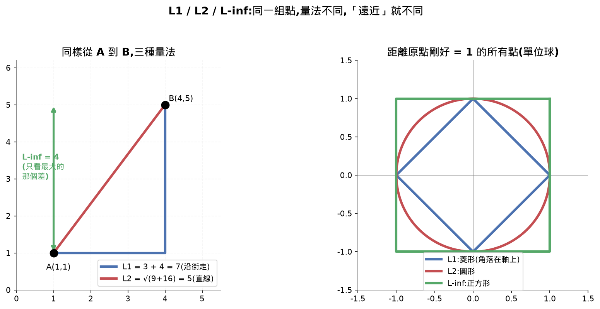
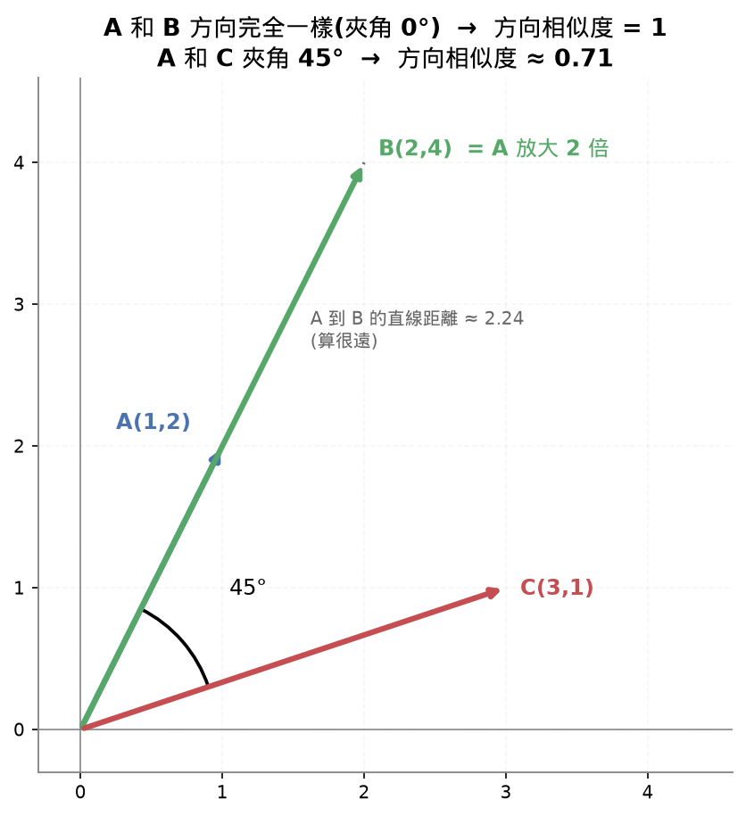
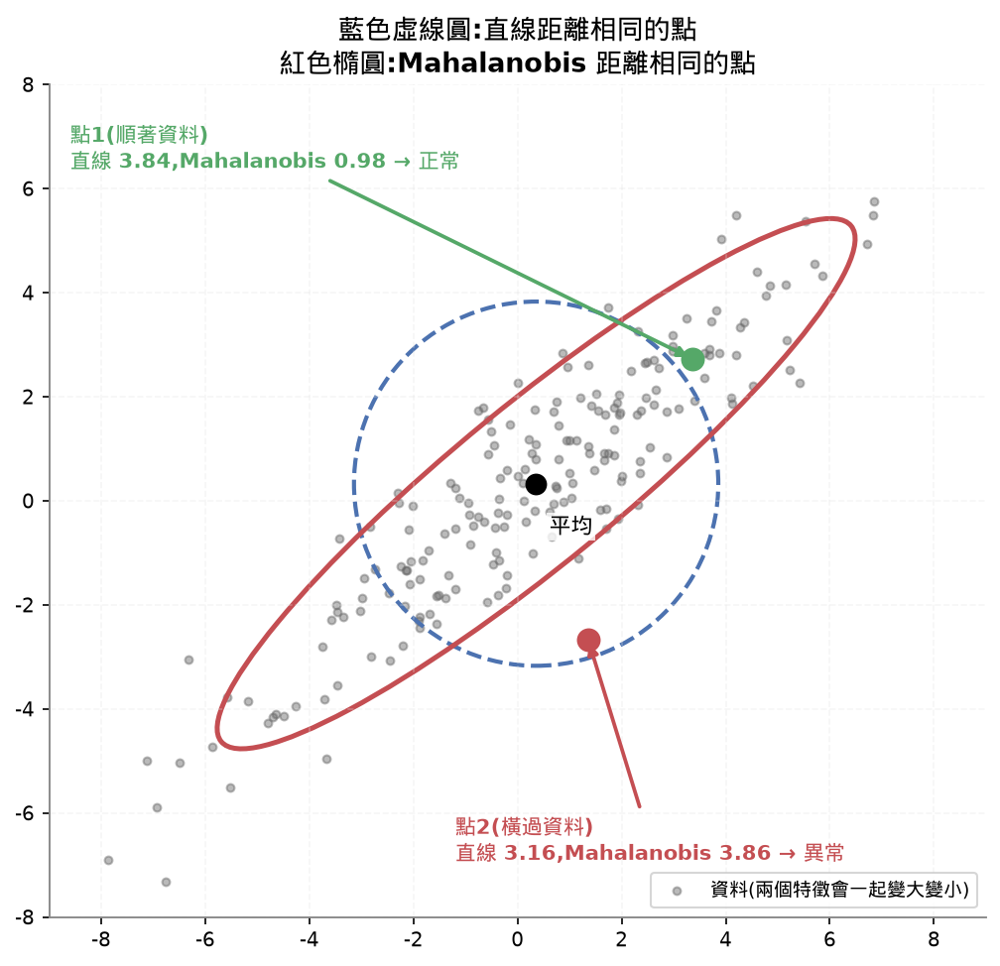

# Lesson 14 - Norms and Distances(範數與距離)

## 目錄

- [Learning Objectives 打勾清單](#learning-objectives-打勾清單)
- [30秒抓重點](#30秒抓重點)
- [公式速查表](#公式速查表)
- [這堂課的名詞總表](#這堂課的名詞總表)
- [這堂課我卡住/搞混的地方(完整問答記錄,給複習用)](#這堂課我卡住搞混的地方完整問答記錄給複習用)
- [常見地雷](#常見地雷)
- [相關概念(跨堂連結)](#相關概念跨堂連結)
- [面試向問題](#面試向問題)
- [課程結尾理解確認題](#課程結尾理解確認題)
- [我自己手打的部分](#我自己手打的部分)
- [今天評分](#今天評分)
- [程式語法筆記](#程式語法筆記)

## Learning Objectives 打勾清單

- [~] 從零實作 L1、L2、cosine、Mahalanobis、Jaccard、edit distance ⚠️(L1/L2/L∞/cosine/內積/Jaccard/編輯距離/KL/搬土距離都用小數字手算過、對照過reference.py,並放進practice.py;Mahalanobis只看圖和數字結果,沒看程式碼)
- [x] 針對任務選合適的距離,並說明其他選項為什麼不適用(整理過選擇表;結尾題答出cosine看方向、Mahalanobis看資料形狀)
- [~] 把L1/L2跟Lasso/Ridge正則化及幾何限制區域連起來 ⚠️(用10個權重逐步模擬,懂L1固定減會歸0、L2按比例減不會歸0;菱形角落的幾何解釋只看圖簡單帶過)
- [x] 示範同一份資料在不同距離下最近鄰居不同(同一組資料,P6在cosine排第2、在L2排最後;課程demo的第一名四種距離其實一致,差別在排名)

## 30秒抓重點

- 距離的主軸:距離 = 兩點相減後,量那個差的長度;所以「有幾種距離」就是「有幾種量長度的方法」,選哪一種就決定了「像」是什麼意思
- L1走格子(絕對值相加)、L2直線(平方相加開根號)、L∞只看差最大的那一格;永遠 L∞ ≤ L2 ≤ L1;Lp是同一家族,p越大越接近只看最大值
- cosine只看夾角不看長度(同方向1、垂直0、反方向-1);cosine距離=1−相似度;內積多包含長度;兩個向量先縮成長度1,內積就等於cosine
- 集合用Jaccard(交集÷聯集);字串用編輯距離(插入、刪除、替換最少幾次,動態規劃填表)
- 機率分布:KL不對稱,而且兩邊沒重疊會變無限大;搬土距離 = 土量×搬的距離,一維可以用「累加後的差」快速算
- 特徵有相關(資料斜斜一長條)時,直線距離會判錯;Mahalanobis會看資料形狀,等距離線是橢圓不是圓,用來找異常值
- L1/L2正則化:在損失裡加「權重大小」當處罰;L1每步固定減,小權重會剛好歸0(自動選特徵);L2每步減自己的比例,只縮小不歸0
- MAE是L1做的損失、MSE是L2平方做的損失;誤差加倍,MAE約2倍、MSE約4倍,所以MSE對極端值敏感,但平滑好訓練、找的是平均數,MAE找中位數
- 正規化(縮放資料)、標準化(平均0標準差1)、正則化(對權重加處罰)是三件不同的事
- 資料多時找最近鄰居要用近似搜尋(HNSW);選距離:文字用cosine、像素用L2、集合用Jaccard、字串用編輯距離、異常值用Mahalanobis

## 公式速查表

<details>
<summary>展開:公式速查表</summary>

| 用途 | 寫法 |
|---|---|
| 距離的通式 | `d(a, b) = ‖a − b‖`(相減後量長度) |
| L1(走格子) | `Σ│aᵢ − bᵢ│` |
| L2(直線) | `√Σ(aᵢ − bᵢ)²` |
| Lp | `(Σ│aᵢ − bᵢ│^p)^(1/p)`,p=1是L1、p=2是L2 |
| L∞(最大差) | `max│aᵢ − bᵢ│`,答案一定是差向量裡的某個數字 |
| 大小順序 | `L∞ ≤ L2 ≤ L1` |
| 內積 | `a·b = Σ aᵢbᵢ = ‖a‖‖b‖cos(夾角)` |
| cosine相似度 | `a·b ÷ (‖a‖ × ‖b‖)`,範圍 −1 到 1 |
| cosine距離 | `1 − cosine相似度`,範圍 0 到 2 |
| 縮成長度1 | `v ÷ ‖v‖`,縮完後內積 = cosine |
| Jaccard | `│A∩B│ ÷ │A∪B│`,距離 = 1 − 相似度 |
| 編輯距離填表 | 字母相同:抄左上角;不同:`1 + min(上, 左, 左上)` |
| KL散度 | `Σ p·log(p÷q)`,p是真實、q是你以為的;p>0而q=0則為無限大 |
| 搬土距離(一維) | 兩邊各做累加,差取絕對值後加總 |
| Mahalanobis | `√((x−y)ᵀ S⁻¹ (x−y))`,S是共變異數矩陣;S是單位矩陣時等於L2 |
| 誤差 | 預測 − 答案 |
| MAE | `平均 │誤差│` |
| MSE | `平均 誤差²` |
| 標準化 | `(x − 平均) ÷ 標準差` |

</details>

## 這堂課的名詞總表

<details>
<summary>展開:名詞總表</summary>

| 英文 | 中文 | 一句話定義 |
|---|---|---|
| Norm | 範數 | 量一個向量「有多長」的方法 |
| L1 norm(Manhattan distance) | L1範數(走格子距離) | 每個分量取絕對值再相加,像在棋盤式街道只能沿街走 |
| L2 norm(Euclidean distance) | L2範數(直線距離) | 各分量平方相加再開根號,就是兩點間的直線 |
| Lp norm | Lp範數 | L1、L2的一般化,每個分量取p次方再開p次方根 |
| L-infinity norm(Chebyshev distance) | L∞範數(最大差) | 只看差最大的那一個分量,是p趨近無限大時Lp的極限 |
| Cosine similarity | cosine相似度 | 內積除以兩個長度,只看夾角、不看長度,範圍−1到1 |
| Cosine distance | cosine距離 | 1減cosine相似度,把「越像越大」翻成「越像越小」 |
| Dot product | 內積 | 對應位置相乘再相加,同時包含方向和長度 |
| Mahalanobis distance | Mahalanobis距離 | 會看資料形狀(相關性和尺度)的距離,等距離線是橢圓 |
| Jaccard similarity | Jaccard相似度 | 兩個集合的交集大小除以聯集大小 |
| Edit distance(Levenshtein) | 編輯距離 | 把一個字串變成另一個,最少需要的插入、刪除、替換次數 |
| KL divergence | KL散度 | 真實是P、你以為是Q,平均會多損失多少資訊;不對稱,所以不算真正的距離 |
| Wasserstein distance(Earth Mover's) | 搬土距離 | 把一個分布當土堆搬成另一個分布要花的工(土量×距離),是真正的距離 |
| Approximate nearest neighbor(ANN) | 近似最近鄰 | 犧牲一點準確度,換大幅加速的最近鄰搜尋 |
| HNSW | 多層近鄰圖 | 向量資料庫最常用的ANN演算法,多層圖,上層稀疏長跳、下層密集短跳 |
| L1 regularization(Lasso) | L1正則化 | 損失加上權重的L1範數,讓小權重剛好歸0,自動選特徵 |
| L2 regularization(Ridge、weight decay) | L2正則化 | 損失加上權重的L2平方,所有權重一起縮小但不歸0 |
| Elastic Net | 彈性網路 | L1加L2一起用 |
| Normalization | 正規化 | 縮放資料,例如縮成長度1 |
| Standardization | 標準化 | 減平均再除以標準差,變成平均0、標準差1 |
| Regularization | 正則化 | 在損失裡加處罰,限制模型權重大小,防止死背 |
| MAE | 平均絕對誤差 | 誤差取絕對值再平均,是L1做的損失 |
| MSE | 平均平方誤差 | 誤差平方再平均,是L2平方做的損失 |
| Huber loss | Huber損失 | 小誤差用L2、大誤差用L1的折衷 |
| Correlation | 相關 | 兩個特徵會一起變大或變小,畫成圖是斜斜一長條 |
| Covariance matrix | 共變異數矩陣 | 記錄各特徵一起變動的程度(Lesson 10) |
| Cumulative sum | 累加 | 從左到右一格一格加起來,第i格是「到這裡為止總共有多少」 |

</details>

## 這堂課我卡住/搞混的地方(完整問答記錄,給複習用)

<details>
<summary>Manhattan距離、Euclidean距離是什麼(一開始太多陌生英文)</summary>

一開始我把課程的十幾個英文名一次丟出來,使用者說「這次太多陌生英文」。重講:

- Manhattan距離(曼哈頓):曼哈頓是紐約的一區,街道像棋盤。要從一個路口走到另一個,只能沿街走,不能穿大樓斜走。走的距離 = 往東幾格 + 往北幾格。課程叫它L1。
- Euclidean距離(歐幾里得):古希臘數學家,國中的畢氏定理。拿尺在兩點間拉直線量長度。課程叫它L2。

用A(1,1)到B(4,5):差是(3,4)。走格子 3+4=7;直線 √(9+16)=5。直線一定比走格子短。



之後的原則:先用中文講它在做什麼,英文名每個只附一次,分批講,不一次丟十幾個。

</details>

<details>
<summary>L∞是什麼、為什麼叫無限大、跟L1一樣嗎、最大差是比x軸y軸嗎(這堂最大的卡點,答錯三次)</summary>

**最大差怎麼算:** 比每一個方向的差,誰最大就取誰。差向量(6,8),x方向差6、y方向差8,取大的得8。不用加、不用平方、不用開根號。三維(2,9,5)就取9。

**為什麼叫L∞:** L1和L2其實是同一個公式,只差「幾次方」:每格取絕對值,做p次方,加起來,開p次方根。這一家叫Lp。用差(3,4)算,p越大結果越小,最後貼在4(最大的那個分量):

| p | 結果 |
|---|---|
| 1(L1) | 7 |
| 2(L2) | 5 |
| 3 | 4.50 |
| 5 | 4.17 |
| 10 | 4.02 |
| 50 | 4.00 |
| 200 | 4.00 |

原因:p次方會把大數放大得特別兇,p越大,最大的那一格越是唯一重要的。p大到無限大,就剛好等於最大差,所以叫L∞。

**L1不等於L∞,它們是兩個極端:** L1每格都算進去,算出來最大(7);L∞只看最大那格,最小(4);L2在中間(5)。永遠 `L∞ ≤ L2 ≤ L1`,只有特殊情況會相等(例如差向量(5,0,0),只有一格有值,三種都是5)。

**我的答錯紀錄(三次都是同一個誤解):**
- (6,8) → 寫6(應該是8)
- (2,7,4) → 寫2(應該是7)
- (5,1,9,3) → 寫7(應該是9,7根本不在這串數字裡)

可能的原因:我說過「L∞算出來最小」,被理解成「取最小的」。正確的意思是:從L1到L∞數字一路變小,但最小只小到「最大的那一格」,不會再往下掉。自我檢查:**L∞的答案一定是差向量裡的某個數字,而且是最大的那個。** 最後一題(4,9,2)答對9。

</details>

<details>
<summary>cosine相似度怎麼算、為什麼只看方向(含cosine距離、內積、縮成長度1)</summary>

**為什麼不能只看長度:** 兩篇都在講貓的文章,一篇是另一篇的兩倍長,字的比例完全一樣。A=(1,2),B=(2,4)。直線距離是√5≈2.24,算「滿遠」,但它們講同一件事。這種情況要看方向,不看長度。



夾角0度(同方向)相似度1,90度(垂直)0,180度(反方向)−1。

**怎麼算:** 先算內積(對應位置相乘再加):A·B = 1×2+2×4 = 10。再除以兩個長度相乘:√5 × √20 = √100 = 10。相似度 = 10÷10 = 1。A和C(3,1):內積 5,長度 √5×√10=√50≈7.07,相似度≈0.71(夾45度,跟圖對上)。

**為什麼除以長度就不管長度:** B是A的兩倍,分子(內積)變2倍,分母(長度相乘)也變2倍,剛好約掉。這跟softmax減最大值是同一種「上下約掉」。

**使用者看不懂的那段,重講:**
1. cosine距離 = 1 − 相似度。因為走格子、直線都是「越像越小」,要統一方向才能放在一起排名:同方向0、垂直1、反方向2。
2. 內積 vs cosine。A=(1,2),跟P=(1,2)、Q=(2,4)、R=(10,20)比,cosine全是1(方向一樣),內積分別是5、10、50(把長度也算進去)。只想比「是不是講同一件事」用cosine;長度有意義(越熱門、越重要向量越長)就用內積。(我第一次寫的「10 vs 5」例子拿錯東西比,造成混淆,已更正。)
3. 縮成長度1後內積=cosine。A=(3,4)、B=(4,3),長度都是5。直接算cosine:24÷25=0.96。先各自縮成長度1得(0.6,0.8)和(0.8,0.6),內積 0.48+0.48=0.96。一樣。向量資料庫先縮成長度1存起來,之後只算內積,不用每次算長度、開根號、相除,速度快,結果跟cosine相同。

**確認題:** (3,3)和(1,1)→1;(1,0)和(0,5)→0(垂直,B再長也沒影響)。使用者兩題都對。A=(1,2)、S=(3,6)、T=(0.1,0.2):cosine兩個都是1(同方向);內積S=15、T=0.5,S大。

</details>

<details>
<summary>正規化、標準化、正則化有什麼不同</summary>

使用者問「縮成長度1算標準化還是正規化」,後來又問「正則化跟正規化一樣嗎」。用「對什麼動手」來分:

| 名稱 | 動手的對象 | 做什麼 | 目的 | 例子 |
|---|---|---|---|---|
| 正規化(normalization) | 資料 | 縮放數字,例如縮成長度1 | 讓數字大小一致 | (3,4)→(0.6,0.8) |
| 標準化(standardization) | 資料 | 減平均再除以標準差 | 平均0、標準差1 | (10,20,30)→(-1.22,0,1.22) |
| 正則化(regularization) | 模型的權重 | 損失裡加權重大小的處罰 | 防止模型太複雜、死背 | 損失+處罰項 |

記法:正規化、標準化 = 改資料;正則化 = 改處罰。中文翻譯不統一,不同書有時三個混著翻,所以看它實際做了什麼:縮放資料,還是在損失裡加處罰。Lesson 13的layer norm英文名叫normalization,但做的是減平均除標準差(標準化類),所以特別容易混。這堂課兩個都出現,是因為用的是同一個工具:範數(正規化拿L2範數當分母;正則化拿權重的範數當處罰)。

</details>

<details>
<summary>Jaccard、編輯距離怎麼算(含「空變成t要3」的表格誤會)</summary>

**Jaccard:** 相似度 = 兩邊都有的個數 ÷ 全部加起來(重複只算一次)的個數。小明{貓,狗,魚}、小華{貓,鳥,魚,蛇}:交集{貓,魚}=2,聯集5個,2÷5=0.4,距離0.6。完全一樣是1,完全沒重疊是0。用在標籤比較、文章有沒有出現同樣的字、找重複網頁、圖片辨識的IoU(框的重疊比例)。

**編輯距離:** 把一個字串變成另一個,每次只能插入、刪除、替換一個字母,數最少幾次。kitten→sitting:k換s、e換i、插入g,共3次。

**填表:** 以sun→sat為例,每一格是「原字串前i個字」變成「目標前j個字」的最少次數:字母相同就抄左上角;不同就是 1 + 上、左、左上三格的最小值(分別代表刪除、插入、替換)。右下角就是答案。

```
          空    s    sa   sat
   空      0    1    2    3
   s       1    0    1    2
   su      2    1    1    2
   sun     3    2    2    2
```

**我卡住使用者的地方:** 我第一次畫表只在欄位標單一字母(s、a、t),使用者問「空變成t為什麼要3」。其實每個欄位代表「到那個字母為止的整段字」,所以是「空→sat」要插入3個字母。重畫後把整段字寫出來。示範一格:「su→sa」最後字母u和a不同,花1次,加上上方(s→sa)=1、左方(su→s)=1、左上(s→s)=0三格的最小值0,等於1。

確認題:{蘋果,香蕉,橘子}和{香蕉,橘子,芒果,西瓜}→2/5=0.4(對);cat→cut→1(對)。

</details>

<details>
<summary>KL散度怎麼算(使用者忘記了)</summary>

KL量的是「真實是P、你心裡以為是Q,平均每次會多驚訝多少」。公式:每一格算 `p × log(p÷q)`,再全部加起來,log用自然對數。

例:P=[0.9,0.1](硬幣真實90%正面)、Q=[0.5,0.5](你以為公平):
```
第1格:0.9 × log(0.9÷0.5) = 0.9 × 0.5878 = 0.5290
第2格:0.1 × log(0.1÷0.5) = 0.1 × (−1.6094) = −0.1609
加起來 = 0.3681
```

為什麼這樣算:log(p÷q)比較「真實」和「你以為」差幾倍;前面乘p,是因為只有真的常發生的事才值得算進去;p=q時每格log(1)=0,KL=0。

**不對稱:** 反過來算KL(Q對P)=0.5×log(0.5÷0.9)+0.5×log(0.5÷0.1)=0.5108,跟0.3681不同,因為權重換成Q的。所以它不算真正的距離。

**無限大:** 某格p>0(真的會發生)但q=0(你以為不可能),log(p÷0)是無限大,意思是你說不可能的事真的發生了。

</details>

<details>
<summary>搬土距離是什麼、「累加」是什麼</summary>

KL有兩個毛病:不對稱、兩個分布完全沒重疊時是無限大(只知道差很多,不知道差多少)。搬土距離:把機率想成土堆,把P搬成Q要花多少工,工 = 土量 × 搬的距離。

![搬土距離:P=[0.5,0.5,0,0]搬成Q=[0,0,0.5,0.5]](images/wasserstein_dirt.png)

P=[0.5,0.5,0,0]、Q=[0,0,0.5,0.5]:位置0的0.5搬到2(0.5×2=1),位置1的0.5搬到3(1),總共2。

| 情況 | 搬土距離 | KL |
|---|---|---|
| 完全一樣 | 0 | 0 |
| 往右移1格 | 1 | 無限大 |
| 往右移2格 | 2 | 無限大 |
| 一頭搬到另一頭 | 3 | 無限大 |

用在生成圖片的模型(GAN),早期訓練不穩,換成這個距離才穩,因為分布沒重疊時它還給得出有意義的方向。

**累加是什麼:** 從左到右一格一格加起來,第i格是「到這一格為止總共堆了多少土」。P=[1,0,0,0]累加1,1,1,1;Q=[0,0,1,0]累加0,0,1,1;差的絕對值1,1,0,0,加起來2。意思:每兩格之間想成一道門檻,差多少就代表有多少土要越過那道門檻;每越過一道花1,全部加起來就是總工。是「一格一格搬」的快速算法。

**使用者的問題「是一個一個搬,還是1變0、0變1數幾個步驟」:** 是土的量×搬幾格。P=[1,0,0,0]→Q=[0,0,1,0]剛好也是兩個數字有改,容易誤會;換成Q=[0,0,0,1],還是只有兩個數字有改,但土搬3格,距離是3。重點是搬多遠,不是改幾個數字。

</details>

<details>
<summary>Mahalanobis是什麼、「相關」是什麼、為什麼直線距離會判錯</summary>

**相關:** 兩個特徵會一起變大、一起變小,畫成圖是斜斜一長條(正相關);斜向右下是負相關;圓圓一團是沒有相關。(使用者問「資料群是斜著的一長條,這是相關嗎」,是。)我們那組資料的相關係數約0.92;reference.py註解寫「r ~ 0.8」是課程原本的說法,0.8其實是造資料時的係數,不是相關係數。

**Mahalanobis:** 名字是統計學家的名字,不用背,記「會看資料形狀的距離」。直線距離拿一把尺量,四面八方同一個標準;Mahalanobis先看資料群是什麼形狀(斜長條),再用這個形狀當標準。比喻:一群人排成斜斜的長隊,站在隊伍後面很遠很正常,但從隊伍側邊離開三步就很突兀。



用200筆相關資料實測:

| | 直線距離 | Mahalanobis |
|---|---|---|
| 點1(順著資料的方向) | 3.84 | 0.98 |
| 點2(橫過資料的方向) | 3.16 | 3.86 |

直線距離說點2比較近、比較正常,但看圖點2其實離資料群很遠。Mahalanobis判對:點1正常(0.98),點2異常(3.86)。藍色虛線圓是直線距離相同的點,紅色橢圓是Mahalanobis距離相同的點,順著資料被拉長。做法是先把資料「拉成圓的」(消掉相關性和尺度)再量直線距離;特徵沒有相關、尺度一樣時就等於L2;用到Lesson 10的共變異數矩陣。用在找異常值(盜刷、機器故障、品管)。要有夠多資料才能估出可靠的共變異數矩陣。

結尾題使用者答「因為是橢圓不是圓」「超出橢圓」,方向對。

</details>

<details>
<summary>L1和L2正則化的細節(為什麼L1會歸0)</summary>

正則化:模型有一堆權重,只追求答對可能變得又大又複雜、死背訓練資料。在損失裡加一項「權重的大小」當處罰,模型就要在「答對」和「權重別太大」之間取捨。這個大小用L1量就是L1正則化(Lasso),用L2量就是L2正則化(Ridge、權重衰減),兩個一起用是Elastic Net。

用10個權重模擬(只看處罰本身),規則:
- L1:每一步,不管權重多大,往0走**固定的0.1**;剩下比0.1小就直接跨到0並停住。
- L2:每一步,往0走**自己的20%**。

| 步數 | 大權重1.0用L1 | 大權重1.0用L2 | 小權重0.25用L1 | 小權重0.25用L2 |
|---|---|---|---|---|
| 開始 | 1.0 | 1.0 | 0.25 | 0.25 |
| 第1步 | 0.9 | 0.8 | 0.15 | 0.2 |
| 第2步 | 0.8 | 0.64 | 0 | 0.16 |
| 第3步 | 0.7 | 0.512 | 0 | 0.128 |
| 第4步 | 0.6 | 0.4096 | 0 | 0.1024 |
| 第5步 | 0.5 | 0.3277 | 0 | 0.0819 |

小權重0.25:L1第2步剩0.05,比0.1小,下一步會跨過0,所以停在0;L2每次只減自己的20%,越減越少,越來越接近0但永遠不會剛好等於0。10個權重第5步的結果:L1有7個剛好是0,大的還留著;L2一個0都沒有,全部一起縮小。

一句話:L1力道固定,小權重一下就被推到0;L2力道跟權重大小成正比,權重越小推得越輕,所以只縮小不歸0。

**誠實說明:** 課程原本跑50步,兩邊最後都幾乎全0,因為這個小實驗只有處罰、沒有「答對」那一項把權重拉回來,所以我挑第5步看差異。真正訓練時有「答對」在拉,L1才會只留下重要的權重。幾何的看法:L1的單位球是菱形,角落落在軸上(某權重為0),模型的解最容易撞到角;L2是圓,沒有角(只看圖簡單帶過)。

使用者的回答:「L1可以變成0」「L2是都減20%」對,L1的詳細一開始寫成「減錯的」(應是減固定的)。

</details>

<details>
<summary>MAE和MSE是什麼、MSE有什麼優點(使用者說不知道)</summary>

損失是告訴你「模型預測得有多差」的數字,越小越準。誤差 = 預測 − 答案。
- MAE(平均絕對誤差):誤差取絕對值再平均。
- MSE(平均平方誤差):誤差平方再平均。

答案[10,20,30]、預測[12,20,25],誤差[2,0,−5]:MAE=(2+0+5)÷3=2.33,MSE=(4+0+25)÷3=9.67。誤差5跟2比,絕對值是2.5倍,平方是25比4約6倍,MSE對大誤差罰得特別重。

跟這堂課的關係:預測和答案是兩個向量,它們的L1距離=7,MAE=7÷3;L2距離平方=29,MSE=29÷3。MAE是L1做的損失,MSE是L2平方做的損失。

**極端值的影響:** 答案[10,11,12,13,100],預測全是12,誤差[−2,−1,0,1,88]:MAE=18.4、MSE=1550。極端值的誤差加倍成176:MAE=36(約2倍)、MSE=6196.4(約4倍)。

**使用者問「MSE一定有優點吧」:** 對,缺點是會被極端值帶偏:只給一個固定預測值時,MSE最小的是平均數29.2,MAE最小的是中位數12(掃過0到100確認)。若100是壞資料,MSE會被拉偏,對4個正常點各差16到19;MAE對正常點只差0到2。優點:
1. 大錯誤本來就該重罰(預測橋樑承重、藥物劑量,大錯代價高)。
2. 好訓練:MSE的梯度跟誤差成正比,離答案遠就大步、靠近自動放慢(Lesson 8);MAE梯度大小固定,靠近答案時還是同樣大的一步,容易來回跳。
3. 找的是平均數,會用到每一筆資料;MAE找中位數。

選擇:極端值是真的而且重要→MSE;極端值是雜訊或壞資料→MAE;兩個都想要→Huber loss(小誤差L2、大誤差L1)。

我誤會處:使用者算[5,10]/[7,4]時MAE寫3,正確是4:誤差[2,−6],絕對值2和6加起來8,÷2=4(可能漏了2);MSE=(4+36)÷2=20,答對。

</details>

<details>
<summary>用距離找最相似的資料、怎麼選距離(最近鄰居、近似搜尋)</summary>

最近鄰居:有了距離,就能找「最像的那幾筆」。分類(看離你最近的k個已知答案多數決,叫KNN)、搜尋與推薦(文字轉成向量,拿問題向量找最近的向量,向量資料庫做的就是這件事)。

**換距離,最近的鄰居會不同:** 我拿課程demo實際跑,誠實說明:課程兩個demo(找最近鄰居、KNN分類)四種距離最後選的是同一個點、預測同一類別,沒有展示出意見不同。但往下看排名就有差別:同一個查詢點、8個候選,P6離查詢點很遠(L2=5.96,排最後),方向卻很接近(cosine距離0.378,排第2)。更簡單的對照:(1,2)和(10,20)cosine=1(最像)、直線距離20.1(很遠);(0.1,0)和(0,0.1)cosine=0(毫不相關)、直線距離0.14(很近)。不是哪個比較準,是你要的「像」是哪一種。

**近似搜尋:** 精確做法要跟每一筆資料都比一遍,上億筆太慢。近似最近鄰(ANN)犧牲一點準確度換大幅加速;最常用的HNSW建多層圖,上層稀疏一步跳很遠、下層密集一步跳很近,從最上層開始往下找,像先看全國地圖再看街道圖(細節之後再補)。

**怎麼選距離:**

| 情況 | 用什麼 | 理由 |
|---|---|---|
| 文字、embedding相似度 | cosine(或內積) | 長度是雜訊,方向才是意思 |
| 圖片像素、空間資料 | L2 | 各維度尺度相近、空間關係重要 |
| 很稀疏的高維特徵 | L1 | 不會被少數大差異放大 |
| 集合(標籤、有沒有出現) | Jaccard | 資料本來就是集合 |
| 字串、拼字 | 編輯距離 | 對應人修改文字的直覺 |
| 找異常值、特徵有相關 | Mahalanobis | 看資料形狀 |
| 比較兩個機率分布 | KL或搬土距離 | 分布沒重疊時搬土距離仍有意義 |
| 推薦(長度代表熱門度) | 內積 | 長度是有用的訊息 |
| 品管(每個維度都要合格) | L∞ | 最差的那個維度才重要 |

</details>

## 常見地雷

- L∞取的是「最大」,不是最小;答案一定是差向量裡的某個數字(這堂答錯三次)
- 距離選擇不同,同一對點可能給相反結論(cosine說最像、直線距離說很遠)
- 正規化、標準化、正則化名字像、做的事不同,看它是縮放資料還是對權重加處罰
- 課程demo的「不同最近鄰居」第一名四種距離其實一致,差別在排名;正則化demo跑50步兩邊都幾乎全0,要看第5步才看出差異
- reference.py的註解「r ~ 0.8」是造資料的係數,實際相關係數約0.92

## 相關概念(跨堂連結)

- Lesson 1的向量長度、cosine相似度 = 這堂的L2範數與cosine,只是這堂把整個家族一起整理
- Lesson 8的梯度下降 = MSE梯度跟誤差成正比、靠近答案自動放慢的原因
- Lesson 9的KL散度、交叉熵 = 這堂補上它不對稱、沒重疊會無限大的問題,以及搬土距離
- Lesson 10的共變異數矩陣 = Mahalanobis距離用到的資料形狀
- Lesson 13的layer norm = 標準化類(減平均除標準差),跟這堂的正規化(縮成長度1)是兩件事

## 面試向問題

<details>
<summary>Q1: cosine相似度和歐氏距離差在哪?各適合什麼情況?</summary>

歐氏距離量兩點的直線距離,會受向量長度影響;cosine只看夾角,完全不受長度影響(分子內積和分母長度乘積同時縮放,約掉)。文字、embedding相似度用cosine,因為文章長短是雜訊,主題(方向)才是意思;像素、空間資料用歐氏距離,因為各維度尺度相近、位置關係重要。向量先縮成長度1時,內積等於cosine,所以向量資料庫常存縮好的向量、搜尋時只算內積。

</details>

<details>
<summary>Q2: 為什麼L1正則化會讓權重變成剛好0,L2不會?</summary>

L1的處罰力道固定(每步往0走固定的量),小權重一下就被推到0並停住,等於自動選出重要的特徵;L2的力道跟權重大小成正比,權重越小推得越輕,所以只縮小、不會歸0。幾何上,L1的單位球是菱形,角落在軸上,損失的等高線最容易撞到角;L2是圓,沒有角。

</details>

<details>
<summary>Q3: MSE和MAE怎麼選?</summary>

誤差加倍時MAE約變2倍、MSE約變4倍,所以MSE對極端值敏感,最小化MSE找的是平均數、最小化MAE找的是中位數。極端值是真的而且大錯代價高時用MSE(梯度也平滑,靠近答案自動放慢);極端值是雜訊或壞資料時用MAE;兩個都想要用Huber loss(小誤差L2、大誤差L1)。

</details>

<details>
<summary>Q4: KL散度為什麼不算真正的距離?搬土距離(Wasserstein)好在哪?</summary>

KL不對稱(KL(P||Q)≠KL(Q||P)),所以不是距離;而且兩個分布沒重疊時是無限大,分不出差多少。搬土距離是土量×搬的距離,是真正的距離(對稱),分布完全沒重疊時仍給出有意義的有限數字,所以GAN訓練改用它才穩。

</details>

## 課程結尾理解確認題

<details>
<summary>Q1: 差向量是(4, 9, 2),L1、L2、L∞各是多少?</summary>

L1 = 4+9+2 = 15。L2 = √(16+81+4) = √101 ≈ 10.05。L∞ = max(4,9,2) = 9。使用者答 15、11、9:L1和L∞對,L2寫11是錯的(11對應√121,不是√101)。順序驗證:9 ≤ 10.05 ≤ 15。

</details>

<details>
<summary>Q2: 兩篇文章講同一件事,一篇是另一篇的兩倍長,為什麼用cosine比直線距離好?</summary>

長的那篇是短的那篇放大2倍,兩個向量指向同一個方向。cosine只看方向,所以相似度是1(最像);直線距離會把長度差也算進去,算出一個不小的距離,誤判成不太像。長度是雜訊,方向才是主題。使用者答「因為他是看方向」,對,但偏簡短。

</details>

<details>
<summary>Q3: 身高體重會一起變大,要找異常的人,為什麼直線距離會判錯、Mahalanobis比較好?</summary>

直線距離用圓來量,只問「離平均幾公分」,不知道資料是斜斜的一長條(兩個特徵有相關),可能把順著資料方向的正常點判得比橫過資料方向的異常點更遠。Mahalanobis會看資料形狀,等距離線是順著資料拉長的橢圓,點落在橢圓外面就是異常。使用者答「因為是橢圓不是圓」,對。

</details>

## 我自己手打的部分

- `practice.py`:依09-29起的新規則,不要求手打,直接複製講解時算過的函式進去:L1/L2/Lp/L∞範數與距離、內積、cosine相似度與距離、縮成長度1、Jaccard、編輯距離、KL散度、一維搬土距離,結尾附上這堂手算過的數字對照。Mahalanobis(含求反矩陣、共變異數)沒看過程式碼,所以沒放進去。

## 今天評分

- 花費時間:63分34秒(課程建議約90分鐘,比建議時間快約26分鐘)
- 三題課程結尾理解確認題:第1題L1、L∞對、L2算錯(寫11,應為√101≈10.05);第2、3題答對,方向正確但偏簡短
- 這堂的弱點:L∞連續答錯三次、MAE算錯一次(3,應為4)、KL公式忘記需要重講、正規化/標準化/正則化需要重新區分;一開始英文名詞太多使用者看不懂,中途改成先用中文講它在做什麼

## 程式語法筆記

<details>
<summary>展開:程式語法筆記</summary>

| 語法 | 意思 |
|---|---|
| `abs(x)` | 絕對值 |
| `sum(abs(xi) for xi in x)` | generator expression,邊走邊加總,不必先建立list |
| `zip(a, b)` | 把兩個list同位置的元素配成一對,一次走一維 |
| `float('inf')` | 無限大;`p == float('inf')` 用來特別處理L∞ |
| `x ** p`、`** (1 / p)` | p次方、開p次方根 |
| `set_a & set_b`、`set_a \| set_b` | 集合的交集、聯集 |
| `[[0] * (n + 1) for _ in range(m + 1)]` | 建立(m+1)×(n+1)的二維表,編輯距離填表用 |
| `min(a, b, c)` | 取三個數的最小值 |
| `max(abs(ai - bi) for ...)` | 取最大值,L∞用 |

</details>
